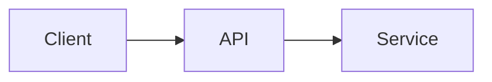
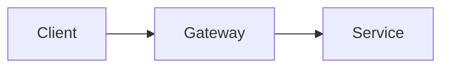

# <Название>

## Source

- Откуда взят кейс (видео, статья, личный опыт, интервью).
- Автор / спикер.
- Дата.

## Problem

Краткая формулировка задачи. Что нужно спроектировать. Какой компонент в фокусе, что вне зоны ответственности.

## Requirements

### Functional
- ...

### Non-functional
- Latency: ...
- Throughput: ...
- Durability / Availability: ...
- Consistency: ...
- Cost / Scaling: ...

## Solution A: <название подхода>

### Описание
...

### Диаграмма

### Используемые паттерны
- [[pattern-1]]
- [[pattern-2]]

### Плюсы
- ...

### Минусы
- ...

## Solution B: <название подхода>

### Описание
...

### Диаграмма

### Используемые паттерны
- [[pattern-1]]

### Плюсы
- ...

### Минусы
- ...

## Trade-offs

| Критерий            | Solution A | Solution B |
|---------------------|------------|------------|
| Latency             | ...        | ...        |
| Связанность         | ...        | ...        |
| Расширяемость       | ...        | ...        |
| Сложность ops       | ...        | ...        |

## Key Takeaways

- Главные уроки из этого кейса.
- Что важно сказать на интервью.

## Open Questions

- Что осталось неразобранным, что почитать дальше.

## References

- Ссылки на статьи, доклады, документацию.
