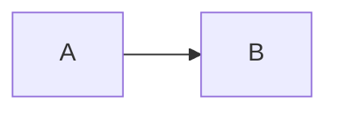

# <Pattern Name>

## What

Одно предложение: что это такое.

## Why / Problem it solves

Какую проблему решает. Почему наивное решение не работает.

## When to apply

- Сигналы, что паттерн уместен.
- Анти-сигналы (когда НЕ нужен).

## How

Механика. Ключевые инварианты. Что должно быть атомарно, что асинхронно.

### Диаграмма



или ASCII:

```
A → B → C
```

## Common pitfalls

- Типичные ошибки реализации.
- Edge cases.

## Variations

- Альтернативные варианты или близкие паттерны.

## Used in case studies

- [[NNN-some-case]]

## References

- Книги, статьи, доклады.
