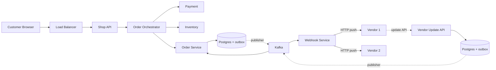
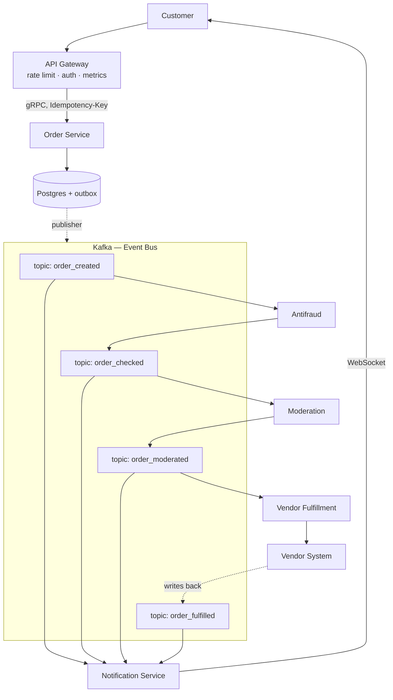

# Order Backend для маркетплейса (Amazon-like)

## Source

- **Видео:** [YouTube — Сисдиз в 2026-м на $15k в месяц](https://www.youtube.com/watch?v=8QggvwEknZ0)
- **Канал:** АйТи Красавчик
- **Эксперт:** Владимир Балун
- **Контекст:** System Design интервью на оффер ~$180k/год (Massive.com, бывший polygon.io), 4-й раунд.

## Problem

Спроектировать **Order Backend** для онлайн-магазина в стиле Amazon. Backend принимает заказы от клиентов через Shop API и уведомляет внешних **вендоров** (поставщиков) о новых заказах.

В фокусе — синий блок «Order Backend». Остальное не контролируется:
- **Customer browser** — мобильное приложение / веб.
- **Shop API** — клиентский API, существующий.
- **Vendors** — внешние системы, динамически конфигурируемые, много, разные.

```
Customer ──▶ Shop API ──▶ [Order Backend] ──▶ Vendor 1
                                            ──▶ Vendor 2
                                            ──▶ Vendor N
```

## Requirements

### Functional
- Принять заказ от Shop API.
- Уведомить соответствующего вендера.
- Получать апдейты статусов от вендеров обратно (`fulfilled`, `shipped`, etc.).
- Уведомлять клиента об изменении статуса.

### Non-functional
- **Latency:** минимизировать время от создания заказа до уведомления вендера.
- **Durability:** заказ не должен теряться. Гарантированная доставка событий.
- **Scalability:** вендеры добавляются/убираются динамически.
- **Independence:** части системы должны эволюционировать независимо (ордерная и вендорская).

---

## Solution A: Orchestration-based

### Описание

Центральный **Order Orchestrator** управляет всем жизненным циклом заказа: дёргает Payment, Inventory, Order Service, Vendor notification. Знает порядок, тайм-ауты, ретраи, компенсации (классическая [[saga]]).

Доставка в Kafka и далее в вендеров — через [[outbox]]. Вендоры получают webhook-уведомления через отдельный Webhook Service.

### Диаграмма



### Используемые паттерны
- [[saga]] — Orchestrator реализует распределённую транзакцию с компенсациями.
- [[outbox]] — гарантированная публикация событий в Kafka.
- [[orchestration-vs-choreography]] — это стиль "orchestration".

### Push vs Pull для vendor API

В этом решении выбран **push** (Webhook Service дёргает endpoint вендера). Трейд-офф:

| Аспект                       | Push (webhook)                              | Pull (polling)                              |
|------------------------------|---------------------------------------------|---------------------------------------------|
| Endpoint exposed             | На стороне **вендера**                      | На стороне **Order Backend**                |
| Кто обеспечивает availability | Вендер для своего endpoint                  | Order Backend для своего endpoint           |
| Ретраи / тайм-ауты           | На стороне Order Backend                    | На стороне вендера                          |
| Latency                      | Низкий — push сразу при событии             | Зависит от частоты polling                  |
| Нагрузка на Order Backend    | Низкая (только outbound HTTP)               | Высокая (вендеры опрашивают постоянно)      |

### Плюсы
- Знакомая модель из опыта (Deliver.ru и подобные).
- Явная модель процесса — видно где сейчас заказ.
- Простые компенсации.

### Минусы
- **Orchestrator становится единой точкой связанности.** Знает обо всех downstream-сервисах.
- **Синхронные вызовы внутри саги** → клиент может ждать всю цепочку, latency растёт.
- **Сложно расширять.** Добавить antifraud / moderation = менять Orchestrator.
- **«Паутина» при росте.** Стрелки пересекаются, схема плохо читается.
- **Циклы в архитектуре** (Order Service → Kafka → Webhook → Vendor → API → Order Service) усложняют ментальную модель.

---

## Solution B: Event-Driven Architecture (рекомендуемое)

### Описание

Kafka выступает **центральной шиной событий**, делящей систему на две независимые подсистемы:
- **Левая** (Order) — приём и хранение заказов.
- **Правая** (Vendor) — fulfillment и обратные апдейты.

Клиенту отвечаем сразу после сохранения заказа (`POST /orders → 200 OK, order_id`). Всё остальное — асинхронно через цепочку топиков. Каждый сервис подписан на нужный топик, обрабатывает и публикует следующее событие.

См. [[event-driven-architecture]] для общего описания стиля.

### Диаграмма



### Цепочка топиков

```
order_created  →  Antifraud      →  order_checked
order_checked  →  Moderation     →  order_moderated
order_moderated→  VendorFulfill  →  (call vendor)
                                 ←  order_fulfilled (от вендера)

Notification подписан на все order_* — шлёт WebSocket клиенту.
```

### Используемые паттерны
- [[event-driven-architecture]] — основа решения.
- [[outbox]] — Order Service → Kafka надёжно.
- [[idempotency-key]] — клиент передаёт ключ, защита от дублей заказа.
- [[orchestration-vs-choreography]] — это стиль "choreography".

### Ключевые элементы

1. **API Gateway** — rate limiting, auth, metrics, маршрутизация.
2. **Idempotency Key** в заголовке клиентского запроса — Order Service дедуплицирует.
3. **Order Service** — gRPC, сохраняет в Postgres, отвечает клиенту немедленно.
4. **Outbox + Publisher** — гарантия доставки в Kafka.
5. **Kafka** — event bus, граница между подсистемами.
6. **Цепочка consumers** — каждый сервис подписан на свой топик, публикует следующий.
7. **Notification Service** — подписан на все `order_*`, шлёт обновления клиенту через WebSocket.
8. **Vendor пишет обратно напрямую в Kafka** — не дёргает RPC. Order Service подписан на `order_fulfilled` и обновляет своё состояние.

### Плюсы
- **Низкий latency для клиента** — ответ сразу после сохранения, не ждём вендера.
- **Расширяемость.** Добавить новый шаг (moderation, antifraud, analytics) = новый consumer, без изменений в Order Service.
- **Независимые подсистемы.** Левая (ордера) и правая (вендеры) не знают друг о друге.
- **Независимый скейлинг** каждого сервиса.
- **Простая схема.** Линейные потоки через шину, без циклов.

### Минусы
- **Kafka — критический компонент.** Падение шины ломает всё. Нужен HA-кластер, мониторинг, обслуживание.
- **Eventual consistency.** Клиент видит «заказ создан», статусы прилетают позже — UX должен это учитывать.
- **Сложнее ответить «где сейчас заказ».** Нужны correlation_id, observability, может быть отдельная Process View.
- **Schema management.** Версионирование событий (Avro/Protobuf + Schema Registry) обязательно.

---

## Trade-offs

| Критерий                          | Solution A: Orchestration | Solution B: Event-Driven   |
|-----------------------------------|---------------------------|----------------------------|
| Latency для клиента               | Высокий (синхронная сага) | **Низкий** (async)         |
| Расширяемость                     | Сложно (менять Orch)      | **Легко** (новый consumer) |
| Связанность сервисов              | Высокая через координатор | **Низкая** через события   |
| Наблюдаемость процесса            | **Простая** (Orch знает)  | Сложнее (correlation, tracing) |
| Простота отладки                  | **Проще** (линейный flow) | Сложнее (распределённо)    |
| Операционная сложность            | Средняя                   | Высокая (Kafka HA)         |
| Готовность к росту бизнес-логики  | Плохая                    | **Хорошая**                |

---

## Key Takeaways

1. **При требовании на latency — выбирать event-driven, не orchestration.** Клиенту достаточно «заказ принят»; вся дальнейшая обработка не должна блокировать ответ. Аналогия — Яндекс.Еда: пользователь не ждёт приготовления, чтобы получить подтверждение.

2. **Kafka как граница подсистем — мощный приём.** Делит систему пополам так, что левая и правая часть не знают друг о друге → независимые команды, скейлинг, эволюция.

3. **[[outbox]] + [[idempotency-key]] — базовый набор надёжности.** Outbox решает dual write на producer-стороне, idempotency key — дедуп на consumer-стороне. Вместе дают at-least-once без последствий для бизнес-данных.

4. **Choreography легко расширяется через подписку.** Antifraud, Moderation, Analytics добавляются как новые consumers без изменения существующих сервисов.

5. **Не «правильной» архитектуры нет.** Два senior-инженера на одной задаче выдадут разные схемы. На интервью важнее **обосновать выбор** и понимать **трейд-оффы**, чем нарисовать «эталон».

6. **Контекст на стрелках обязателен.** Схема без подписей читается как «паутина». Если интервьюер видит только финальную схему — он не должен ничего гадать.

7. **Аналитика нагрузки — плюс.** На интервью имеет смысл прикинуть read/write ratio, количество пользователей по аналогии с эталоном (Amazon → миллионы DAU), throughput брокера.

8. **Освоить один инструмент рисования заранее.** Excalidraw / Miro / Lucid — не тратить время на интервью на поиск стрелочек.

---

## Open Questions

- Как именно реализовать **distributed tracing** через цепочку топиков (OpenTelemetry context propagation в Kafka headers)?
- Как обрабатывать **dead letters**: вендер недоступен 3 дня → куда уходит событие?
- **Backpressure** между сервисами в цепочке — Kafka буферизует, но если consumer медленный, lag растёт. Стратегии: горизонтальное масштабирование, partitioning по `order_id`.
- **Compensations в EDA**: как откатить заказ, если на середине цепочки `antifraud_rejected`? Отдельная цепочка компенсирующих событий (`order_cancellation_requested → ...`)?
- Как **версионировать схемы событий** при breaking changes?

## References

- Видео-источник: https://www.youtube.com/watch?v=8QggvwEknZ0
- Курс Владимира Балуна по System Design: https://balun.courses/courses/system_design
- Бесплатная статья о подготовке к System Design Interview (по ссылке в описании видео).
- Связанные паттерны: [[outbox]], [[idempotency-key]], [[saga]], [[event-driven-architecture]], [[orchestration-vs-choreography]].
