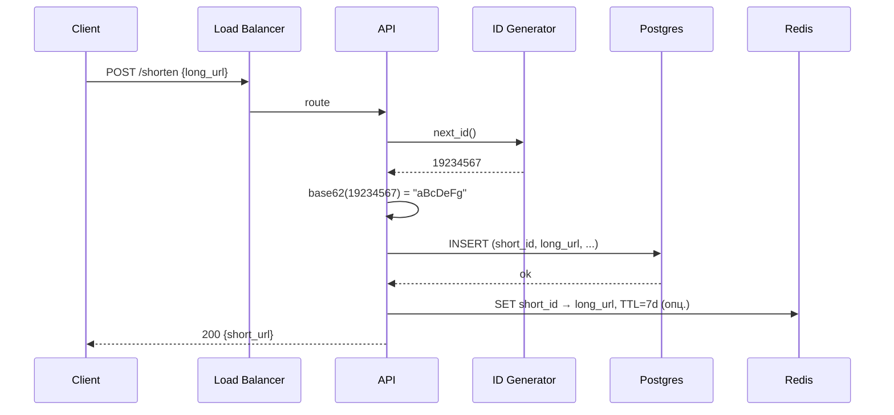
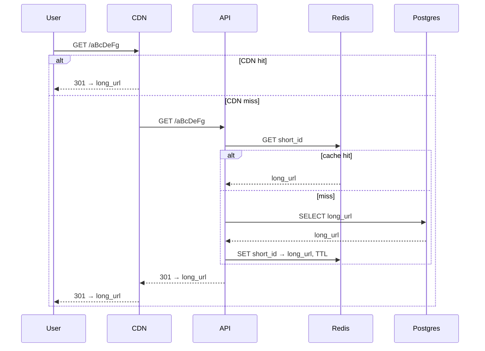
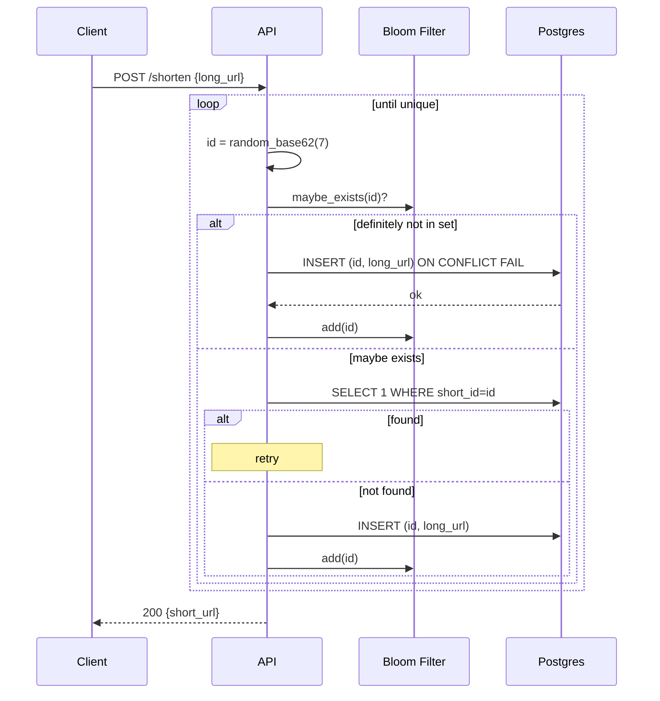

# URL Shortener (TinyURL / Bitly)

## Source

- Классическая задача System Design interview, без конкретного авторского источника.
- Референсы:
  - Alex Xu — "System Design Interview Vol. 1", Chapter 8.
  - Grokking the System Design Interview — Designing a URL Shortening Service.
  - Многочисленные онлайн-разборы.

## Problem

Сервис принимает длинный URL и возвращает короткий идентификатор. По переходу на короткий URL — редирект на оригинальный.

API:
```
POST /shorten
  { "long_url": "https://example.com/very/long/path?with=params" }
  → { "short_url": "https://sho.rt/abc123" }

GET /:short_id
  → 301/302 redirect → long_url
```

Опции (по желанию): custom alias, expiration, click analytics.

## Requirements

### Functional
- Создание короткой ссылки из длинной.
- Resolve короткой → редирект.
- Опционально: custom alias, TTL, analytics, отзыв ссылки.

### Non-functional

Capacity estimation (классическая прикидка для интервью):

| Метрика                  | Значение                           |
|--------------------------|------------------------------------|
| Новых URL в день         | 100M                               |
| Writes/sec               | ~1200 (с учётом неравномерности — пик 5–10x) |
| Read/write ratio         | ~100:1                             |
| Reads/sec (avg / peak)   | ~120k / ~1M                        |
| Размер записи            | ~500 байт (URL может быть длинным) |
| Storage/день             | ~50GB                              |
| Storage за 5 лет         | ~91TB (~180B записей)              |
| Длина short_id           | 7 base62 → 62^7 ≈ 3.5T комбинаций  |

Целевые SLO:
- Latency P99 на redirect: **< 100 ms**.
- Availability: **99.99%**.
- Durability: **не терять** созданные URL.
- Short_id: **уникален**.

Дополнительно: read-heavy → акцент на **кэш + шардинг**.

---

## Solution A: Counter-based + Base62

### Идея

Глобальный монотонный счётчик. Каждый новый URL получает следующее число → base62-encode → `short_id` (7 символов). Хранение в Postgres с PK по `short_id`. Hot URLs кэшируются в Redis с TTL.

### Компоненты

- **Load Balancer** (L7) → **API Service** (stateless, n инстансов).
- **ID Generator** — централизованный counter:
  - Вариант 1: **Ticket Server** / Zookeeper sequencer (atomic INCR).
  - Вариант 2: **Range-based** — worker берёт батч `[N..N+1000]` и раздаёт локально.
- **Postgres** (шардированный) — `urls (short_id PK, long_url, created_at, expires_at)`.
- **Redis** (шардированный через [[consistent-hashing]]) — кэш горячих URL.
- **CDN** перед redirect-эндпоинтом (опционально, для статичных hot ссылок).
- **Background job** — выселение expired URLs.

### Поток write



### Поток read (resolve)



### Используемые паттерны

- [[id-generation]] — counter + base62.
- [[caching-strategies]] — cache-aside для resolve.
- [[consistent-hashing]] — шардинг Postgres и Redis по `short_id`.

### Плюсы

- **Простота.** Counter + base62 — компактный, понятный.
- **Нет коллизий** — counter монотонный.
- **Sequential ordering** — удобно для аналитики, ranges, очистки старого.
- **Малая запись** — 8 байт ID + URL.

### Минусы

- **Counter — bottleneck.** Даже Ticket Server / Zookeeper — single point. Range-based смягчает, но не убирает координацию.
- **Угадываемость.** Sequential ID → можно итерироваться по `abcdefg`, `abcdefh`, ... и обнаруживать чужие URL. Critical для приватных линков.
- **Раскрывает темп роста.** Конкуренты видят, сколько URL создаётся.
- **Clock-skew / переключение DC** — range-based вариант требует, чтобы worker не пересекал диапазоны.

---

## Solution B: Random Hash + Collision Retry

### Идея

Каждый новый URL получает случайный 7-символьный base62-string. Перед записью — проверка уникальности. При коллизии — retry с новым random. Bloom Filter перед БД ускоряет проверку «точно нет».

### Компоненты

- **Load Balancer** → **API Service**.
- **ID Generator** — встроенный в API: `random(7-char base62)`.
- **Bloom Filter** (in-process или shared Redis) — quick negative check.
- **Postgres** + **Redis cache** — как в Solution A.

### Поток write



### Поток read

Идентичен Solution A — cache-aside через Redis → Postgres.

### Используемые паттерны

- [[id-generation]] — random + retry, Bloom Filter.
- [[caching-strategies]] — cache-aside.
- [[consistent-hashing]] — шардинг storage.

### Плюсы

- **Полностью распределённый.** Никакого центрального counter / Ticket Server.
- **ID не угадываемы.** Random → защита от перебора.
- **Не раскрывает темп роста.**
- **Линейный масштаб** — добавляем инстансы API без координации.

### Минусы

- **Коллизии.** При 62^7 ≈ 3.5T комбинаций и 100M URL в день вероятность коллизии низкая (1 на миллион при 10M записей), но **не ноль** → нужен retry-loop.
- **Round-trip в БД** на check, если без Bloom Filter — в худшем случае удваивает write-latency.
- **Bloom Filter** усложняет инфраструктуру (warm-up при старте, persistence, false positives).
- **Не sequential** — нет batch-обработок по диапазону.

---

## Trade-offs

| Критерий                       | A: Counter + Base62        | B: Random Hash + Retry     |
|--------------------------------|----------------------------|----------------------------|
| Коллизии                       | Нет                        | Редкие, retry              |
| Распределённость ID generation | Через Ticket / Range       | **Полная**                 |
| Угадываемость URL              | **Высокая** (sequential)   | Низкая                     |
| Сложность инфры                | Низкая                     | Средняя (Bloom)            |
| Sequential ordering            | Есть                       | Нет                        |
| Bottleneck                     | Counter source             | DB check (mitigated Bloom) |
| Write latency                  | Низкий                     | Средний (Bloom миноры)     |
| Защита от итерации             | Слабая                     | **Сильная**                |
| Раскрытие темпа роста          | Да                         | Нет                        |

**Когда выбрать A:** внутренние сервисы, аналитика по диапазонам, нет требования к секретности URL.

**Когда выбрать B:** публичный сервис, приватные ссылки, требуется горизонтальный scale без координатора.

**Гибрид:** Snowflake-based ID — sequential + распределённый, но раскрывает timestamp. Покрыт в [[id-generation]], не делаем как отдельное решение здесь.

---

## Key Takeaways

1. **Read-heavy системы — это про кэш и шардинг**, не про модные паттерны RPC.
2. **ID generation — отдельная дисциплина.** На интервью важно перечислить хотя бы 3–4 стратегии и обосновать выбор для конкретной задачи. См. [[id-generation]].
3. **Base62 — стандарт коротких ID.** 7 символов = 3.5T комбинаций, хватит почти всем. Bitcoin/Flickr используют base58, исключая `0OIl`.
4. **Cache-aside + TTL + jitter** покрывают 99% read-heavy сценариев. См. [[caching-strategies]].
5. **Consistent hashing — must-have** при горизонтальном шардинге storage и кэша. См. [[consistent-hashing]].
6. **Capacity estimation на интервью обязательна.** Прикинуть QPS, storage, ratio — даже грубо. Показывает инженерное мышление и определяет архитектуру (нужен ли CDN, размер шарда и т.д.).
7. **Угадываемость = security concern.** Sequential ID = можно атаковать перебором. На интервью озвучивать.

## Open Questions

- **Multi-region.** Replication strategy (active-active с conflict resolution или active-passive с failover). DNS-based / latency-based routing.
- **Click analytics.** Реал-тайм аггрегация через [[event-driven-architecture]] (Kafka → Flink / ClickHouse). Lambda vs Kappa архитектура.
- **Anti-abuse.** Защита от спам-ссылок, malicious URLs, rate limiting на shorten API.
- **Custom aliases.** Резервирование namespace, conflict resolution, vanity-URL premium.
- **URL expiration & cleanup.** TTL колонка + background job vs partitioning по времени.
- **DB choice.** Postgres vs Cassandra vs DynamoDB. При read-heavy + горизонтальном scale Cassandra/DynamoDB могут быть проще.

## References

- Alex Xu — "System Design Interview Vol. 1", Chapter 8: Design a URL Shortener.
- Grokking the System Design Interview — Designing a URL Shortening Service.
- Bitly Engineering blog — про их сетап (post-2014 они на DynamoDB).
- Связанные паттерны: [[id-generation]], [[caching-strategies]], [[consistent-hashing]].
