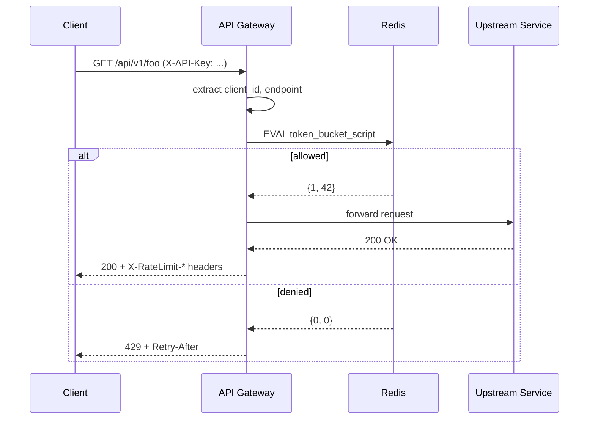
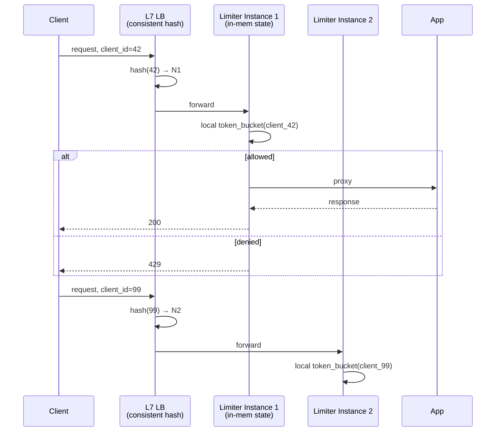

# Rate Limiter

## Source

- Классическая задача System Design interview.
- Референсы:
  - Alex Xu — "System Design Interview Vol. 1", Chapter 4.
  - Stripe Engineering — [Scaling your API with rate limiters](https://stripe.com/blog/rate-limiters).
  - Cloudflare blog — distributed rate limiting в edge.

## Problem

Спроектировать сервис, ограничивающий количество запросов в единицу времени:
- **Per user** (по `user_id` / `api_key`).
- **Per IP** (для unauthenticated requests).
- **Per endpoint** (разные лимиты для разных API).
- **Global** (защита от DDoS).

API:
```
check_limit(client_id, endpoint) → {allowed: bool, retry_after: int, remaining: int}
```

Возвращается клиенту как HTTP `429 Too Many Requests` с `Retry-After` header.

## Requirements

### Functional
- Поддержка multiple rate limit правил (user, IP, endpoint, global).
- Конфигурируемые лимиты (через config / БД / API).
- Возврат метаданных (`remaining`, `reset_at`) клиенту.
- Поддержка различных алгоритмов (token bucket, sliding window).

### Non-functional

| Метрика                | Требование                              |
|------------------------|------------------------------------------|
| Latency overhead       | **< 5 ms** на запрос (P99)              |
| Throughput             | 100k–1M check/sec                       |
| Accuracy               | 95-99% (approximate допустимо)          |
| Availability           | 99.99% (выше чем у защищаемого сервиса) |
| Distributed            | Работает в кластере из N инстансов      |
| Fail mode              | Fail-open для не-критичных API         |

Архитектурные соображения:
- **Latency budget жёсткий** — rate limiter в hot path каждого запроса.
- **Memory budget** — миллионы активных клиентов × state.
- **Подходит как middleware** в API Gateway / Service Mesh / приложении.

Алгоритмическая сторона полностью разобрана в [[rate-limiting-algorithms]].

---

## Solution A: Centralized Redis-based Token Bucket

### Идея

Все инстансы API Gateway / приложения проверяют лимит в общем Redis-кластере. Token bucket алгоритм реализован атомарным Lua-скриптом. Один источник правды → точные глобальные лимиты.

### Компоненты

- **API Gateway** / app middleware — entry point.
- **Rate Limiter Service** (опционально отдельный сервис, либо встроенная библиотека).
- **Redis Cluster** — хранилище state'а.
- **Config Service** — конфигурация лимитов (per endpoint, per tier).
- **Метрики / алерты** — Prometheus / Grafana.

### Алгоритм (Lua в Redis)

```lua
-- KEYS[1] = "rl:user:42:endpoint:/api/v1/foo"
-- ARGV[1] = capacity, ARGV[2] = refill_rate, ARGV[3] = now_ms
local state = redis.call('HMGET', KEYS[1], 'tokens', 'last_refill')
local tokens = tonumber(state[1]) or ARGV[1]
local last_refill = tonumber(state[2]) or ARGV[3]

-- refill
local elapsed = (ARGV[3] - last_refill) / 1000
tokens = math.min(ARGV[1], tokens + elapsed * ARGV[2])

if tokens >= 1 then
    tokens = tokens - 1
    redis.call('HMSET', KEYS[1], 'tokens', tokens, 'last_refill', ARGV[3])
    redis.call('EXPIRE', KEYS[1], 3600)  -- TTL
    return {1, tokens}  -- allowed, remaining
else
    return {0, 0}  -- denied
end
```

Lua-скрипт выполняется атомарно → нет race conditions.

### Поток запроса



### Failure handling

**Redis недоступен:**
- **Fail-open** (default для read-paths): пропустить запрос, инкрементировать метрику `rl_redis_unavailable`.
- **Fail-closed** для критичных операций (платежи): вернуть 503.
- Circuit breaker между Gateway и Redis (рекомендуется): после N подряд неудач — перестать дёргать Redis на M секунд, fall back на локальный лимит.

### Используемые паттерны

- [[rate-limiting-algorithms]] — token bucket в основе.
- [[caching-strategies]] — Redis как cache (state живёт с TTL).
- [[consistent-hashing]] — внутри Redis Cluster для шардинга ключей.

### Плюсы

- **Глобально точный лимит** — все инстансы видят один state.
- **Простая операционная модель** — единый Redis-кластер.
- **Гибко** — можно поменять алгоритм в Lua-скрипте без передеплоя сервисов.
- **Стандарт в индустрии** — Stripe, GitHub, AWS используют этот подход.

### Минусы

- **Network RTT overhead** — каждый запрос = 1 RTT в Redis (~1ms в DC, до 10ms cross-AZ).
- **Redis = SPOF** при наивной конфигурации; нужен кластер с репликацией + sentinel.
- **Hot keys** — очень активный клиент (`celebrity user`) создаёт нагрузку на один Redis-шард.
- **Cost** — Redis cluster дорогой при высоких QPS.

---

## Solution B: Sharded Local Rate Limiter (Consistent Hashing)

### Идея

Каждый клиент маршрутизируется на конкретный инстанс через `hash(client_id) → instance` ([[consistent-hashing]]). Этот инстанс — единственный owner state'а клиента, держит token bucket в **локальной памяти**. Нет Redis.

### Компоненты

- **L7 Load Balancer** с consistent hashing routing (например, Envoy с `ring_hash`, NGINX upstream `hash`, AWS ALB target group).
- **N инстансов** rate limiter — каждый держит state in-memory.
- **Config Service** — конфигурация лимитов (без shared state).

### Поток запроса



### Используемые паттерны

- [[rate-limiting-algorithms]] — token bucket / sliding window counter в памяти.
- [[consistent-hashing]] — sticky routing client → instance.

### Плюсы

- **Околонулевой latency overhead** — state в RAM текущего процесса.
- **Высокий throughput** — отсутствие сетевых вызовов.
- **Линейный scale** — добавляем инстансы → каждый берёт часть клиентов.
- **Дешевле** — нет Redis-кластера.

### Минусы

- **Rebalancing на add/remove ноды** — часть клиентов «теряет» state, эффективно получает свежее ведро (короткий all-clear burst).
- **Hot client** все ещё бьёт в один инстанс — нужно отдельно решать (replicate hot keys, fallback на secondary).
- **Sticky routing требует L7 LB** — добавляет операционную сложность.
- **State теряется при рестарте** — пользователи получают reset. Можно минимизировать через graceful shutdown с снепшотом, но усложняет.
- **Multi-region сложнее** — каждый регион имеет свой кольцо; глобальный лимит требует доп. координации.

---

## Trade-offs

| Критерий              | A: Centralized Redis        | B: Sharded Local            |
|-----------------------|-----------------------------|------------------------------|
| Latency overhead      | ~1–5 ms (RTT Redis)         | **< 0.1 ms** (in-mem)        |
| Throughput per node   | ~50k req/sec                | **~500k+ req/sec**           |
| Accuracy лимита       | **Точная глобальная**       | Точная пока routing стабилен |
| Operational сложность | Redis cluster ops           | L7 LB с consistent hashing   |
| Cost                  | Высокий (Redis)             | Низкий                       |
| Failure blast radius  | Redis down → fail-open всем | Один инстанс down → его clients |
| State persistence     | В Redis (TTL)               | В RAM (теряется)             |
| Hot client mitigation | Sharding в Redis Cluster    | Сложнее (нужны replicas)     |
| Multi-region          | Cross-region Redis (медленно)| Per-region кольца           |

**Когда выбрать A:** глобальные лимиты обязательны (биллинг, SLA), не очень высокий QPS, готов платить за Redis.

**Когда выбрать B:** очень высокий QPS (100k+ per instance), допустим небольшой drift при rebalancing, многомиллионная база клиентов.

**Production реальность:** часто **hybrid** — локальный per-instance с быстрым fallback + периодический sync в Redis для глобальной точности. Cloudflare использует подобный подход.

---

## Key Takeaways

1. **Rate limiter — в hot path каждого запроса.** Latency budget жёсткий, выбор алгоритма критичен.

2. **Token Bucket — default выбор для API.** Балансирует average-rate ограничение и burst tolerance. Используется Stripe, AWS, GitHub. См. [[rate-limiting-algorithms]].

3. **Sliding Window Counter** — лучший компромисс между fixed window (плохо) и sliding log (дорого). Approximate, но достаточно для большинства задач.

4. **Distributed deployment — главный вопрос.** Centralized Redis vs sharded local — выбор зависит от QPS, latency budget, требований к точности.

5. **Иерархические лимиты обязательны.** Per-user + per-IP + per-endpoint + global. Один лимит — недостаточно.

6. **Возвращать стандартные headers.** `429`, `Retry-After`, `X-RateLimit-*`. Клиент должен уметь корректно отступить.

7. **Fail-open vs fail-closed — осознанный выбор.** Default fail-open для read-paths, fail-closed для платежей и критичных операций.

8. **Hot key — отдельная проблема.** Шардинг не помогает, если 90% нагрузки от одного клиента. Нужны replicas, two-level limit, или прямой DDoS защита.

## Open Questions

- **Adaptive rate limiting** — динамическое изменение лимитов на основе нагрузки downstream (back-pressure из БД).
- **Cost-based limiting** — учитывать «стоимость» запроса (read vs write, размер payload), а не штуки.
- **Distributed coordination на больших scale** — sync между регионами без сильной consistency.
- **Anti-fraud integration** — связка с antifraud для прогрессивного снижения лимитов «подозрительным» клиентам.
- **GraphQL / batch APIs** — что лимитировать (запросы или операции внутри)?

## References

- Stripe Engineering — [Scaling your API with rate limiters](https://stripe.com/blog/rate-limiters).
- Cloudflare — [Counting things, a lot of different things](https://blog.cloudflare.com/counting-things-a-lot-of-different-things/).
- Alex Xu — "System Design Interview Vol. 1", Chapter 4: Design a rate limiter.
- Envoy proxy — [Rate Limit Service](https://www.envoyproxy.io/docs/envoy/latest/intro/arch_overview/other_features/rate_limit) docs.
- Связанные паттерны: [[rate-limiting-algorithms]], [[caching-strategies]], [[consistent-hashing]].
