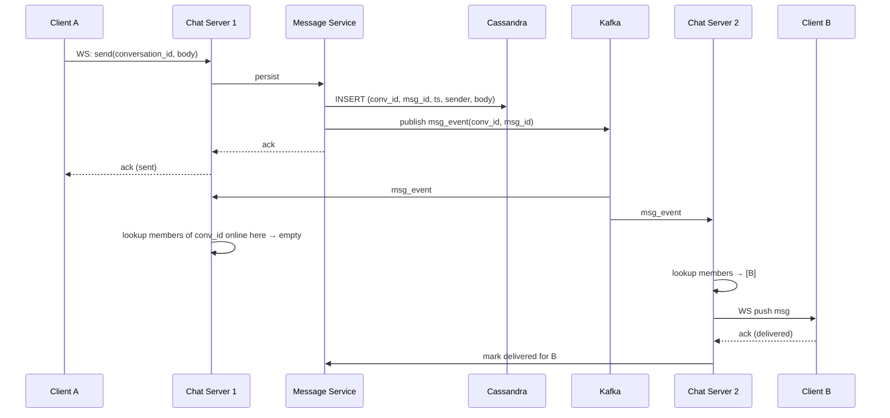
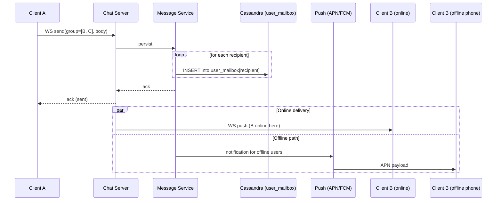

# Chat System (WhatsApp / Slack-like)

## Source

- Классическая задача System Design interview.
- Референсы:
  - Alex Xu — "System Design Interview Vol. 1", Chapter 12.
  - WhatsApp Architecture (post-2014, Erlang + FreeBSD, single-server 2M connections).
  - Discord — [How Discord Stores Billions of Messages](https://discord.com/blog/how-discord-stores-billions-of-messages).
  - Slack — публикации о shared channels.

## Problem

Спроектировать чат-систему, поддерживающую:
- **1-to-1 messaging** (direct messages).
- **Group chats** (от 3 до сотен/тысяч участников).
- **Real-time delivery** для online-пользователей.
- **Push notifications** для offline.
- **Message history** и pagination.
- **Online presence** (online / offline / last seen).
- **Delivery receipts**: sent / delivered / read (опционально).

Вне scope (для простоты): E2E encryption, voice/video, file attachments deep-dive.

API (упрощённо):
```
POST   /messages          { conversation_id, body }
GET    /conversations/:id/messages?before=<msg_id>&limit=50
GET    /conversations
WS     /ws                (real-time bidi)
```

## Requirements

### Functional
- Послать / получить сообщение.
- Group chats: create, add/remove members.
- Получать pushed messages в realtime, если online.
- Хранить историю.
- Presence indicator.
- (Опц.) read receipts, typing indicators.

### Non-functional

| Метрика                | Значение                                            |
|------------------------|------------------------------------------------------|
| Users                  | 100M DAU (WhatsApp = 2B, Slack ~20M)                |
| Messages/day           | 100B (WhatsApp-scale)                                |
| Messages/sec average   | ~1.2M                                                |
| Messages/sec peak      | 10–100x average → 10M+/sec на NYE                   |
| Delivery latency       | **P99 < 500 ms** для online                         |
| Storage retention      | 5+ лет в архиве                                      |
| Group size median      | 10–50 человек; max в WhatsApp 1024                  |
| Availability           | 99.99%                                              |
| Durability             | **0 потерь сообщений**                              |
| Encryption             | E2E (вне scope)                                     |

Архитектурные приоритеты:
- **Persistent connections** для realtime — обязательно. См. [[long-lived-connections]].
- **Storage write-heavy** — выбор БД должен соответствовать.
- **Fanout** для group — стратегия зависит от N. См. [[fanout-strategies]].

---

## Solution A: Conversation-Centric (Slack/Discord-style)

### Идея

Сообщения хранятся **один раз** per conversation/channel. Все участники читают из одного места. Fanout — pub/sub broadcast online-участникам. Простая модель для **средних** групп и channels.

### Компоненты

- **API Gateway** + **Auth Service**.
- **Chat Server** (WebSocket terminators) — N инстансов, держат persistent connections.
- **Connection Registry** (Redis) — `user_id → server_id` для routing.
- **Message Service** (write-side) — принимает сообщения, пишет в БД, публикует событие.
- **Cassandra / Scylla** — message store, time-series by `(conversation_id, message_id)`.
- **Internal Bus (Kafka / Redis Pub/Sub)** — fanout событий между Chat Servers.
- **Presence Service** (Redis) — online status с TTL.
- **Notification Service** — push для offline (APN, FCM).
- **Message Search** (Elasticsearch — опц).

### Поток отправки



### Connection routing

- Client при connect авторизуется → Chat Server регистрирует `user_id → server_id` в Redis (TTL 60s, refresh by heartbeat).
- Все Chat Servers подписаны на Kafka topic `messages` через consumer-group.
- Каждый сервер при получении события смотрит, кто из online-участников **на нём** → пушит.
- Cross-server routing не нужен — broadcast через Kafka.

### Storage schema (Cassandra)

```
TABLE messages (
    conversation_id  UUID,
    message_id       TIMEUUID,    -- sortable by time
    sender_id        UUID,
    body             TEXT,
    created_at       TIMESTAMP,
    PRIMARY KEY (conversation_id, message_id)
) WITH CLUSTERING ORDER BY (message_id DESC);

TABLE conversation_members (
    user_id          UUID,
    conversation_id  UUID,
    last_read_msg_id TIMEUUID,
    PRIMARY KEY (user_id, conversation_id)
);
```

Время-сортировка ключа → последние сообщения в начале партиции. Pagination через `WHERE conversation_id = ? AND message_id < ? LIMIT 50`.

### Используемые паттерны

- [[long-lived-connections]] — WebSocket для realtime.
- [[fanout-strategies]] — Pub/Sub broadcast через Kafka.
- [[consistent-hashing]] — внутри Cassandra (partitioning by conversation_id).
- [[event-driven-architecture]] — Kafka как бэкбон.

### Плюсы

- **Одна копия сообщения** — экономия storage.
- **Простая модель** — все читают из одного места.
- **Простой message ordering** в рамках conversation (timeuuid).
- **Search легче** — индексируется один раз.

### Минусы

- **Fanout через Kafka** — каждое сообщение читают N Chat Servers, даже если у них нет нужных online-users → waste bandwidth.
- **Не оптимально для очень больших каналов** (10k+ участников) — pub/sub нагрузка растёт.
- **Read-heavy ленты participations** — каждый client запрашивает свои conversations отдельно.

---

## Solution B: User-Mailbox (WhatsApp/Messenger-style)

### Идея

Каждый пользователь имеет персональный **mailbox** в БД. Сообщение от A к B — вставка в mailbox B. Group из 50 человек — 50 вставок (fanout-on-write). Offline пользователь получит при следующем onlineplus push.

### Компоненты

- Те же что в A, но Message Service делает **N вставок** при fanout вместо одной.
- **Mailbox storage** (Cassandra) с partitioning by `user_id` (не conversation_id).
- Mobile-first: тяжёлая интеграция с push notifications.

### Storage schema

```
TABLE user_mailbox (
    user_id          UUID,
    message_id       TIMEUUID,
    conversation_id  UUID,
    sender_id        UUID,
    body             TEXT,
    delivered_at     TIMESTAMP,    -- when client confirmed
    PRIMARY KEY (user_id, message_id)
) WITH CLUSTERING ORDER BY (message_id DESC);
```

При логине клиент: `SELECT * FROM user_mailbox WHERE user_id = ? AND message_id > last_seen` — догоняет очередь.

### Поток отправки



### Используемые паттерны

- [[long-lived-connections]] — WebSocket.
- [[fanout-strategies]] — fanout-on-write для groups.
- [[consistent-hashing]] — partitioning user_mailbox by user_id.

### Плюсы

- **Каждый клиент читает только свой mailbox** — простой single-partition read.
- **Catch-up при reconnect тривиален** — `WHERE message_id > last_seen`.
- **Хорошо для mobile** — клиент тянет только свои сообщения, batching по user_id efficient.
- **Push для offline** встраивается естественно.

### Минусы

- **Write amplification** — group of 50 = 50 inserts. На пределе при больших groups.
- **Storage** — каждое сообщение хранится N раз (можно митигировать: mailbox содержит ссылку на shared message store).
- **Group >1k участников** болезненно. WhatsApp в group >1024 не пускает.
- **Search** усложняется (индекс per-user).

---

## Trade-offs

| Критерий                    | A: Conversation-Centric  | B: User-Mailbox         |
|-----------------------------|---------------------------|--------------------------|
| Write cost (group N=50)     | **1 + Kafka publish**     | 50 inserts               |
| Read cost (1 conversation)  | partition scan by conv    | scan user_mailbox + filter |
| Storage per message         | **1 copy**                | N copies                 |
| Realtime fanout overhead    | Kafka к всем Chat Servers | direct per-user route    |
| Cold start (login)          | reload N conversations    | **read mailbox tail**    |
| Очень большие groups (10k+) | возможно                  | плохо                    |
| Offline delivery            | через unread state        | **естественный mailbox** |
| Search                      | проще                     | сложнее                  |
| Mobile-first                | средне                    | **отлично**              |

**Когда A:** Slack/Discord-like — channels десятки–сотни членов, web-first, search важен.
**Когда B:** WhatsApp/Messenger-like — mobile-first, очень много active users, groups средние, push critical.

**Production реальность:** часто **hybrid** — small/medium groups через mailbox (B), huge channels (Slack workspaces) через conversation-centric (A) с lazy load.

---

## Additional concerns

### Message ordering
- В пределах conversation — TIMEUUID гарантирует ordering.
- Cross-conversation ordering не нужен.
- Vector clocks / Lamport — нужны редко, обычно server-time достаточно.

### Delivery receipts (sent / delivered / read)
- **Sent** — клиент получил ack от сервера.
- **Delivered** — recipient client получил (acknowledge через WS).
- **Read** — recipient видел (явный event от клиента).

Каждый статус — отдельное событие, обновление в таблице state'а.

### Typing indicators / presence broadcasts
- Высокая частота, не нужны durability.
- Через Redis Pub/Sub или ephemeral WebSocket-only — **не** хранить в БД.

### Push notifications для offline
- При отправке проверять presence; offline recipient → enqueue push.
- Через APN / FCM (mobile) с rate limiting (Apple/Google ограничения).
- Деduplicate если клиент onbline-ится до того, как push дошёл.

### Hot conversation
- Очень активный group → один partition в Cassandra перегружен.
- Митигация: sub-partition by time bucket (`conversation_id + day`), либо two-level partitioning.

---

## Key Takeaways

1. **Persistent connections — основа real-time chat.** WebSocket + connection registry + sticky-ish routing. См. [[long-lived-connections]].

2. **Fanout strategy зависит от group size.** Малые/средние groups — fanout-on-write (mailbox). Огромные channels — store-once + pull. См. [[fanout-strategies]].

3. **Cassandra/Scylla — стандартный выбор** для message store. Write-heavy, time-sortable, partitioned. Discord (trillions сообщений) использует ScyllaDB.

4. **Push notifications для offline** — отдельная подсистема (APN/FCM), интегрируется через события.

5. **Presence — отдельный сервис на Redis** с TTL и heartbeat. Не хранить в основной БД.

6. **Hot partitions** — главная боль при scale. Sub-partitioning по времени или sharding hot conversations.

7. **Message ordering** — TIMEUUID / server timestamp в пределах conversation. Distributed clocks (vector) обычно overkill.

8. **Mobile vs Web profile** — драматически меняют архитектуру. Mobile: батареи, push, mailbox. Web: WebSocket, channels, search.

## Open Questions

- **E2E encryption** — Signal Protocol, key exchange, group key rotation.
- **Multi-device sync** — sync read state, message echo (sender также получает свой message на других устройствах).
- **Voice/Video calls** — отдельный signaling + media stack (WebRTC, SFU).
- **Federation** (Matrix-like) — cross-server messaging.
- **Message editing / deletion** — distribution of edit events, audit trail.
- **GDPR / compliance** — message retention policies, right to be forgotten при immutable storage.

## References

- Alex Xu — "System Design Interview Vol. 1", Chapter 12: Design a chat system.
- Discord — [How Discord Stores Billions of Messages](https://discord.com/blog/how-discord-stores-billions-of-messages) (Cassandra → ScyllaDB).
- WhatsApp — Engineering посты про Erlang/FreeBSD стек.
- Slack — [Real Time Messaging API](https://api.slack.com/rtm), архитектура shared channels.
- Связанные паттерны: [[long-lived-connections]], [[fanout-strategies]], [[consistent-hashing]], [[event-driven-architecture]].
