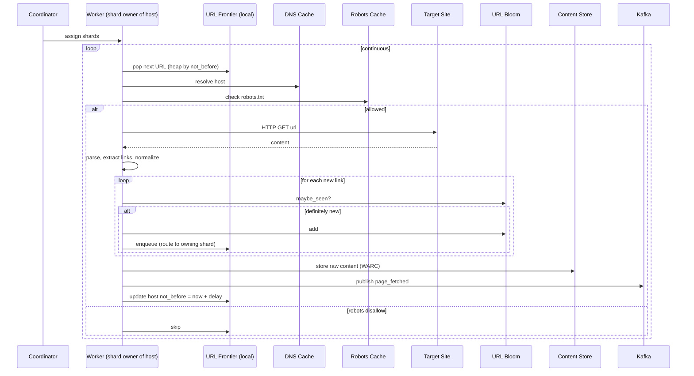
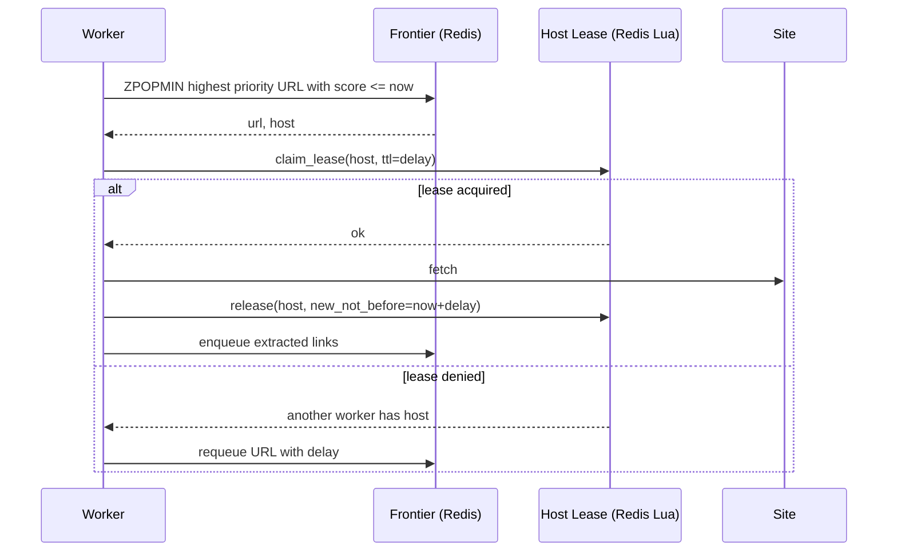

# Web Crawler (Googlebot / Common Crawl)

## Source

- Классическая задача System Design interview.
- Референсы:
  - Alex Xu — "System Design Interview Vol. 1", Chapter 9.
  - Heydon & Najork — "Mercator: A Scalable, Extensible Web Crawler" (1999).
  - Common Crawl — publicly documented architecture.
  - Apache Nutch — open-source реализация.

## Problem

Спроектировать распределённый web crawler, который:
- Обходит web, начиная с seed URLs.
- Скачивает HTML / контент.
- Извлекает ссылки и продолжает обход (BFS).
- Соблюдает `robots.txt` и politeness.
- Дедуплицирует уже виденные URLs и контент.
- Поставляет загруженный контент в downstream (search index, archive, ML pipeline).

API не требуется (offline pipeline), но может быть admin interface:
```
POST /seeds            { urls: [...] }
GET  /status           overall stats
GET  /domains/:host    politeness state, queue size
```

## Requirements

### Functional
- Принимать seed URLs.
- Скачивать страницы по приоритету.
- Парсить, извлекать новые links.
- Сохранять content + metadata.
- Уважать `robots.txt` и `Crawl-delay`.
- Detect duplicates (exact и near-duplicate).
- Поддержка нескольких content types (HTML, PDF, images — основное HTML).

### Non-functional

| Метрика                | Значение                                  |
|------------------------|--------------------------------------------|
| Scale                  | 10B+ URLs (Common Crawl: ~3B per crawl)   |
| Throughput             | 1k–10k pages/sec global                    |
| Politeness             | Default 1-2 sec/host, robots.txt-respect  |
| Freshness              | Re-crawl popular sites раз в дни/часы     |
| Storage                | Petabytes (HTML compressed)                |
| Crawl latency per page | Не критично (batch)                       |
| Robustness             | Восстановление после сбоя без потерь URL  |

Архитектурные приоритеты:
- **Politeness** — главный constraint, иначе ban.
- **Dedup** — без него обходим один и тот же контент бесконечно.
- **Persistent state** — нельзя терять frontier.
- **Distributed coordination** — миллионы хостов, N workers.

---

## Solution A: Distributed crawler with sharded frontier

### Идея

Архитектура Mercator-style с двухуровневым [[url-frontier]] (front queues по приоритету + back queues per host). Frontier шардирован по `hash(host)` через [[consistent-hashing]]: каждый host «живёт» на одном инстансе. Дедупликация — Bloom Filter per shard + central canonical store.

### Компоненты

- **Seeder / Admin** — приём seed URLs, manual injection.
- **Crawl Worker** — N инстансов:
  - Локальная часть frontier (для своих host'ов).
  - HTTP fetcher (async I/O, pool of connections).
  - HTML parser + link extractor.
  - URL normalizer + dedup check.
  - Content writer в blob storage.
- **Frontier Store** (RocksDB / SQLite per shard) — persistent очередь URLs, back queues state.
- **URL Bloom Filter** — per shard, in-memory + persisted snapshots.
- **DNS Cache** — long-TTL cache (часто per worker).
- **Robots Cache** (Redis) — `robots.txt` per host с TTL.
- **Content Store** (S3 / HDFS / blob) — raw HTML + WARC-формат.
- **Metadata DB** (Cassandra / HBase) — `url → (content_hash, fetched_at, http_status, ...)`.
- **Content Dedup** — SimHash + LSH index для near-duplicate.
- **Kafka** — события `page_fetched(url, content_id)` для downstream consumers.
- **Coordinator** — мониторинг, rebalancing, admin.

### Поток crawling



### Storage layout

**Frontier (RocksDB):**
```
key:   <shard_id>:<host>:<priority>:<url_hash>
value: { url, depth, discovered_at, retries }
```

**Metadata (Cassandra):**
```
CREATE TABLE url_metadata (
    url_hash       BLOB PRIMARY KEY,
    url            TEXT,
    host           TEXT,
    content_hash   BLOB,
    simhash        BIGINT,
    fetched_at     TIMESTAMP,
    http_status    INT,
    content_length INT
);

CREATE TABLE simhash_lsh_index (
    bucket_key  TEXT,         -- LSH bucket
    simhash     BIGINT,
    url_hash    BLOB,
    PRIMARY KEY (bucket_key, simhash)
);
```

### Используемые паттерны

- [[url-frontier]] — основа очереди.
- [[content-deduplication]] — Bloom + SimHash.
- [[consistent-hashing]] — шардинг по host.
- [[event-driven-architecture]] — Kafka для downstream.

### Плюсы

- **Politeness invariant** соблюдается автоматически (один host = один shard).
- **Линейный scale** — добавляем workers.
- **Persistent frontier** — переживает рестарт.
- **Distributed dedup** — Bloom per shard, central content dedup через SimHash + LSH.
- **Стандартный production design** — Common Crawl и Apache Nutch используют этот подход.

### Минусы

- **Hot host** перегружает один worker (huge site целиком на одном инстансе).
- **Rebalancing** при add/remove worker — миграция back queues по [[consistent-hashing]].
- **Coordinator = SPOF** при наивной конфигурации.
- **DNS-зависимость** — DNS resolution в hot path.
- **`robots.txt` overhead** — нужен агрессивный кэш.

---

## Solution B: Centralized frontier + stateless workers

### Идея

Один shared frontier (Redis-cluster / Kafka topic per priority). Stateless workers вытаскивают URL'ы. Politeness обеспечивается через **claim-with-lease** на host: worker «арендует» host на N секунд, кладёт обратно после fetch + delay.

### Компоненты

- **Frontier**: Redis sorted set per priority, score = `not_before` timestamp.
- **Host Lease Service** — atomic claim + release через Redis Lua.
- **Stateless workers** — пуллят URL, выполняют fetch, отдают результат.
- Остальное аналогично A.

### Поток



### Используемые паттерны

- [[url-frontier]] — реализация через Redis вместо local RocksDB.
- [[content-deduplication]] — Bloom Filter shared (Redis SETBIT) или distributed.
- [[event-driven-architecture]].

### Плюсы

- **Stateless workers** — простой autoscaling.
- **Нет rebalancing** при изменении числа workers.
- **Простая модель ownership** (claim-release).

### Минусы

- **Centralized frontier = bottleneck** при высоком QPS.
- **Lease overhead** — лишний round-trip per URL.
- **Hot host** — все workers пытаются claim'ить один популярный host → contention на lease.
- **Слабее для очень большого scale** — Common Crawl level требует sharding.

---

## Trade-offs

| Критерий                 | A: Sharded local frontier  | B: Centralized + stateless |
|--------------------------|----------------------------|----------------------------|
| Throughput per worker    | **высокий** (local state)  | средний (Redis RTT)        |
| Scale (URLs)             | **10B+ realistic**         | до 1-10B comfortably       |
| Worker stateful?         | да (own shards)            | нет                        |
| Rebalancing complexity   | средняя                    | **нет**                    |
| Hot host handling        | страдает (один shard)      | страдает (lease contention)|
| Politeness invariant     | **автомат**                | через lease (хрупче)       |
| Persistence              | RocksDB                    | Redis (с persistence)      |
| Operational сложность    | средняя                    | проще                      |

**Когда A:** очень большой scale (Google, Common Crawl).
**Когда B:** средний scale, simplicity, autoscaling важнее.

---

## Подробности

### `robots.txt` handling

- Cache per host с TTL ~24h.
- При первом запросе host'а — fetch `/robots.txt`.
- Парсить User-agent rules, `Crawl-delay`.
- Sitemap извлекать как high-priority seed.
- Если `robots.txt` недоступен — conservative behavior (low rate).

### Re-crawl policy

Sites меняются с разной скоростью. Стратегии:
- **Static** — каждые N дней независимо.
- **Adaptive** — track change rate per URL, расписание based on it.
- **Importance-based** — popular pages чаще.

Хранить `next_crawl_at` в metadata, инжектировать в frontier когда настанет время.

### Trap detection

- **Crawler traps** — динамически генерируемые URLs (calendar pages, infinite query parameters).
- Mitigation: max depth per host, max URLs per host, fuzzy URL similarity (одинаковая структура с разными параметрами).

### Distributed fault tolerance

- **Worker crash** — frontier persistent, переподнимется и продолжит.
- **Coordinator crash** — Raft / ZK для leader election.
- **Bloom Filter consistency** — snapshots на S3 каждые N минут.

### Content extraction (после download)

Отдельный pipeline:
- Parse HTML → DOM → extract text + structure.
- Language detection, tokenization, stemming.
- Index в Elasticsearch / Lucene.
- Feed в downstream ML pipeline.

Этот pipeline — out of scope для frontier, читает события из Kafka.

### Adversarial sites

- Detect anti-crawler (Cloudflare challenge, captcha) → respect или escalate.
- Rotate User-Agent (если контент закрыт specifically для известных crawlers, но это серая зона этики).
- IP rotation (multi-region).

---

## Key Takeaways

1. **Web crawler = distributed BFS over the web graph + politeness constraint.** URL Frontier — основной механизм. См. [[url-frontier]].

2. **Politeness > raw throughput.** Без politeness быстро банят. Per-host rate limit обязателен.

3. **Dedup критичен.** Без Bloom Filter — бесконечный цикл. Без near-dup detection — индекс набивается мусором. См. [[content-deduplication]].

4. **Sharding by host** — стандартный подход для big scale. Politeness invariant получается автоматически.

5. **Frontier persistent** — RocksDB / LMDB локально, snapshots на S3. Worker crash не должен терять прогресс.

6. **`robots.txt` — обязательный gate.** Cache агрессивно, иначе DNS + extra fetches убивают throughput.

7. **Content store ≠ metadata store.** Сырой HTML — в blob (S3/HDFS, WARC формат). Метаданные — в KV/columnar (Cassandra).

8. **Crawler traps существуют.** Max depth + structural similarity detection обязательны.

## Open Questions

- **Distributed coordination и leader election** — Raft/ZK для координатора, deep dive.
- **JS-rendering** — современные сайты SPA → headless browser (Puppeteer/Playwright). Дорогой, отдельная подсистема.
- **Politeness без host overlap** — что если 100 доменов на одном IP (CDN)? Per-IP throttling.
- **Multi-region crawling** — обходить ru-сайты с ru-IP, etc.
- **Ethics & legal** — fair use, opt-out beyond robots.txt, GDPR.
- **Real-time vs batch** — push vs pull integration с downstream.

## References

- Alex Xu — "System Design Interview Vol. 1", Chapter 9: Design a web crawler.
- Heydon & Najork — [Mercator: A Scalable, Extensible Web Crawler](http://www.cindoc.csic.es/cybermetrics/pdf/68.pdf) (1999).
- Manku, Jain, Sarma — [Detecting Near-Duplicates for Web Crawling](http://www.wwwconference.org/www2007/papers/paper215.pdf) (Google).
- Common Crawl — [Architecture overview](https://commoncrawl.org/).
- Apache Nutch — production-grade open-source crawler.
- Связанные паттерны: [[url-frontier]], [[content-deduplication]], [[consistent-hashing]], [[event-driven-architecture]].
