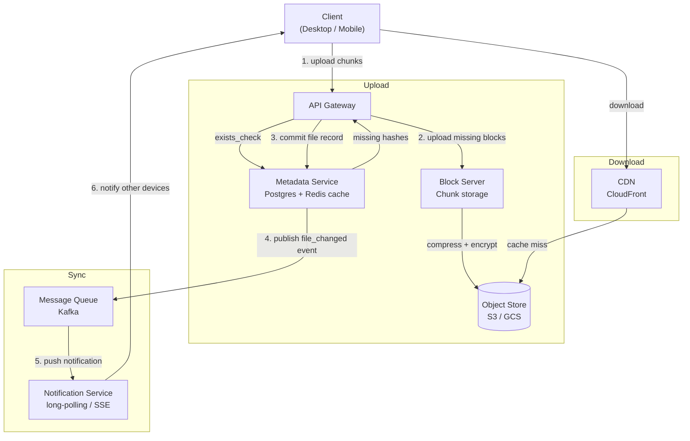

# 008 — Distributed File Storage

## Source

Alex Xu, *System Design Interview Vol. 1*, Chapter 15. Аналоги: Dropbox, Google Drive, OneDrive.

---

## Problem

Спроектировать облачное хранилище файлов: пользователи загружают, скачивают, редактируют файлы с любого устройства. Изменения синхронизируются автоматически. Поддержка совместного доступа и история версий.

---

## Requirements

### Functional

- Загрузка и скачивание файлов (любые типы, до 50 GB).
- Автоматическая синхронизация между устройствами одного пользователя.
- История версий (восстановление предыдущих версий файла).
- Совместный доступ (share link, share с конкретным пользователем).
- Поддержка offline-режима: файлы доступны без интернета, изменения синхронизируются при подключении.
- Конфликт при одновременном редактировании: разрешение (conflict copy / last-write-wins).

### Non-Functional

- Durability файлов: 11 девяток (99.999999999%) — как Amazon S3.
- Availability: 99.99%.
- Strong consistency для метаданных (в пределах одного пользователя — никаких потерянных обновлений).
- Eventual consistency для синхронизации между устройствами.
- Поддержка файлов до 50 GB, delta sync (не перегружать весь файл при малом изменении).

### Scale (back-of-envelope)

| Метрика | Значение |
|---|---|
| Total users | 500M |
| DAU | 50M |
| Avg storage per user | 10 GB |
| Total storage | 5 PB |
| Daily uploads | 10M файлов |
| Avg file size | 500 KB |
| Daily upload traffic | ~5 TB |
| Peak upload RPS | ~1 000 |

---

## Solution A — Dedicated Block Server + Metadata DB

### Идея

Классическая Dropbox-архитектура. Клиент делит файл на блоки (chunks), вычисляет хэши, загружает только изменившиеся блоки на **Block Server**. Метаданные (дерево файлов, версии, ссылки блоков) хранятся отдельно в **Metadata Service**. Уведомления об изменениях — через **Notification Service** (long polling).

### Architecture



### Upload Flow (delta sync)

```
sequenceDiagram
    participant C as Client
    participant API as API Gateway
    participant M as Metadata Service
    participant BS as Block Server

    C->>C: split file into chunks (4 MB blocks)
    C->>C: compute SHA256 per chunk
    C->>API: PUT /files {path, size, chunks: [hash_0, hash_1, ...]}
    API->>M: exists_check([hash_0, hash_1, ...])
    M-->>API: missing: [hash_1]   (hash_0 already stored)
    API-->>C: upload_required: [hash_1]
    C->>BS: POST /blocks/hash_1 {data}
    BS->>BS: compress (zstd) + encrypt (AES-256)
    BS-->>C: 201 OK
    C->>API: PATCH /files/commit {version_id}
    API->>M: write file record + increment version
    M->>M: publish file_changed event
    M-->>C: 200 OK {file_id, version}
```

Клиент передаёт только **отсутствующие** блоки. Если файл изменился частично — только изменившиеся чанки. При переименовании без изменения контента — нет передачи данных вообще.

### Block Server internals

```
Block Server Pipeline
    │
    ├─ Receive chunk (POST /blocks/{hash})
    │
    ├─ Verify: SHA256(data) == hash  (tamper check)
    │
    ├─ Compress: zstd (~50–70% compression for text/documents)
    │
    ├─ Encrypt: AES-256-GCM, per-user key from KMS
    │
    └─ Store to Object Store (S3)
         key = "blocks/{hash}"   (CAS addressing)
```

### Metadata DB schema

```sql
-- Файлы пользователей
CREATE TABLE files (
    file_id     UUID PRIMARY KEY,
    owner_id    UUID NOT NULL,
    path        TEXT NOT NULL,           -- /Documents/report.pdf
    is_deleted  BOOLEAN DEFAULT FALSE,
    created_at  TIMESTAMPTZ,
    updated_at  TIMESTAMPTZ
);

-- Версии файла (append-only)
CREATE TABLE file_versions (
    version_id   UUID PRIMARY KEY,
    file_id      UUID REFERENCES files,
    version_num  INT NOT NULL,
    size_bytes   BIGINT,
    chunks       JSONB,                  -- [{hash, size, order}]
    created_at   TIMESTAMPTZ,
    device_id    UUID
);

-- Совместный доступ
CREATE TABLE shares (
    share_id    UUID PRIMARY KEY,
    file_id     UUID REFERENCES files,
    shared_with UUID,                    -- NULL = public link
    link_token  TEXT UNIQUE,
    permission  TEXT CHECK (permission IN ('read', 'write')),
    expires_at  TIMESTAMPTZ
);
```

### Sync (Notification Service)

```
Device A изменил файл:
    Metadata Service → publish {user_id, file_id, version_id} to Kafka

Device B (клиент пользователя) подключён через long-polling:
    GET /sync/changes?since=<last_cursor>
    → poll timeout 30 s
    → при событии в Kafka → немедленный ответ

Device B получает список changed_files → запрашивает missing chunks → обновляет локальную копию
```

Long-polling vs WebSocket: long-polling проще с прокси и NAT, достаточно для sync (не real-time чат). Для мобильных клиентов — push notification через APNs/FCM вместо постоянного соединения.

### Conflict Resolution

```
Device A и Device B редактируют файл_X offline:
    Device A сохраняет version_3 (base: version_2)
    Device B сохраняет version_3 (base: version_2) — конфликт!

Стратегия: последний записанный выигрывает (last-write-wins):
    Первый commit (version_3) принимается как version_3.
    Второй commit → сервер видит version conflict →
        создаёт "Conflict Copy" файла:
        "report (Conflict Copy - Device B - 2026-05-23).pdf"
        с version_3b

Пользователь вручную разрешает конфликт.
```

Для текстовых документов (Google Docs-подход) — operational transforms или CRDTs, но это вне scope для Dropbox-like (бинарные файлы не мёрджатся автоматически).

### Pros

- Полный контроль над хранением — собственная дедупликация, шифрование, compaction.
- Delta sync минимизирует трафик.
- Block Server можно горизонтально масштабировать независимо.
- Шифрование per-user key — клиент может держать ключ у себя (zero-knowledge).

### Cons

- Высокая сложность реализации (Block Server, chunk протокол, GC).
- Операционная нагрузка: Block Store GC, compaction, key management.
- Задержка на exists_check + round trip до Block Server перед upload.

---

## Solution B — S3 Presigned URL + CDN

### Идея

Клиент загружает файлы **напрямую** в S3 через presigned URL, минуя сервисы (кроме получения URL). Скачивание — через CDN. Метаданные — в Metadata DB. Нет собственного Block Server, нет CAS — S3 управляет хранением. Дедупликация опциональна: S3 Intelligent-Tiering + versioning вместо chunk-level dedup.

### Architecture

```mermaid
flowchart LR
    Client -->|1. request upload URL| MetaAPI[Metadata API]
    MetaAPI -->|2. generate presigned URL| S3[(Amazon S3)]
    MetaAPI -->>|3. presigned URL + upload_id| Client
    Client -->|4. PUT file directly to S3| S3
    S3 -->|5. S3 Event Notification| SQS[SQS / EventBridge]
    SQS -->|6. process| MetaWorker[Metadata Worker]
    MetaWorker -->|7. commit file metadata| MetaDB[(Postgres)]
    MetaWorker -->|8. notify devices| NS[Notification Service]

    Client -->|download| CDN[CloudFront CDN]
    CDN -->|origin| S3
```

### Multipart Upload (large files)

Для файлов > 100 MB S3 Multipart Upload:

```
1. CreateMultipartUpload → upload_id
2. UploadPart(upload_id, part_number, data)  × N (параллельно)
3. CompleteMultipartUpload(upload_id, [part ETags])
```

Клиент загружает части параллельно (напр. 8 потоков × 16 MB = 128 MB/s при хорошем канале). Прерванная загрузка возобновляется: части уже загруженные повторно не передаются (resumable upload). S3 хранит незакоммиченные части до 7 дней; lifecycle policy должна их зачищать.

### Versioning

S3 Bucket Versioning: каждый PUT создаёт новую version_id. Metadata DB хранит маппинг user file_path → S3 key + version_id. Удаление = delete marker (не физическое удаление), физическая очистка — через lifecycle rule или явный DeleteVersion.

```
История версий в S3:
    report.pdf (version_id: abc)  ← current
    report.pdf (version_id: xyz)  ← previous
    report.pdf (version_id: 123)  ← older
```

### Pros

- Минимальный код: S3 управляет durability, replication, versioning.
- Масштаб S3 — нет проблем роста Block Store.
- Presigned URL: сервер не является bottleneck для данных.
- CDN из коробки через CloudFront.

### Cons

- Нет chunk-level дедупликации — каждый пользователь платит за полный объём.
- Нет delta sync — при изменении 1 байта перегружается весь файл (или реализуется client-side diff + multipart, сложно).
- Vendor lock-in на S3 API.
- Без per-file шифрования со своим ключом — приходится доверять провайдеру (или реализовывать client-side encryption).

---

## Deep Dives

### Delta Sync (только Solution A)

Клиент отслеживает, какие блоки изменились через local manifest:

```
Local Manifest (SQLite на клиенте):
  file_path → {version_id, chunks: [{hash, offset, size}]}

При изменении файла:
  1. Перечитать файл, вычислить новые chunk hashes
  2. diff(new_chunks, manifest_chunks) → changed + new + deleted
  3. Upload only changed/new chunks
  4. Update manifest after successful commit
```

Алгоритм нарезки — fixed-size (4 MB) или Content-Defined Chunking (CDC через Rabin fingerprint) для лучшей дедупликации при вставках/удалениях.

### Resumable Upload

При обрыве загрузки:
- **Solution A**: блоки — idempotent (CAS: повторная загрузка того же блока → тот же ответ). Клиент просто продолжает с незагруженных блоков.
- **Solution B**: S3 Multipart — сохранить `upload_id` + список `{part_num: ETag}` в local state. При возобновлении — ListParts → загрузить только недостающие.

### File Versioning and Trash

```
Retention policy:
  - История версий: 30 дней (или 100 версий — whichever less).
  - Корзина (soft delete): 30 дней, затем hard delete.
  - Extended version history: платный план.

GC (Solution A):
  - Ежедневный job: найти chunks без активных ссылок (file_versions) старше grace_period.
  - Batch delete из Block Store.
  - Reference count в Redis для hot dedup check.
```

### Sharing и Permissions

```
Share types:
  1. Public link: link_token (UUID) → любой читает.
  2. User share: shared_with = user_id, permission = read | write.
  3. Team folder: group ownership, члены группы наследуют доступ.

Enforcement:
  Auth middleware проверяет:
    1. Пользователь — owner файла?  → allow
    2. Есть ли запись в shares с permission >= required?  → allow
    3. Public link token совпадает?  → allow (для read)
    4. Otherwise → 403
```

### Encryption

```
Per-user encryption:
  User key K_user → хранится в AWS KMS (зашифрован master key).
  Каждый chunk зашифрован: AES-256-GCM(K_user, chunk_data, nonce).
  Nonce хранится рядом с chunk metadata.

Shared file:
  Файл зашифрован своим data key K_file.
  K_file зашифрован K_user для каждого участника (envelope encryption).
```

Zero-knowledge (Tresorit-подход): K_user генерируется и хранится только на клиенте. Сервер хранит только зашифрованные данные. Но тогда web-клиент без приложения не имеет доступа к ключу — trade-off удобства.

### CDN Strategy

```
Upload: client → origin (Block Server / S3 напрямую)
Download: client → CDN edge
    Cache-Control: immutable, max-age=31536000
    (CAS hash в URL → содержимое никогда не меняется → вечный кэш)

CDN invalidation не нужна для блоков (immutable).
Нужна только для metadata endpoints и public share pages.
```

---

## Trade-offs

| Критерий | Solution A (Block Server + CAS) | Solution B (S3 + Presigned URL) |
|---|---|---|
| Delta sync | Да (chunk-level) | Нет (весь файл) |
| Дедупликация | Chunk-level, cross-user | Нет |
| Сложность реализации | Высокая | Низкая |
| Operational burden | Высокий (GC, key mgmt) | Низкий |
| Vendor independence | Высокая | Низкая (S3 lock-in) |
| Cost при больших файлах | Ниже (dedup + delta) | Выше |
| Time to market | Медленно | Быстро |
| **Рекомендация** | Зрелый продукт, высокие требования к cost efficiency | MVP, стартап, облачная среда |

---

## Key Takeaways

1. **Delta sync = chunk-level deduplication на клиенте**: не «какой файл изменился», а «какие 4 MB блоки изменились» — суть Dropbox-эффективности.
2. **CAS делает Block Store идемпотентным**: повторный upload одного блока безопасен, упрощает ретрай, GC, кэширование.
3. **Metadata и data — разные системы с разными требованиями**: Metadata — ACID (Postgres), Data — high-throughput object store. Никогда не мешай их.
4. **Presigned URL снимает нагрузку с серверов для передачи данных**: API сервер выдаёт только URL и токен, трафик идёт напрямую между клиентом и S3/CDN.
5. **Conflict detection должна быть на стороне сервера**: клиент не знает о параллельных изменениях с других устройств. Versioning + optimistic locking.

---

## Open Questions

- **Мобильные клиенты с ограниченным трафиком**: нужна ли политика «sync only on WiFi»? Клиент решает, сервер предоставляет механизм.
- **Очень большие файлы (50 GB видео)**: Block Server pipeline должен стримить блоки, не буферизировать весь файл в RAM.
- **Compliance / GDPR**: право на удаление — физическое удаление из Block Store (не только delete marker). Нужен explicit purge job.
- **Real-time co-editing** (Google Docs-like): выходит за рамки Dropbox-модели, требует OT/CRDTs + separate document service.

---

## References

- Alex Xu, *System Design Interview Vol. 1*, Chapter 15
- Dropbox Tech Blog — Scaling to Exabytes
- [Dropbox — Magic Pocket: Exabyte-scale object store](https://dropbox.tech/infrastructure/inside-the-magic-pocket)
- AWS — S3 Multipart Upload documentation
- FastCDC paper — Fast Content-Defined Chunking
- [[content-addressable-storage]]
- [[content-deduplication]]
- [[consistent-hashing]]
