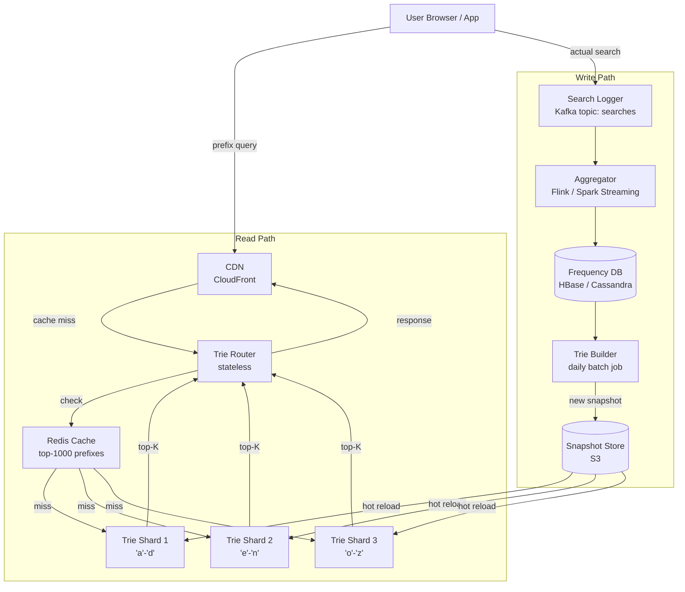

# 009 — Search Autocomplete (Typeahead)

## Source

Alex Xu, *System Design Interview Vol. 1*, Chapter 13. Аналоги: Google Search suggestions, YouTube typeahead, Amazon search bar.

---

## Problem

При вводе запроса в поисковую строку система должна мгновенно предлагать до 5–10 наиболее релевантных завершений. Задержка — не более 100 ms. Релевантность определяется частотой прошлых поисков. Подходит для сотен миллионов пользователей и миллиардов поисковых запросов в день.

---

## Requirements

### Functional

- По введённому префиксу вернуть top-5 наиболее популярных завершений.
- Учитывать только начало строки (prefix match, не substring).
- Ранжирование: по частоте (+ опционально: свежесть, персонализация).
- Фильтрация: нецензурная лексика, запрещённый контент не попадает в suggestions.
- Поддержка ASCII (в базовом scope); Unicode / CJK — расширение.

### Non-Functional

- Latency: p99 < 100 ms (с учётом CDN — < 20 ms для популярных префиксов).
- Eventual consistency: обновление частот — раз в час (batch), не real-time.
- High availability: 99.99%, typeahead — деградирует gracefully (без suggestions, поиск продолжает работать).
- Scale: 10B поисковых запросов/день → 5 нажатий клавиши на запрос → 50B typeahead RPS avg ≈ 600K RPS.

### Scale (back-of-envelope)

| Метрика | Значение |
|---|---|
| DAU | 500M |
| Поисков/день | 10B |
| Нажатий клавиши на поиск (avg) | 5 |
| Typeahead RPS (avg) | ~600K |
| Typeahead RPS (peak ×3) | ~1.8M |
| Уникальных поисковых термов | ~100M |
| Trie size (top-10 per node) | ~10–50 GB |
| QPS для data collection pipeline | ~115K writes/s |

---

## Solution A — Distributed Trie with Top-K Nodes

### Идея

Trie хранится in-memory, шардированный по первым 2 символам префикса. Каждый узел pre-computed top-K. Read path — O(P) обход + O(1) возврат top-K. Write path — batch пересборка раз в час из агрегированных логов.

### Architecture



### Read Flow (prefix = "goo")

```
sequenceDiagram
    participant C as Client
    participant CDN
    participant R as Router
    participant RC as Redis Cache
    participant T as Trie Shard ("g*")

    C->>CDN: GET /autocomplete?q=goo
    CDN-->>C: cache hit → ["google","good","goodreads","goodnight","goodies"]
    note over CDN: Cache-Control: max-age=60, stale-while-revalidate=300

    alt CDN miss (cold prefix or low-traffic)
        CDN->>R: forward
        R->>RC: GET autocomplete:goo
        RC-->>R: miss
        R->>T: lookup("goo")
        T-->>R: node.top_k = [("google",98M), ("good",71M), ...]
        R->>RC: SET autocomplete:goo [...] EX 3600
        R-->>CDN: response
        CDN-->>C: response + cache
    end
```

### Write Path: Data Collection Pipeline

```
User performs search: "golang tutorial"
    │
    ▼
Search Service → Kafka topic "search-events"
    {user_id, query, timestamp, session_id}
    │
    ▼
Flink Streaming Job (5-minute windows):
    GROUP BY query
    COUNT(*) as freq_delta
    → upsert into Frequency DB:
       (query="golang tutorial", hourly_count += 42)
    │
    ▼
Frequency DB (HBase / Cassandra):
    rowkey: query_text
    columns: total_count, last_updated, trend_score
    │
    ▼
Trie Builder (hourly batch — Spark):
    1. SELECT query, total_count FROM frequency_db
       WHERE total_count > MIN_THRESHOLD (напр. 1000)
    2. Build trie in memory
    3. Compute top-K per node (bottom-up: leaf → root)
    4. Serialize to Protocol Buffers → S3
    │
    ▼
Trie Shards: hot-reload новый снапшот
    (синий-зелёный swap через router weight shift)
```

### Trie Sharding

```
Shard assignment (by first 2 chars of prefix):

  prefix[:2] in {'aa'..'cm'} → Shard 1  (hot: en, go, in, is...)
  prefix[:2] in {'cn'..'ho'} → Shard 2
  prefix[:2] in {'hp'..'no'} → Shard 3
  prefix[:2] in {'np'..'sq'} → Shard 4
  prefix[:2] in {'sr'..'zz'} → Shard 5

Hot shard mitigation: популярные двубуквенные префиксы
("go", "in", "ho") получают dedicated micro-shard + более
агрессивное CDN кэширование.

Каждый шард: 1 primary + 2 read replicas.
```

### Zero-Downtime Trie Reload

```
Trie Builder → записал новый снапшот v2 в S3

Reload sequence:
  1. Каждый Shard загружает v2 snapshot в shadow instance
  2. Router: weight shift — 5% трафика на shadow
  3. Мониторинг: latency + error rate норма?
  4. Router: 100% на shadow → shadow становится primary
  5. Старый primary освобождает память

Время reload 1 GB trie → ~5-10 s (приемлемо при сине-зелёном swap)
```

### Pros

- P99 < 5 ms на trie lookup (всё in-memory).
- Полный контроль над ранжированием и top-K логикой.
- Дедупликация prefixes — общий путь хранится один раз.
- Шардирование позволяет масштабировать горизонтально.

### Cons

- Сложный build pipeline (Flink + Spark + S3 + hot-reload).
- Batch обновление = 1-часовая задержка до появления trending queries.
- Sharding по первым буквам → hot shard проблема (latent).
- Сложная поддержка Unicode / emoji — нужна нормализация перед индексацией.

---

## Solution B — Elasticsearch with Edge N-Grams

### Идея

Все поисковые термы индексируются в Elasticsearch с **edge n-gram** анализатором. При запросе — prefix query с boost по frequency field. Elasticsearch берёт на себя шардинг, репликацию, ранжирование. Проще в операционном плане, но менее предсказуем по latency.

### Edge N-Gram

Анализатор разбивает "google" на токены: `g`, `go`, `goo`, `goog`, `googl`, `google`. При поиске "goo" → стандартный term query по токену "goo" попадает в inverted index → быстрый lookup.

```json
PUT /autocomplete
{
  "settings": {
    "analysis": {
      "analyzer": {
        "edge_ngram_analyzer": {
          "tokenizer": "edge_ngram_tokenizer"
        }
      },
      "tokenizer": {
        "edge_ngram_tokenizer": {
          "type": "edge_ngram",
          "min_gram": 1,
          "max_gram": 20
        }
      }
    }
  },
  "mappings": {
    "properties": {
      "term":      {"type": "text", "analyzer": "edge_ngram_analyzer"},
      "frequency": {"type": "long"},
      "updated_at":{"type": "date"}
    }
  }
}
```

### Query

```json
GET /autocomplete/_search
{
  "query": {
    "match": {"term": "goo"}
  },
  "sort": [{"frequency": "desc"}],
  "size": 5
}
```

### Pros

- Нет custom infrastructure — ES берёт на себя шардинг, failover, API.
- Легко добавить substring / fuzzy matching.
- Real-time обновление: индексирование нового термина работает сразу.
- Расширение на многоязычность: просто другой analyzer.

### Cons

- Latency выше, чем у in-memory trie: p99 ~20-50 ms (без CDN), не 5 ms.
- Edge n-gram раздувает индекс: каждое слово → N токенов, индекс в 5–10× больше словаря.
- Ранжирование сложнее кастомизировать (нужны script_score или function_score).
- При 1.8M RPS пика ES кластер нужен большой; trie на той же нагрузке — меньше ресурсов.

---

## Deep Dives

### Ранжирование: частота + свежесть + персонализация

```
score(term) = freq_score + freshness_bonus + personalization_boost

freq_score     = log10(global_count + 1)   # логарифм сглаживает хвост
freshness_bonus= decay * days_since_trending  # trending queries получают boost
personalization= user_history_match * weight  # только в personalized режиме

Персонализация:
  - Хранится в User Service (compressed history, последние 100 запросов)
  - При typeahead запросе Router добавляет user_context к trie lookup
  - Trie возвращает top-20, Router применяет personalization re-rank → top-5
  - Не для анонимов (нет истории)
```

### Фильтрация (Block List)

```
Block list:
  - Хранится в Redis Set: O(1) lookup per term
  - Обновляется через Trust & Safety pipeline (ручная + ML модерация)
  - Применяется на Router уровне после получения top-K от trie:
      results.filter(term => !block_list.contains(term))
  - Если все top-K заблокированы → вернуть пустой список (graceful)

Размер block list: ~100K-1M terms → поместится в Redis (< 100 MB)
```

### Кэширование

```
Стратегия многоуровневого кэша:

L1: CDN (CloudFront)
    Ключ: normalized_prefix (lowercase, trimmed)
    TTL: 60s (popularity обновляется раз в час, 60s — компромисс)
    Cache-Control: public, max-age=60, stale-while-revalidate=300
    Hit rate: ~70% (большинство запросов — короткие популярные префиксы)

L2: Redis (Router уровень)
    Ключ: autocomplete:{prefix}
    TTL: 3600s (час — совпадает с trie rebuild)
    Hit rate: ~20% от оставшихся

L3: Trie Shard (in-memory)
    ~10% запросов достигают шарда
    Latency: < 1 ms
```

### Trending Queries (Near Real-Time)

Для продуктов с trending (Twitter / YouTube):
```
Отдельный Trending Pipeline (Flink, 5-min windows):
  1. COUNT queries per term, last 5 minutes
  2. Compare to baseline (same time last week)
  3. velocity = (current_count / baseline_count)
  4. IF velocity > 10x → trending: true

Trending terms → Redis Sorted Set (score = velocity)
Router: для запроса "q" → смешать top-K из trie + top-3 trending с "q" prefix
```

### Нормализация запроса

```
Client → "  GoOgle  " → normalize → "google"

Pipeline:
  1. Trim whitespace
  2. Lowercase
  3. Unicode NFKC normalization (ё → е для русского, etc.)
  4. Remove special characters (punctuation)
  5. Truncate to max_prefix_length (напр. 20 chars)

Одинаковая нормализация при индексировании и при запросе.
```

---

## Trade-offs

| Критерий | Solution A (Distributed Trie) | Solution B (Elasticsearch) |
|---|---|---|
| Read latency | < 5 ms (in-memory) | 20–50 ms |
| Update latency | Batch, 1 час | Near real-time |
| Сложность реализации | Высокая | Низкая |
| Operational burden | Высокий (pipeline, hot-reload) | Низкий (managed ES) |
| Scalability | Линейная (add shards) | Ограничена ES кластером |
| Substring / fuzzy | Нет (только prefix) | Да (из коробки) |
| Cost при 1M+ RPS | Ниже (CPU-efficient) | Выше (ES resource-heavy) |
| **Рекомендация** | Google / YouTube масштаб | Внутренний поиск, стартап |

---

## Key Takeaways

1. **Top-K per node — ключевая оптимизация trie**: без неё каждый запрос = DFS по всему поддереву. С top-K — O(1) после обхода префикса.
2. **Read/Write разделены**: trie — read-only снапшот. Данные о частоте собирает отдельный pipeline. Никогда не обновляй trie в реальном времени под нагрузкой запросов.
3. **CDN кэширует большинство запросов**: top-1000 префиксов — 70%+ трафика. Правильный Cache-Control + нормализация ключей (lowercase) максимизирует hit rate.
4. **Batch update достаточен**: ранжирование по «вчерашним» частотам — приемлемо. Real-time нужен только для trending (отдельный fast-path).
5. **Нормализация — на обоих концах**: одинаковая нормализация при индексировании и при запросе обязательна; иначе "GoOgle" не совпадёт с "google".

---

## Open Questions

- **Многоязычный typeahead**: trie on unicode runes vs отдельный индекс per language? Языки с logographic scripts (CJK) — pinyin input требует transliteration layer.
- **Персонализация vs privacy**: хранение query history требует consent. Персонализация может быть on-device (на мобиле) без передачи на сервер.
- **Spell correction**: "googel" → предложить "google"? Нужен отдельный spell-checker (BK-tree или Norvig algorithm) поверх trie.
- **Did you mean?**: постфактум (после zero-results search) vs during typing (другой latency SLA).

---

## References

- Alex Xu, *System Design Interview Vol. 1*, Chapter 13
- Google Research — Query Suggestions
- Elasticsearch Edge N-Gram documentation
- Apache Flink — streaming aggregations
- [[trie-prefix-index]]
- [[caching-strategies]]
