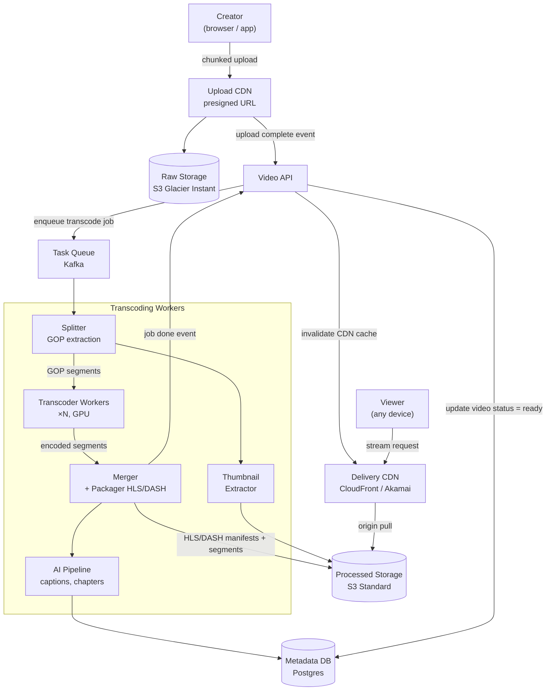
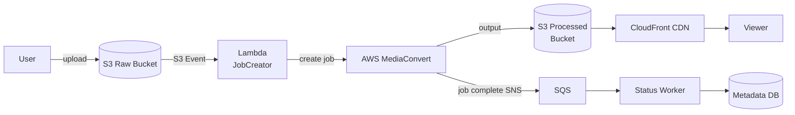

# 010 — Video Streaming (YouTube / Netflix)

## Source

Alex Xu, *System Design Interview Vol. 1*, Chapter 14. Аналоги: YouTube, Netflix, TikTok.

---

## Problem

Спроектировать платформу для загрузки, обработки и просмотра видео. Пользователи загружают видео (до 10 GB, разные форматы), другие смотрят их с адаптивным качеством на любом устройстве. Система должна обслуживать миллиарды просмотров в день.

---

## Requirements

### Functional

- Загрузка видео (любые форматы: MP4, MOV, AVI, MKV).
- Транскодирование в несколько разрешений и форматов (HLS/DASH).
- Потоковое воспроизведение с адаптивным битрейтом (ABR).
- Метаданные: название, описание, теги, превью-кадры (thumbnails).
- Рекомендации (in scope как feature, архитектуру рекомендаций — отдельный кейс).
- Лайки, комментарии, счётчик просмотров.
- Поиск по названию и тегам.

### Non-Functional

- Durability загруженных видео: 99.999%.
- Availability воспроизведения: 99.99%.
- Latency до первого кадра (Time to First Frame, TTFF): < 2 с.
- Throughput: поддержать 1B часов просмотра в день.
- Eventual consistency счётчиков (likes, views) — задержка до 1 минуты.

### Scale (back-of-envelope)

| Метрика | Значение |
|---|---|
| DAU | 2B (YouTube масштаб) |
| Видео загружается | 500 часов/мин |
| Просмотров/день | 1B часов |
| Avg просмотра | 30 мин |
| Avg bitrate при просмотре | 2 Mbps |
| Пиковый исходящий трафик | 1B ч/д × 2 Mbps / 86 400 s ≈ **23 Tbps** |
| Хранение (raw, 1 час 1080p) | ~7 GB |
| После транскодирования (все renditions) | ~3–4× сжатие → ~2 GB / час финального контента |
| Storage growth | 500 ч/мин × 60 × 24 × ~2 GB ≈ **1.4 PB/день** |

---

## Solution A — Custom DAG Transcoding Pipeline (YouTube-подход)

### Идея

Загруженное видео проходит через **DAG (Directed Acyclic Graph) of tasks**: разбивка на GOP (группы кадров), параллельное транскодирование сегментов, сборка манифестов. Каждый этап — независимый worker; зависимости описаны в DAG. Готовые сегменты раздаются через CDN как статические файлы.

### Architecture



### Upload Flow

```
sequenceDiagram
    participant C as Creator
    participant API as Video API
    participant S3 as Raw S3

    C->>API: POST /videos {title, description}
    API->>API: create video record (status=pending)
    API-->>C: {video_id, upload_url (presigned)}
    C->>S3: PUT large file (multipart, resumable)
    note over C,S3: 10 GB file → 64 MB parts, parallel upload
    S3->>API: S3 Event Notification: upload complete
    API->>Kafka: enqueue {video_id, raw_s3_key}
```

### DAG Transcoding Pipeline

```
video_id job → DAG:

              ┌─ Transcode 240p  ──┐
              ├─ Transcode 360p  ──┤
Split ────────├─ Transcode 720p  ──┤──── Merge/Package ──── Upload to S3
(GOP chunks)  ├─ Transcode 1080p ──┤         │
              └─ Transcode 4K    ──┘    HLS Manifest
                                         DASH MPD
              ┌─ Extract Thumbnail (frame 10s)
              └─ Extract SRT captions (Whisper AI)

Каждая задача в Kafka topic "transcode-tasks".
Worker берёт GOP-сегмент, кодирует ffmpeg, кладёт результат в S3.
Merge worker ждёт все сегменты конкретного rendition → собирает финальный файл.
```

### GPU Workers

```
Transcoder Pod (GPU):
    CPU: split GOP, IO
    GPU: codec (H.264 / H.265 / AV1)
    
ffmpeg -i input.mp4 \
    -vf scale=1280:720 \
    -c:v libx264 -crf 23 -preset fast \
    -c:a aac -b:a 128k \
    -hls_time 6 -hls_playlist_type vod \
    -hls_segment_filename 'seg_%03d.ts' \
    output.m3u8

Параллелизм:
    1 час видео → 360 сегментов по 10 с
    360 / 20 workers = 18 с на transcoding часового видео
    (при условии GPU-ускорения и 20 workers)
```

### Storage Tiering

```
Hot (S3 Standard):
    Видео загруженные < 30 дней + trending (>10K просмотров/день)
    Latency: < 10 ms first byte

Warm (S3 Standard-IA):
    30 дней–1 год, умеренный трафик
    Дешевле хранение, дороже retrieval

Cold (S3 Glacier Instant Retrieval):
    > 1 год, редкие просмотры
    Retrieval: миллисекунды (не часы), но дорого

Archive (S3 Glacier Deep Archive):
    Raw исходники (оригинальные файлы)
    Retrieval: 12 часов → только для юридических запросов / re-encode

Lifecycle policy (S3):
    /raw/*      → Glacier Deep Archive after 7 days
    /processed/* → Standard-IA after 30 days, Glacier Instant after 1 year
```

### Pros

- Полный контроль над кодеком (AV1, per-title bitrate ladder, HDR).
- Параллельный GOP-level transcoding → часовое видео транскодируется за минуты.
- GPU workers масштабируются независимо от API.
- Нет vendor lock-in на транскодирование.

### Cons

- Сложность: DAG coordinator + worker fleet + GPU infra.
- Операционный overhead: ffmpeg версии, codec compatibility, GPU driver management.
- Время до рынка: месяцы на разработку pipeline vs дни с managed service.

---

## Solution B — Cloud-Managed Transcoding (AWS MediaConvert + CloudFront)

### Идея

Загрузка видео → S3. Триггер Lambda → AWS MediaConvert job (управляемый транскодинг). Готовые файлы → S3 output bucket. CloudFront раздаёт. Нет собственных GPU workers. Оплата за минуту транскодирования.

### Architecture



### MediaConvert Job (упрощённо)

```json
{
  "Settings": {
    "Inputs": [{"FileInput": "s3://raw/video123.mp4"}],
    "OutputGroups": [{
      "OutputGroupSettings": {
        "Type": "HLS_GROUP_SETTINGS",
        "HlsGroupSettings": {
          "Destination": "s3://processed/video123/",
          "SegmentLength": 6
        }
      },
      "Outputs": [
        {"NameModifier": "_360p", "VideoDescription": {"Width": 640, "Height": 360, "CodecSettings": {"Codec": "H_264", "H264Settings": {"Bitrate": 800000}}}},
        {"NameModifier": "_720p", "VideoDescription": {"Width": 1280, "Height": 720, "CodecSettings": {"Codec": "H_264", "H264Settings": {"Bitrate": 3000000}}}},
        {"NameModifier": "_1080p", "VideoDescription": {"Width": 1920, "Height": 1080, "CodecSettings": {"Codec": "H_264", "H264Settings": {"Bitrate": 6000000}}}}
      ]
    }]
  }
}
```

### Pros

- Нет GPU инфраструктуры — pay-per-use.
- Быстрый time to market.
- AWS SLA на доступность MediaConvert.
- Встроенная поддержка DRM (Widevine / FairPlay через AWS Elemental).

### Cons

- Дороже при высоком объёме (500 ч/мин → ~$50K+/день только на transcoding).
- Меньше гибкости: нельзя кастомизировать codec pipeline, per-title encode.
- Vendor lock-in: MediaConvert API != ffmpeg.
- Задержка старта job'а: несколько секунд overhead.

---

## Deep Dives

### CDN Strategy: Pull vs Push, Pre-warming

```
Pull (стандарт для VOD):
    Первый запрос к edge → CDN запрашивает origin → кэширует
    Cache-Control: max-age=31536000, immutable (сегменты immutable, CAS-like адресация)
    Для большинства видео — достаточно

Pre-warming (для ожидаемо вирусного контента):
    Большой дроп / финал сезона → CDN API: preload(url_list)
    Раздать сегменты по всем PoP до момента публикации
    Снижает нагрузку на origin при traffic spike

Live streaming:
    CDN pull с origin media server (реального времени, короткий TTL)
```

### View Counter (Счётчик просмотров)

Прямой UPDATE `views + 1` в Postgres при каждом просмотре = bottleneck при 1B просмотров/день.

```
Решение: batch aggregation в Redis + периодический flush

On view event:
    INCR view_counter:{video_id}    # атомарный, O(1)

Cron job (каждые 30 секунд):
    keys = SCAN view_counter:*
    for key in keys:
        count = GETDEL key
        UPDATE videos SET views = views + count WHERE id = video_id

Read path (display):
    views_db = SELECT views FROM videos WHERE id = ?
    views_redis = GET view_counter:{video_id} OR 0
    display = views_db + views_redis   # eventual consistency < 30s
```

Для YouTube-масштаба: counter sharding — N Redis keys per video_id, aggregate on read.

### Video Search

```
При загрузке video:
    Metadata Worker → индексирует в Elasticsearch:
      {video_id, title, description, tags, transcript_summary, channel}
    
    Анализатор: edge n-gram для title (autocomplete) +
                standard для full-text search description

Search query:
    multi_match на title (boost×3), tags (boost×2), description
    filter: status=published, language, duration range
    sort: _score + recency + view_count boost
```

### DRM (Digital Rights Management)

```
Контент зашифрован (AES-128 для HLS, Widevine/FairPlay для DASH):
    Сегмент = encrypted_bytes
    Ключ хранится в Key Server (не в CDN)

Playback flow:
    1. Клиент запрашивает license у DRM Server
    2. DRM Server проверяет entitlement (куплена ли подписка)
    3. Возвращает decryption key (в зашифрованном виде для device)
    4. Клиент расшифровывает сегменты in-memory (не на диск)

Widevine = Google, FairPlay = Apple, PlayReady = Microsoft
CMAF + CBCS позволяет один набор сегментов для всех DRM.
```

### Thumbnail Generation

```
При транскодировании:
    ffmpeg -i input.mp4 \
        -vf "fps=1/60,scale=320:-1" \
        -frames:v 10 \
        thumb_%02d.jpg

Хранятся в S3, раздаются через CDN с aggressive caching.
YouTube также использует AI-based thumbnail selection
(выбирает кадр с лицом, высокой информативностью).
```

### Resumable Upload для больших файлов

```
Creator загружает 10 GB файл:
    1. POST /videos/upload → {upload_id, presigned_urls[]}
       (список presigned URL для каждой 64 MB части)
    2. Клиент загружает части параллельно (8 потоков)
    3. Клиент сохраняет progress: {upload_id, uploaded_parts: [1,2,5,...]}
    4. При обрыве: возобновить с незагруженных частей
    5. POST /videos/upload/complete {upload_id, parts} → S3 CompleteMultipartUpload

При обновлении страницы / закрытии браузера:
    progress сохраняется в localStorage или IndexedDB
```

---

## Trade-offs

| Критерий | Solution A (Custom DAG) | Solution B (AWS MediaConvert) |
|---|---|---|
| Гибкость кодека | Полная (AV1, HDR, per-title) | Ограничена MediaConvert |
| Скорость транскодирования | Максимальная (GPU fleet) | Зависит от MC capacity |
| Операционная сложность | Высокая | Низкая |
| Cost при большом объёме | Ниже | Выше (pay-per-minute) |
| Time to market | Медленно | Быстро |
| DRM | Нужна своя реализация | AWS Elemental из коробки |
| **Рекомендация** | YouTube/Netflix масштаб | MVP, стартап, <1M видео/месяц |

---

## Key Takeaways

1. **Разделяй upload и processing**: upload идёт напрямую в S3 через presigned URL, transcoding — асинхронный pipeline. Никогда не блокируй upload на транскодирование.
2. **DAG на уровне GOP**: параллельное транскодирование 360 сегментов × 5 renditions = часовое видео за минуты, не часы.
3. **Сегменты immutable по природе**: SHA-ориентированная адресация в CDN (URL содержит hash или version) → вечный кэш, нет инвалидации.
4. **View counter через Redis INCR**: прямой UPDATE в DB при 1B просмотров = bottleneck. Batch flush раз в 30 с — eventual consistency, но держит нагрузку.
5. **Storage tiering критичен**: 99% просмотров — свежий контент. Hot/Warm/Cold lifecycle экономит 70%+ storage cost.

---

## Open Questions

- **Live Streaming**: другой pipeline (RTMP ingest → segmenter → HLS/DASH with short TTL). Архитектурно похоже, но latency requirements кардинально иные.
- **4K HDR / Dolby Vision**: требует расширенного bitrate ladder и специального оборудования на стороне CDN.
- **Copyright detection**: Content ID (YouTube) — fingerprinting по аудио и видео при upload; сравнение с базой правообладателей.
- **Auto-generated captions**: Whisper / Google STT в AI pipeline; хранятся как VTT файлы рядом с сегментами.

---

## References

- Alex Xu, *System Design Interview Vol. 1*, Chapter 14
- [YouTube Engineering Blog — Video ingestion and processing at scale](https://youtube-eng.googleblog.com/)
- [Netflix Tech Blog — Toward a Better Editorialized Recommendation](https://netflixtechblog.com/)
- [Netflix Tech Blog — Per-Title Encode Optimization](https://netflixtechblog.com/per-title-encode-optimization-7e99442b62a2)
- AWS MediaConvert documentation
- [[adaptive-bitrate-streaming]]
- [[content-addressable-storage]]
- [[caching-strategies]]
