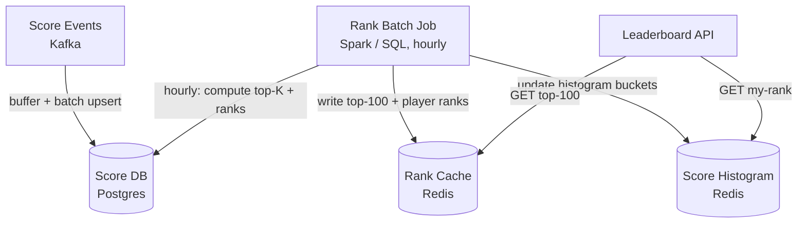

# 015 — Leaderboard (Gaming / Live Scoring)

## Source

Alex Xu, *System Design Interview Vol. 2*, Chapter 10. Аналоги: Clash of Clans, Candy Crush, Fortnite, chess.com рейтинги, Duolingo XP-таблица.

---

## Problem

Спроектировать систему лидерборда для мобильной / браузерной игры: отображать топ-100 игроков в реальном времени, показывать ранг конкретного игрока, поддерживать сегментированные таблицы (глобальная, друзья, недельная, региональная). Масштаб: 500M зарегистрированных игроков, 25M DAU.

---

## Requirements

### Functional

- Обновление score игрока при завершении раунда/уровня.
- Топ-K (K=100) — глобальный, в режиме реального времени.
- "Мой ранг" — позиция среди всех игроков.
- Сегменты: глобальный, друзья (social graph), регион, всё время / эта неделя / сегодня.
- Ближайшие соседи: игроки ±5 позиций вокруг меня.

### Non-Functional

- Latency: p99 < 100 ms для top-100 и my-rank.
- Eventual consistency: обновление score → видно в лидерборде за < 1 мин.
- Availability: 99.99%.
- Write throughput (peak): 25M DAU × 10 игр/день = 250M events/день = ~2 900 events/s avg; peak ×10 = 29 000 events/s.

### Scale

| Метрика | Значение |
|---|---|
| Registered players | 500M |
| DAU | 25M |
| Score update events/s (peak) | 29 000 |
| Top-100 queries/s | ~50 000 |
| "My rank" queries/s | ~200 000 |
| ZSET size (all-time global) | 500M members |
| RAM (Redis, ~80B/element) | ~40 GB |

---

## Solution A — Redis ZADD (Real-Time, Sharded)

### Идея

Каждый лидерборд-сегмент — отдельный Redis ZSET. Score updates — через `ZINCRBY` (атомарно, без race). Top-K — `ZREVRANGE`. "Мой ранг" — `ZREVRANK`. Для 500M игроков — score-range sharding.

### Architecture

```mermaid
flowchart TD
    GameSvc[Game Service]
    MQ[Kafka\ngame-events]
    LBWorker[Leaderboard Worker\nKafka consumer]
    Redis1[(Redis\nglobal:alltime\nshard 0..N)]
    Redis2[(Redis\nglobal:weekly)]
    Redis3[(Redis\nregion:us-east:alltime)]
    PlayerDB[(Player DB\nPostgres)]
    LBApi[Leaderboard API\nstateless]
    Client[Mobile Client]

    GameSvc -->|game.finished event| MQ
    MQ --> LBWorker
    LBWorker -->|ZINCRBY global:alltime| Redis1
    LBWorker -->|ZINCRBY global:weekly| Redis2
    LBWorker -->|ZINCRBY region:{r}:alltime| Redis3

    Client -->|GET /leaderboard/top100| LBApi
    Client -->|GET /leaderboard/my-rank| LBApi
    LBApi -->|ZREVRANGE| Redis1
    LBApi -->|ZREVRANK| Redis1
    LBApi -->|HGETALL player:{id}| PlayerDB
```

### Score Update Flow

```
sequenceDiagram
    participant G as Game Service
    participant K as Kafka
    participant W as LB Worker
    participant R as Redis

    G->>K: produce {player_id, score_delta, region, timestamp}
    K-->>W: consume (batch, up to 100ms)
    W->>R: Pipeline:
            ZINCRBY global:alltime {delta} {player_id}
            ZINCRBY global:weekly:{week} {delta} {player_id}
            ZINCRBY region:{region}:alltime {delta} {player_id}
    R-->>W: [new_score, new_score, new_score]
    note over W: pipeline = 1 round-trip для 3 ZINCRBY
```

### Top-100 Query

```python
def get_top_100(leaderboard_key):
    # ZREVRANGE: O(log N + K), K=100
    top = redis.zrevrange(leaderboard_key, 0, 99, withscores=True)
    # → [("player_bob", 2100.0), ("player_alice", 1550.0), ...]

    # Batch fetch player details (pipeline)
    pipe = redis.pipeline()
    for player_id, score in top:
        pipe.hgetall(f"player:{player_id}")
    details = pipe.execute()

    # Merge
    return [
        {"rank": i+1, "player": details[i], "score": score}
        for i, (player_id, score) in enumerate(top)
    ]

# Cache result: Cache-Control: max-age=10
# Top-100 меняется редко → 10 секунд кэш снимает большую часть нагрузки
```

### "My Rank" Query

```python
def get_my_rank(player_id, leaderboard_key):
    pipe = redis.pipeline()
    pipe.zrevrank(leaderboard_key, player_id)   # 0-based rank from top
    pipe.zcard(leaderboard_key)                  # total players
    pipe.zscore(leaderboard_key, player_id)      # my score
    rank_0based, total, score = pipe.execute()

    if rank_0based is None:
        return {"rank": None, "message": "not yet on leaderboard"}

    return {
        "rank": rank_0based + 1,      # human 1-based
        "total": total,
        "score": score,
        "percentile": round((total - rank_0based) / total * 100, 1)
    }
```

### Score-Range Sharding для 500M игроков

40 GB для одного ZSET — не помещается на одну ноду. Шардинг по диапазонам score:

```
Анализ распределения:
  99% игроков имеют score < 5000
  0.9% игроков: 5000–50000
  0.1% игроков: > 50000

Shard boundaries (percentile-based):
  shard_low:    score [0, 5000)      → ~495M players, ~38 GB RAM
  shard_mid:    score [5000, 50000)  → ~4.5M players, ~360 MB
  shard_top:    score [50000, +inf)  → ~500K players, ~40 MB

Top-100 queries → только shard_top (fast, small)
My rank:
  score ∈ [50000, +inf) → ZREVRANK shard_top + 0 (no players above this shard)
  score ∈ [5000, 50000) → ZREVRANK shard_mid + ZCARD shard_top
  score ∈ [0, 5000)     → ZREVRANK shard_low + ZCARD shard_mid + ZCARD shard_top

Rebalancing: при смещении распределения → скрипт миграции (batch ZSCAN + ZADD)
```

### Friends Leaderboard

```
Social graph: PlayerDB хранит friend_list per player (или отдельный Graph DB)

Friends leaderboard:
  НЕ создавать отдельный ZSET на каждого пользователя (500M × N_friends = unbounded)

Подход: On-demand computation
  1. Fetch friend_ids: SELECT friend_id FROM friends WHERE player_id = ?
     (кэшируем friend list в Redis с TTL 60s)
  2. Pipeline ZSCORE global:alltime {friend_id} для каждого друга
  3. Сортируем в приложении → top-K среди друзей
  4. Кэшируем результат: player:{id}:friends_lb с TTL 30s

Для игроков с < 1000 друзей — работает отлично.
Для игроков с 10K+ друзей — batch ZSCORE в pipeline (~5 ms).
```

### Weekly Leaderboard Reset

```
В полночь понедельника UTC:
  1. RENAME global:weekly → global:weekly:archive:{YYYY-WNN}
     (атомарно — запросы во время rename получат новый пустой ключ)
  2. EXPIRE global:weekly:archive:{YYYY-WNN} 2592000  (30 дней)

Проблема: между rename и первым ZINCRBY новый ключ не существует
→ ZINCRBY создаёт ключ автоматически (Redis поведение) ✓

Альтернатива: score = points * 1e12 + (MAX_WEEK - week_number)
→ один ZSET на всё время, ZRANGEBYSCORE для недели
→ но score range огромный, tie-break сложный
```

### Pros

- O(log N) все операции, atomic ZINCRBY (нет race).
- Topk-100 + my-rank — единый Redis call.
- Score-range sharding делает top-K queries дешёвыми (small shard_top).
- Friends leaderboard без хранения отдельных ZSETs.

### Cons

- 40 GB RAM для 500M игроков — дорогой Redis.
- Rebalancing score-range шардов при drift распределения.
- Friends leaderboard: N pipeline calls при каждом запросе.

---

## Solution B — Batch Ranking с Approximate Rank

### Идея

Для систем с миллиардами пользователей и не требующих < 1 min latency обновления — батчевое вычисление ранга. Храним score в Postgres (дешевле RAM), ранг вычисляем через гистограмму распределения.

### Architecture



### Score Storage (Postgres)

```sql
CREATE TABLE player_scores (
    player_id   BIGINT PRIMARY KEY,
    score       BIGINT NOT NULL DEFAULT 0,
    region      TEXT,
    updated_at  TIMESTAMPTZ
);

CREATE INDEX idx_scores_score ON player_scores(score DESC);

-- Upsert score update (batched, every 10s):
INSERT INTO player_scores (player_id, score, region)
VALUES ($1, $2, $3)
ON CONFLICT (player_id) DO UPDATE
  SET score = player_scores.score + EXCLUDED.score,
      updated_at = NOW();

-- Top-100:
SELECT player_id, score
FROM player_scores
ORDER BY score DESC
LIMIT 100;
-- Быстро с индексом
```

### Approximate "My Rank" via Score Histogram

```
Exact rank для 1B пользователей через Postgres = медленно (COUNT WHERE score > my_score)

Approximate rank через pre-computed histogram:

Batch job (каждые 5 минут):
  SELECT
    floor(score / 1000) * 1000 AS bucket,
    COUNT(*) AS cnt
  FROM player_scores
  GROUP BY bucket
  → Redis HSET score_histogram {bucket} {count}

My rank (approximate):
  my_score = 7500
  buckets_above = SUM(counts for buckets > 7000)
  players_in_my_bucket = HGET score_histogram 7000
  
  estimated_rank = buckets_above + (players_in_my_bucket / 2)  # середина bucket
  percentile = 100 - (estimated_rank / total_players * 100)

Точность: ±500 позиций при 1B игроков с bucket_size=1000 (приемлемо)
Стоимость: O(1) Redis lookup (несколько HGET)
```

### Pros

- Postgres дешевле Redis для 1B строк.
- Approximate rank масштабируется на любой размер.
- Простота: нет сложного шардинга ZSET.

### Cons

- Latency обновления: batch job раз в 5 мин → 5 мин задержки в ранге.
- Approximate rank — не точный (±500 позиций при 1B).
- Postgres под write storm при многих concurrent upserts → нужна очередь.

---

## Deep Dives

### Anti-Cheat: Score Validation

```
Проблема: злоумышленник отправляет произвольные score events

Клиентский score НИКОГДА не доверяем напрямую:
  ❌ POST /score {player_id: 123, score: 999999999}

Валидация на серверной стороне:
  1. Game session token: начало игры → сервер создаёт session_id
  2. Game event replay: сервер воспроизводит действия → вычисляет score
  3. Max delta per game: score_delta > theoretical_max_per_session → reject
  4. Rate limiting: ZINCRBY слишком часто от одного player_id → throttle
  5. ML anomaly detection: score distribution anomaly → flag for review
  6. Signed score package (cryptographic signature) для мобильных клиентов:
     score_package = {score, session_id, timestamp}
     signature = HMAC(score_package, server_secret)
     → сервер проверяет подпись перед применением
```

### Neighbor Query (±5 around me)

```
Мой ранг = R (из ZREVRANK)
ZREVRANGE leaderboard (R-5) (R+5) WITHSCORES

Если R < 5:
  ZREVRANGE leaderboard 0 10 WITHSCORES (топ)

Если total - R < 5:
  ZREVRANGE leaderboard (total-11) (total-1) WITHSCORES (хвост)

Enrichment: pipeline HGETALL для каждого из 11 игроков
```

### Tie-Breaking

```
Одинаковый score у нескольких игроков:
  Redis ZSET: лексикографический порядок по member id → непредсказуемо

Правильный tie-break (первый достигший score получает лучший ранг):
  composite_score = score * 1e12 + (MAX_TIMESTAMP - timestamp)
    (older timestamp → higher subtracted value → lower composite → 
     NO: более ранний игрок должен быть выше)
  
  composite_score = score * 1e12 + (2^31 - unix_timestamp)
    score=2100, timestamp=1700000000 →
      2100 * 1e12 + (2147483648 - 1700000000) = 2100000000447483648
    score=2100, timestamp=1700000001 →
      2100 * 1e12 + (2147483648 - 1700000001) = 2100000000447483647
  
  → более ранний игрок → выше в ZSET ✓
  Ограничение: score × 1e12 не должен превышать float64 точность (2^53)
```

### Segmented Leaderboard Keys (Redis naming)

```
Naming convention:
  lb:{scope}:{timeframe}[:{shard}]

  lb:global:alltime           -- глобальный за всё время
  lb:global:weekly:2026-W21   -- глобальный за неделю 21 2026 года
  lb:global:daily:2026-05-23  -- за сегодня
  lb:region:us-east:alltime   -- регион US East
  lb:region:eu-west:weekly:2026-W21
  
  Автоматический expiry через EXPIRE:
    weekly: 35 дней (запас на месяц)
    daily:  8 дней
    alltime: no expiry
```

### Cache для Top-100

```
Top-100 меняется медленно (только если кто-то ворвался в топ):
  Redis cache отдельно:
    key: lb_top100_cache:global:alltime
    value: JSON [{rank, player_id, score, name, avatar}]
    TTL: 10s

Invalidation:
  При каждом ZINCRBY если new_score > min_score_in_top100:
    DEL lb_top100_cache:global:alltime

  ZREVRANGE leaderboard 99 99 WITHSCORES → min score in top-100
  Если my_new_score > min_score → я мог войти в топ → invalidate

  На практике: обычно просто TTL=10s достаточно (2% игроков в топ-100 из 500M)
```

---

## Trade-offs

| Критерий | Solution A (Redis ZADD) | Solution B (Batch + Approximate) |
|---|---|---|
| Latency обновления | Real-time (< 1s) | Batch (5 мин) |
| Точность ранга | Точная | Approximate (±500 для 1B) |
| RAM (500M players) | ~40 GB | Minimal (Postgres) |
| Top-100 query | O(log N + K) Redis | O(1) cache |
| Write throughput | 29K/s (ZINCRBY) | Batch upsert (Postgres) |
| Сложность шардинга | Score-range sharding | Нет |
| **Рекомендация** | < 100M players, real-time | 1B+ players, eventual consistency OK |

---

## Key Takeaways

1. **ZINCRBY — не ZADD**: atomic increment без race condition. Два воркера обновляют score одновременно — ZINCRBY корректен, ZADD (read-modify-write) — нет.
2. **Score-range sharding**: топ-K запросы идут только в самый маленький шард (топ 0.1% игроков) — быстро и дёшево.
3. **Friends leaderboard без отдельного ZSET**: on-demand computation из social graph + batch ZSCORE pipeline — избегает O(N_users × N_friends) хранения.
4. **Weekly reset = RENAME**: атомарная операция, нет downtime. Старый ключ сохраняется с TTL для архива.
5. **Approximate rank для > 100M**: гистограмма распределения в Redis → O(1) percentile без scan Postgres.

---

## Open Questions

- **Tournament leaderboards** (ограниченное время, тысячи участников): маленький ZSET без шардинга, expire при окончании турнира.
- **Anti-cheat для replay-based validation**: хранение полной игровой сессии (game log) для воспроизведения на сервере — дорого хранить, но необходимо для соревновательных игр.
- **Multi-region**: игроки в EU и US видят один глобальный лидерборд → CRDT-based approach или master-region writes.
- **Real-time notifications**: "кто-то обошёл тебя в рейтинге" — нужен WebSocket канал + score watch (WAIT или Keyspace notifications в Redis).

---

## References

- Alex Xu, *System Design Interview Vol. 2*, Chapter 10
- Redis documentation — Sorted Sets (ZADD, ZRANK, ZREVRANGE)
- William Pugh — *Skip Lists: A Probabilistic Alternative to Balanced Trees* (1990)
- Clash of Clans engineering — Leaderboard at scale
- [[sorted-set-index]]
- [[caching-strategies]]
- [[consistent-hashing]]
