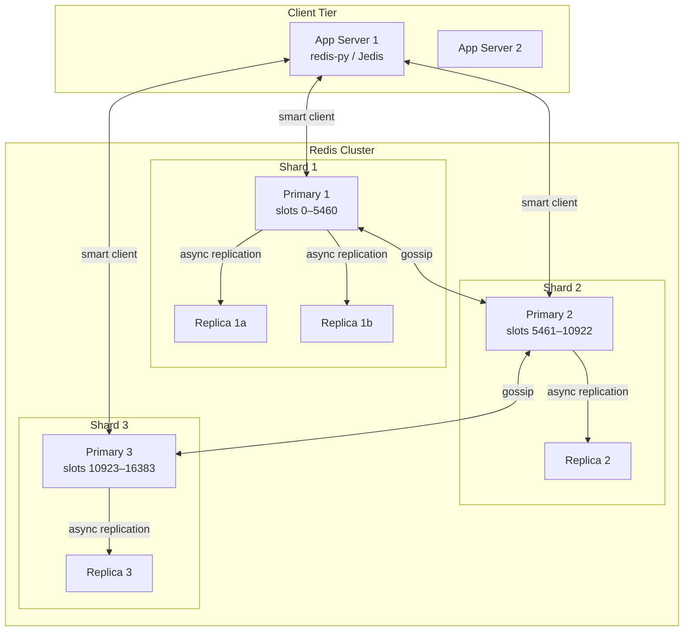
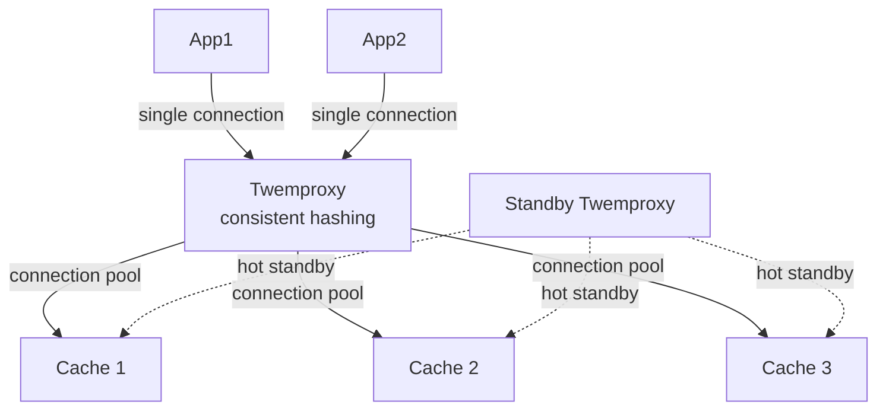

# 016 — Distributed Cache

## Source

Alex Xu, *System Design Interview Vol. 2*, Chapter 6 + дополнительные темы из Redis Cluster documentation. Аналоги: Redis Cluster, Memcached + mcrouter, Apache Ignite.

---

## Problem

Спроектировать распределённый кэш высокой доступности: горизонтально масштабируемый, устойчивый к отказам, с настраиваемым eviction, поддержкой репликации. Кэш используется как shared read layer для снижения нагрузки на базу данных.

---

## Requirements

### Functional

- GET / SET / DEL с TTL.
- Eviction policies: LRU, LFU, configurable.
- Репликация: primary + N replicas.
- Автоматический failover при недоступности ноды.
- Горизонтальное масштабирование (resharding без downtime).
- Поддержка cache-aside, read-through, write-through паттернов (на клиентской стороне).

### Non-Functional

- Latency: p99 GET < 1 ms, p99 SET < 2 ms.
- Availability: 99.99% (< 52 мин/год downtime).
- Consistency: eventual (replication lag < 100 ms).
- Throughput: 1M ops/s.

### Scale (back-of-envelope)

| Метрика | Значение |
|---|---|
| Cached objects | 1B |
| Avg object size | 1 KB |
| Total cached data | ~1 TB |
| Read RPS | 1M |
| Write RPS | 100K |
| Cache hit rate target | 90% |
| DB RPS with cache | 100K (vs 1M without) |

---

## Solution A — Redis Cluster (Hash Slots + Gossip)

### Идея

Redis Cluster — нативное решение для шардинга + репликации. Ключевое отличие от [[consistent-hashing]]: не hash ring, а **16384 hash slots**. Каждый узел владеет диапазоном слотов. Gossip протокол для cluster state. Автоматический failover через Raft-подобный election.

### Architecture



### Hash Slot Assignment

```
key → hash slot:
  slot = CRC16(key) % 16384

Hash tags: принудить несколько ключей на один слот:
  MSET {user:123}:name "Alice" {user:123}:email "a@b.com"
  → оба ключа → slot = CRC16("user:123") % 16384
  → гарантированно на одной ноде → MULTI/EXEC работает

Mapping:
  Slot 0–5460    → Primary 1
  Slot 5461–10922 → Primary 2
  Slot 10923–16383 → Primary 3
```

### Smart Client (Cluster-aware)

```
Клиент хранит slot map: slot → node address

GET user:123:
  slot = CRC16("user:123") % 16384 = 7283
  node = slot_map[7283] → Primary 2 (10.0.0.2:6379)
  → прямое соединение, 1 round-trip

При MOVED redirect (slot переехал):
  Primary 1 → MOVED 7283 10.0.0.3:6379
  Клиент обновляет slot_map и повторяет → Primary 3
  
При ASK redirect (миграция слота в процессе):
  ASKING + команда → временный redirect без обновления slot_map

Cluster topology discovery:
  Клиент при старте: CLUSTER SLOTS → полная карта
  При MOVED: обновить карту для этого слота
```

### Gossip Protocol

```
Каждые 100ms каждый узел:
  Выбирает случайные N соседей → отправляет:
    {node_id, address, state, last_seen, slots}
  Получает их view кластера → merge

Обнаружение сбоя:
  Узел A не отвечает → другие помечают PFAIL (possible failure)
  Если PFAIL от большинства primary → FAIL (confirmed failure)
  Реплика первичного замечает FAIL → инициирует election

Failover election (Raft-like):
  Реплика 1a: "Primary 1 is FAIL, я хочу стать primary"
  → отправляет FAILOVER_AUTH_REQUEST всем primary
  → собирает кворум (большинство primary подтверждают)
  → становится новым primary для слотов 0–5460
  → сообщает через gossip о новой топологии

Время failover: ~1–5 секунд (configurable cluster-node-timeout)
```

### Resharding (добавление ноды)

```
Добавить Primary 4 в кластер:

redis-cli --cluster add-node 10.0.0.4:6379 10.0.0.1:6379
redis-cli --cluster reshard 10.0.0.1:6379 --cluster-slots 4096 \
    --cluster-from all --cluster-to 10.0.0.4:6379

Процесс (live, без downtime):
  1. Слот X помечается MIGRATING на источнике
  2. Ключи из слота X перемещаются: MIGRATE command
  3. Слот X помечается IMPORTING на целевой ноде
  4. После переноса всех ключей: slot assignment обновляется

Клиенты во время миграции:
  → ASK redirect для ключей в мигрирующем слоте
  → Прозрачно для приложения (умный клиент обрабатывает ASK)
```

### Eviction Policies

```
Redis eviction когда maxmemory достигнут:

allkeys-lru:     удалить наименее недавно использованный из всех ключей
allkeys-lfu:     удалить наименее часто используемый
allkeys-random:  случайный ключ
volatile-lru:    LRU только среди ключей с TTL
volatile-lfu:    LFU только среди ключей с TTL
volatile-ttl:    удалить ключ с ближайшим истечением TTL
noeviction:      ошибка при записи (для persistence-critical данных)

LRU vs LFU:
  LRU: хорошо для recency-oriented (новости, сессии)
  LFU: хорошо для frequency-oriented (популярные товары, shared config)

Redis approximated LRU: не точный LRU (дорого), а случайная выборка N ключей
  (maxmemory-samples=10) → выбрать наименее недавний из выборки
  Достаточно точен на практике (~95% точности при N=10)
```

### Replication

```
Async replication (default):
  Primary пишет → отвечает клиенту → реплицирует асинхронно
  Плюс: низкая latency
  Минус: при падении primary до репликации → потеря записей
  Конфиг: min-replicas-to-write 1, min-replicas-max-lag 10
    (если реплики отстают > 10s → primary отказывает от writes)

Sync-ish replication через WAIT:
  WAIT numreplicas timeout
  → блокирует клиента пока N реплик не подтвердят
  → semi-synchronous, более надёжно, но latency выше
```

### Pros

- Native solution: шардинг + репликация + failover в одном.
- Smart client: нет proxy bottleneck, прямые соединения.
- Online resharding без downtime.
- Богатые типы данных (String, Hash, List, ZSET, Stream).

### Cons

- Multi-key операции только для ключей в одном слоте (hash tags нужны).
- Lua scripts ограничены одним слотом.
- Gossip overhead при большом числе нод (> 1000).
- Async replication: возможна потеря данных при failover.

---

## Solution B — Client-Side Sharding + Proxy (Twemproxy / mcrouter)

### Идея

Клиент использует [[consistent-hashing]] для выбора cache-ноды. Proxy tier (Twemproxy / mcrouter) стоит перед кэш-нодами, абстрагирует шардинг, пулит соединения. Каждая нода — независимый Redis / Memcached без cluster mode.

### Architecture



### Twemproxy

```
Конфигурация:
  pools:
    mypool:
      listen: 0.0.0.0:22121
      hash: fnv1a_64
      distribution: ketama  # consistent hashing
      servers:
        - 10.0.0.1:6379:1
        - 10.0.0.2:6379:1
        - 10.0.0.3:6379:1

Клиент подключается к Twemproxy (один адрес)
Twemproxy маршрутизирует по ketama consistent hashing
Pipeline connections к backend ноды
```

### Pros

- Простота: обычные Redis без cluster mode.
- Connection pooling: proxy управляет пулом → меньше соединений к Redis.
- Language-agnostic: любой клиент подключается к proxy.

### Cons

- Proxy = single point of failure (нужен HA pair).
- Proxy = extra hop (~0.2 ms дополнительно).
- Нет native failover: при падении ноды → потеря сегмента (если нет репликации на стороне Twemproxy).
- mcrouter (Facebook) поддерживает репликацию, Twemproxy — нет.

---

## Deep Dives

### Hot Key Problem

```
Проблема: key "homepage_config" запрашивается 100K RPS
  → все запросы → один Redis Primary → CPU saturation → latency spike

Решение 1: L1 Local Cache (Caffeine / lru_cache)
  Каждый pod кэширует локально с TTL=5s
  100 pods × 1000 RPS/pod = 100K RPS → 20 L2 reads/s (один pod раз в 5s)
  
Решение 2: Key Splitting (Key Scattering)
  Вместо одного ключа "homepage_config":
    "homepage_config_{shard}" где shard = random(0, N-1)
  SET homepage_config_0 value
  SET homepage_config_1 value
  ...
  SET homepage_config_N-1 value
  
  При чтении: GET homepage_config_{random(0, N-1)}
  → нагрузка распределяется по N нодам
  Недостаток: update = write N ключей (атомарность невозможна)
  
Решение 3: Read Replicas
  Redis: READONLY команда к реплике
  Клиент: 70% reads → replicas, 30% → primary
  mcrouter поддерживает replica reads нативно
```

### Cache Warming Strategies

```
Cold start: после деплоя нового кэш-кластера → 0% hit rate → DB storm

Стратегия 1: Lazy Warming (cache-aside)
  Первые запросы идут в DB → постепенно кэш прогревается
  Приемлемо если DB выдержит 100% нагрузки кратковременно

Стратегия 2: Eager Pre-warming
  Перед запуском: batch script загружает топ-K ключей:
    SELECT key, value FROM objects ORDER BY access_count DESC LIMIT 100000
    → MSET в новый кэш
  Потом переключаем трафик

Стратегия 3: Dual Write (Blue-Green cache)
  Параллельно пишем в старый и новый кэш
  Трафик reads сначала → старый, потом постепенно → новый
  После прогрева: полный switch

Стратегия 4: Shadow Warm (record + replay)
  Записываем реальные GET запросы в очередь
  Replay на новый кластер (только ключи, без значений → cache miss → DB)
  Прогревает без необходимости знать "горячие" ключи заранее
```

### Cache Invalidation Strategies

```
Три сложных проблемы в CS: naming, cache invalidation, off-by-one.

1. TTL-based (simple):
   SET key value EX 3600
   → автоматически устаревает
   Минус: данные могут быть stale до истечения TTL

2. Event-driven invalidation (CDC + Kafka):
   DB update → Debezium CDC → Kafka "db-changes" topic
   → Cache Invalidation Service → DEL key в Redis
   Плюс: минимальная staleness
   Минус: дополнительный pipeline, lag CDC

3. Write-Through:
   При записи в DB: одновременно обновить кэш
   SET cache_key new_value; UPDATE db_table SET ...
   Плюс: кэш всегда актуален
   Минус: write path медленнее; inconsistency при partial failure
   → Используй [[outbox]] + CDC для надёжности

4. Versioned Keys:
   key = "user:123:v5" → при обновлении инкрементируй версию
   Старые версии автоматически "мертвы" (просто не читаются)
   Плюс: нет явной инвалидации
   Минус: tombstoning (старые ключи занимают память до TTL)
```

### Multi-Tier Cache Architecture

```
Tier 1: Browser / CDN cache (статика, public данные)
    Cache-Control: max-age=3600, stale-while-revalidate=86400
    
Tier 2: Application-level in-process (Caffeine / lru_cache)
    Capacity: 10K entries, TTL: 5–30s
    Защита от hot keys и stampede на Redis
    
Tier 3: Redis Cluster (shared, cross-service)
    Capacity: 1 TB, TTL: минуты–часы
    LFU eviction, [[cache-stampede]] protection
    
Tier 4: Read Replicas Database (PostgreSQL read replicas)
    For cache misses that can tolerate eventual consistency
    
Tier 5: Primary Database
    Only for writes and cache-miss fallback

Cache hit routing:
  Request → L1 hit (0.01ms) → return
  Request → L1 miss → L2 Redis hit (1ms) → return, populate L1
  Request → L2 miss → DB read (10ms) → return, populate L2 + L1
```

### Monitoring: Cache Health Metrics

```
Key metrics:

  cache_hit_rate = hits / (hits + misses)
    Target: > 90%, alert if < 80%

  cache_eviction_rate (evictions/s)
    High eviction = maxmemory too low или poor TTL strategy

  cache_memory_usage_percent
    Alert: > 85% → risk of aggressive eviction

  redis_replication_lag (ms)
    Alert: > 1000 ms → replica is falling behind

  redis_connected_clients
    Sudden drop → clients disconnected (network issue or Redis OOM)

  p99_get_latency (ms)
    Alert: > 5 ms → congestion or hot key

Dashboard: hit rate + latency + eviction rate на одном экране
```

---

## Trade-offs

| Критерий | Solution A (Redis Cluster) | Solution B (Proxy + Sharding) |
|---|---|---|
| Шардинг | Hash slots (automatic) | Consistent hashing (proxy) |
| Failover | Automatic (gossip + election) | Manual / Proxy-managed |
| Типы данных | Полные (ZSET, Stream, etc.) | Зависит от backend |
| Multi-key ops | Только с hash tags | Не поддерживается |
| Extra hop | Нет (smart client) | +0.2 ms (proxy) |
| Resharding | Online, без downtime | Требует перезапуска proxy |
| Операционная сложность | Средняя (один кластер) | Высокая (proxy fleet) |
| **Рекомендация** | Новые системы, rich data types | Legacy Memcached migration |

---

## Key Takeaways

1. **Redis Cluster = hash slots, не hash ring**: 16384 слотов фиксированы, ноды владеют диапазонами. Переназначение слотов = resharding; клиент получает MOVED redirect.
2. **Async replication = возможная потеря данных**: при failover новый primary не имеет последних записей. Для критичных данных — `WAIT` или `min-replicas-to-write`.
3. **Hot key убивает один шард**: L1 local cache (Caffeine, 5s TTL) снимает 99% нагрузки с Redis для популярных ключей. Key splitting для write-intensive hot keys.
4. **Cache warming обязателен при деплое**: cold cache + full traffic = DB overload. Pre-warm топ-100K ключей перед переключением трафика.
5. **[[cache-stampede]] — отдельная проблема от rate limiting**: TTL expiry под нагрузкой = thundering herd к DB. Stale-while-revalidate или singleflight — обязательны для > 1K RPS на ключ.

---

## Open Questions

- **Persistence**: RDB snapshot vs AOF (append-only file). Cache обычно без persistence (восстановление = re-warm). AOF нужен если кэш хранит данные, которые нет смысла переносить из DB.
- **Redis vs Memcached**: Memcached проще (только String), Redis богаче (ZSET, Streams, Lua). Memcached лучше масштабирует multi-threaded. Для большинства use cases — Redis.
- **Keyspace notifications**: Redis может уведомлять при истечении/удалении ключей (`__keyevent@0__:expired`). Используется для cache invalidation downstream.
- **TLS + AUTH**: для production Redis — обязательны TLS для трафика + requirepass + ACL по командам.

---

## References

- Alex Xu, *System Design Interview Vol. 2*, Chapter 6
- Redis Cluster specification
- [Redis documentation — Memory optimization](https://redis.io/docs/management/optimization/memory-optimization/)
- Facebook mcrouter — Memcached proxy
- Twemproxy (nutcracker) — Twitter
- [[cache-stampede]]
- [[caching-strategies]]
- [[consistent-hashing]]
