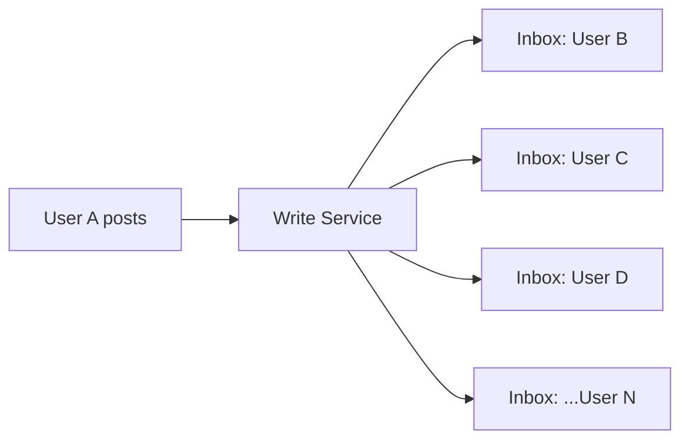
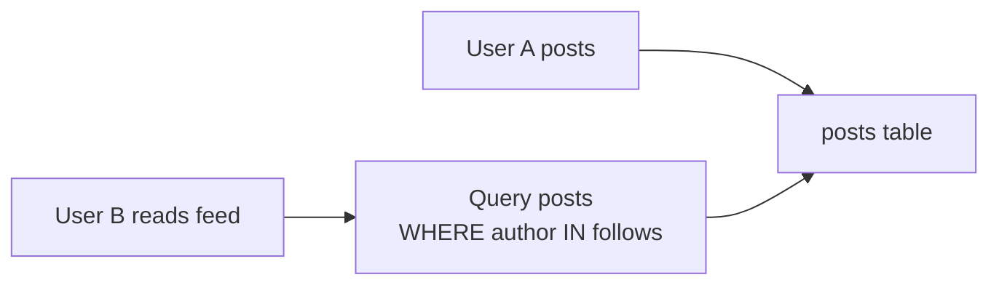
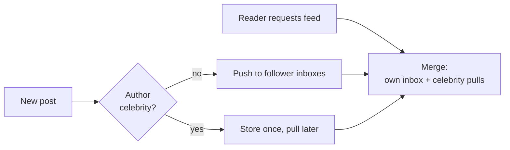
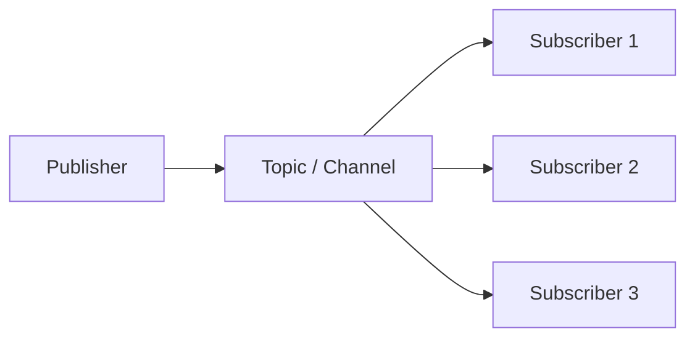

# Fanout Strategies

## What

Способы распределения одного события / сообщения / поста к множеству получателей. Главные стратегии — **fanout-on-write** (push) и **fanout-on-read** (pull). Применяются в чатах, лентах, нотификациях, pub-sub.

## Why / Problem it solves

Когда `user_A` отправляет сообщение в группу из N людей, есть выбор:
- **Сразу скопировать** сообщение в N inbox'ов получателей (write-expensive, read-cheap).
- **Хранить один раз** и собирать «ленту» при чтении (write-cheap, read-expensive).

При больших N и read/write асимметрии выбор драматически влияет на стоимость и latency.

## Strategies

### 1. Fanout-on-Write (Push model)

При написании — копируем во все inbox'ы получателей.

```
user_A posts → for each follower in followers(A):
                  insert into inbox[follower]
```



**+** Чтение **дешёвое**: `SELECT * FROM inbox WHERE user_id = X` — один индексированный запрос.
**+** Низкая read-latency, легко кэшируется.
**+** Простая модель данных.

**−** Запись **дорогая** O(N) на пост.
**−** **Celebrity problem**: пост Lady Gaga (60M+ followers) → 60M вставок.
**−** Storage explosion: одно сообщение хранится N раз (можно митигировать ссылками вместо копий).

**Когда:** read-heavy, среднее число получателей умеренное (десятки–тысячи), большинство пользователей не celebrity.

### 2. Fanout-on-Read (Pull model)

При написании — храним пост один раз. При чтении ленты — собираем посты от всех `followed`.

```
user_A posts → insert into posts[A]

user_B reads feed →
    SELECT * FROM posts
    WHERE author IN follows(B)
    ORDER BY time
    LIMIT 50
```



**+** Запись **дешёвая** — одна вставка.
**+** Никакого storage explosion.
**+** Celebrity-проблема исчезает на write.

**−** Чтение **дорогое**: JOIN/aggregation по N авторам, обычно read-heavy 100:1 → бьёт жёстко.
**−** Сложно кэшировать (лента уникальна каждому).
**−** Высокая read-latency.

**Когда:** write-heavy, read редко (мало активных читателей), low-traffic users, celebrity-доминирующий граф.

### 3. Hybrid (push-pull)

Combine оба подхода в зависимости от типа отправителя/получателя:

**Стратегия A (Twitter подобная):**
- **Non-celebrity posts** → fanout-on-write в inbox followers.
- **Celebrity posts (>N followers)** → store once, pull at read.
- При чтении feed: union(inbox push'ов) + pull(celebrity posts followed).

**Стратегия B (active vs inactive readers):**
- Push только для **активных** followers (логинились за последние N дней).
- Inactive — pull on demand.
- Reduce write amplification ~10x.



**+** Балансирует write/read cost.
**+** Решает celebrity problem.

**−** Сложность реализации.
**−** Сложнее ordering и pagination (две источника).

**Когда:** large-scale social networks (Twitter, Instagram).

### 4. Pub/Sub Broadcast

Сообщение публикуется в topic, все онлайн-подписчики получают через persistent connection ([[long-lived-connections]]).



**+** Realtime для online users.
**+** Broker (Kafka, NATS, Redis Pub/Sub) делает heavy lifting.

**−** Только online — нужен fallback для offline.
**−** Делает в основном fanout-on-write через broker.

**Когда:** real-time chat, live updates, presence broadcasts. Обычно **в комбинации** с persistent storage для offline и history.

## Сравнительная таблица

| Стратегия           | Write cost | Read cost | Celebrity | Storage   | Лучший use case            |
|---------------------|------------|-----------|-----------|-----------|----------------------------|
| Fanout-on-Write     | **O(N)**   | O(1)      | плохо     | N copies  | Mid-N, read-heavy          |
| Fanout-on-Read      | O(1)       | **O(N)**  | хорошо    | 1 copy    | Write-heavy, low reads     |
| Hybrid (push-pull)  | mixed      | mixed     | хорошо    | селективно| Large social (Twitter)     |
| Pub/Sub broadcast   | O(N online)| 0         | online ok | none      | Realtime online (chat)     |

## Push vs Pull для notifications

Похожая дилемма для нотификаций:

**Push (server → client):**
- Sender (server) знает, кого уведомить.
- Подходит для **fanout-on-write** модели.
- WebSocket / SSE / mobile push.

**Pull (client → server):**
- Client сам запрашивает обновления.
- Подходит для **fanout-on-read** модели.
- Polling / lazy refresh.

В практике — комбинация: push для realtime + pull для catch-up при reconnect.

## Common pitfalls

- **Fanout-on-write для celebrity без ограничений.** Один пост → миллионы вставок → write storm в БД.
- **Игнорирование active vs inactive users.** Push в inbox пользователя, который не заходил год → waste.
- **Pull для каждого page-load.** Без кэширования собранной ленты — БД сгорит.
- **Ordering при hybrid.** Push-сообщения и pull-celebrity-posts имеют разные timestamps → нужна consistent ordering логика.
- **Дубликаты при reconnect.** При hybrid и offline-catchup можно прислать пост дважды. Дедупликация по message_id обязательна.
- **Hot topic — single partition в Kafka.** Один очень популярный канал → одна партиция → bottleneck. Шардить или replicate.

## Used in case studies

- [[004-chat]] — fanout-on-write для group chats с малым N; pull/lazy подход для очень больших channels (Slack workspaces).

## References

- Twitter Engineering — [Timelines at scale](https://www.infoq.com/presentations/Twitter-Timeline-Scalability/) (Raffi Krikorian).
- Instagram — [Building the new Instagram messaging API](https://about.instagram.com/blog/engineering/messaging-architecture).
- Facebook Messenger — [Building Mobile-First Infrastructure for Messenger](https://engineering.fb.com/2014/10/09/production-engineering/building-mobile-first-infrastructure-for-messenger/).
