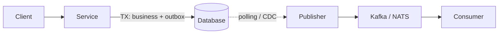

# Outbox Pattern (Transactional Outbox)

## What

Паттерн надёжной публикации событий из сервиса в брокер сообщений: событие сохраняется в специальную таблицу (`outbox`) в той же транзакции, что и бизнес-данные. Отдельный процесс (publisher / relay) асинхронно вычитывает outbox и публикует в брокер.

## Why / Problem it solves

Наивное решение «сохранить в БД + отправить в Kafka» — это **dual write**: две независимые операции, между которыми может упасть процесс или сеть.

Возможные плохие исходы:
- Запись в БД прошла, отправка в Kafka упала → событие потеряно, consumers не узнают об изменении.
- Отправка в Kafka прошла, запись в БД откатилась → consumers получили событие, которого «не было».

Outbox устраняет dual write: транзакция БД — единственный источник правды. Публикация в брокер делается из этой же БД, отдельно.

## When to apply

**Применять:**
- Сервис меняет состояние в БД и должен опубликовать событие.
- Нужна гарантия at-least-once без потерь.
- Распределённой транзакции (XA / 2PC) хочется избежать.

**Не применять:**
- Событие чисто информационное, потеря допустима.
- Брокер сам поддерживает транзакционную интеграцию с твоей БД (редкий случай).

## How

### Механика

1. В одной транзакции:
   - Меняются бизнес-таблицы (например, вставка в `orders`).
   - В таблицу `outbox` вставляется запись с типом события и payload (JSON / Avro).
2. Транзакция коммитится — оба изменения видны атомарно.
3. Publisher (отдельный процесс или поток) опрашивает outbox или ловит изменения через CDC (Debezium), публикует в брокер, помечает запись как отправленную (или удаляет).

### Инварианты

- Запись в outbox и изменение бизнес-данных — **в одной транзакции БД**.
- Publisher идемпотентен: повторная публикация той же записи не страшна (consumers всё равно должны быть готовы к дублям → [[idempotency-key]] на consumer-стороне).
- Гарантия: **at-least-once**.

### Диаграмма



ASCII-вариант:

```
Service ──TX──▶ [orders + outbox]  (Postgres)
                       │
                       ▼ (polling / CDC)
                  Publisher
                       │
                       ▼
                    Kafka
                       │
                       ▼
                  Consumer
```

## Common pitfalls

- **Забыть положить outbox в ту же транзакцию.** Тогда снова получается dual write.
- **Publisher не идемпотентен.** При рестарте он отправит одно и то же событие дважды — и если consumer не дедуплицирует, будут дубликаты в downstream.
- **Outbox растёт бесконечно.** Нужен механизм очистки (удалять отправленные / архивировать).
- **Сериализация event payload в outbox-формате, который мутирует.** Версионируй схему с самого начала.
- **Долгая транзакция.** Большой payload в outbox + сложная бизнес-логика → длинные локи. Держать транзакцию короткой.

## Variations

- **Polling publisher** — простой `SELECT ... WHERE sent = false`. Просто, но создаёт нагрузку на БД.
- **CDC publisher** (Debezium и аналоги) — читает WAL/binlog, отправляет в Kafka. Меньше нагрузки на БД, но требует инфраструктуру.
- **Outbox в той же таблице** (вместо отдельной) — добавить колонку `event_payload` в `orders`. Реже встречается, усложняет схему.

## Used in case studies

- [[001-order-backend-marketplace]] — в обоих решениях (orchestration и event-driven) Outbox гарантирует доставку события `order_created` в Kafka.

## References

- Chris Richardson, "Microservices Patterns" — глава про Transactional Outbox.
- microservices.io — [Pattern: Transactional Outbox](https://microservices.io/patterns/data/transactional-outbox.html).
- Debezium documentation — Outbox Event Router.
