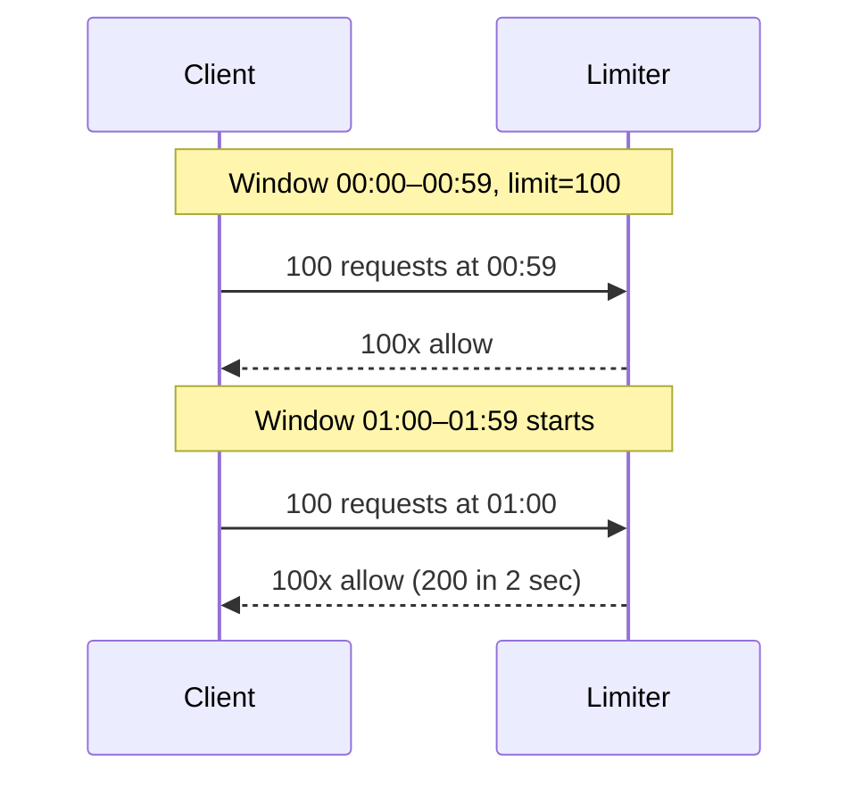

# Rate Limiting Algorithms

## What

Алгоритмы, ограничивающие количество запросов / событий за интервал времени. Применяются для защиты сервисов от перегрузки, fairness между клиентами, защиты от abuse.

Главный вопрос: **разрешён ли этот запрос прямо сейчас?** Ответ зависит от выбранного алгоритма и его параметров.

## Why / Problem it solves

Без ограничений:
- Один клиент может «съесть» все ресурсы (deliberate abuse или баг в его коде).
- Spike нагрузки кладёт downstream.
- Cost управление невозможно (биллинг по запросам).
- Fair use не обеспечен.

Rate limiting — простейшая, но критически важная защитная мера. Каждый production-сервис её имеет на каком-то уровне (API Gateway, LB, приложение, БД).

## Algorithms

### 1. Fixed Window Counter

Счётчик запросов в фиксированном временном окне (например, по минутам). При достижении лимита — все следующие запросы в этом окне отклоняются. На границе окна счётчик сбрасывается.

```
Time:    [00:00 .. 00:59] [01:00 .. 01:59]
Limit:   100              100
Counter: 0 → 100 → DENY   0 → ...
```

**+** Простая реализация: `INCR key:user42:minute_NNN` в Redis с TTL.
**+** Минимальная память: один counter на окно.

**−** **Burst на границе.** Клиент может сделать 100 запросов в 00:59 и ещё 100 в 01:00 → 200 запросов за 2 секунды. Эффективный rate в 2x от лимита.



### 2. Sliding Window Log

Хранится **список timestamp-ов** всех запросов клиента за последний интервал. На каждый новый запрос:
1. Удалить все timestamp старше `now - window`.
2. Если `len(log) < limit` → allow + append timestamp.
3. Иначе → deny.

**+** **Идеально точный** — нет burst-проблем.

**−** Память O(limit) на клиента. При 1000 RPS лимите и 1M пользователей — гигабайты.
**−** Каждый запрос — N операций (cleanup + check + append).

### 3. Sliding Window Counter (approximate)

Гибрид fixed window и sliding log. Хранятся **счётчики** для текущего и предыдущего окна. Эффективный rate:

```
rate = current_window_count + previous_window_count × overlap_ratio

где overlap_ratio = (window_size - position_in_current_window) / window_size
```

Пример: лимит 100/мин. Сейчас 00:30 (середина окна).
- В окне 00:00–00:59 было 80 запросов.
- В окне 01:00–01:59 пока 30 запросов.
- Effective rate = 30 + 80 × 0.5 = 70 → allow (если лимит 100).

**+** Память O(1) (два counter'а), как fixed window.
**+** **Гладкое поведение** на границе — нет burst'а.
**+** Очень близко к точному (sliding log) на практике.

**−** Чуть сложнее реализовать.
**−** Approximate — может быть погрешность 5-10% в пиковых ситуациях.

### 4. Token Bucket

Каждому клиенту — «ведро» с токенами:
- Capacity `C` — максимум токенов в ведре.
- Refill rate `R` — токенов добавляется в секунду.
- На каждый запрос — берём 1 токен. Нет токенов → deny.

```
state = (tokens: float, last_refill: timestamp)

on request:
    elapsed = now - last_refill
    tokens = min(C, tokens + elapsed * R)
    last_refill = now
    if tokens >= 1:
        tokens -= 1
        allow
    else:
        deny
```

**+** **Позволяет burst** до `C` запросов мгновенно — естественно для interactive UX (пользователь может «нажать F5 пять раз»).
**+** Простая память: O(1) state на клиента (2 числа).
**+** Гладкое average-rate ограничение.

**−** Нужна синхронизация при distributed (atomic refill + decrement).

**Когда применять:** API rate limiting с burst tolerance. **Самый популярный** алгоритм в production. Используется AWS, Stripe, GitHub.

### 5. Leaky Bucket

«Ведро с дыркой»: запросы заливаются сверху в очередь, обрабатываются с постоянной скоростью `R`. Полное ведро → drop / deny.

```
queue + worker (constant rate)

[req] → [req][req][req] → [req] → out at rate R
        ↑ overflow → drop
```

**+** **Сглаживает burst** — на выходе всегда constant rate.
**+** Хорошо для downstream, который не переваривает шипы (legacy API, БД).

**−** Latency возрастает при burst (запросы стоят в очереди).
**−** Сложнее в реализации (нужна очередь, worker).
**−** Memory зависит от размера очереди.

**Когда применять:** traffic shaping (TCP / network). Реже для HTTP rate limiting.

### Token Bucket vs Leaky Bucket

Часто путают. Различие:
- **Token Bucket** = **rate limit на average + burst tolerance**. Burst разрешён, если есть токены.
- **Leaky Bucket** = **traffic shaping**. Burst сглаживается; output всегда constant rate.

## Сравнительная таблица

| Algorithm              | Memory   | Burst handling      | Точность     | Сложность | Пример use case                 |
|------------------------|----------|---------------------|--------------|-----------|----------------------------------|
| Fixed Window           | O(1)     | **Bad** (boundary)  | Низкая       | Минимальная | Грубое quota tracking         |
| Sliding Window Log     | O(limit) | Нет burst-проблем   | **Точная**   | Средняя   | Когда точность критична       |
| Sliding Window Counter | O(1)     | Гладкое             | ~95-99%      | Средняя   | **Default для большинства**   |
| Token Bucket           | O(1)     | **Разрешён**, ограничен | Высокая   | Низкая    | API rate limit, AWS/Stripe    |
| Leaky Bucket           | O(queue) | Сглаживает          | Высокая      | Высокая   | Traffic shaping (network)     |

## Distributed considerations

Один rate limiter в одном инстансе — тривиально. Проблемы появляются при N инстансах:

### Локальный (per-instance)
Каждый инстанс держит свой state. Эффективный лимит = `N × limit_per_instance`.
- **+** Zero latency overhead.
- **−** Точность плохая — клиент может «попасть» на разные инстансы.

### Централизованный (Redis)
Все инстансы читают/пишут в Redis. Atomic операции через `INCR + EXPIRE` или Lua-скрипт для token bucket.
- **+** Глобально точный лимит.
- **−** Latency Redis (~1ms сетевой).
- **−** Redis = bottleneck и SPOF (мити: репликация, кластер).

### Sharded (consistent hashing)
Каждый клиент маршрутизируется по `hash(client_id)` на конкретный инстанс через [[consistent-hashing]]. Этот инстанс — единственный owner state'а для клиента.
- **+** Локальный state, но глобально точный.
- **+** Нет network overhead.
- **−** Rebalancing при добавлении нод (часть клиентов «теряет» историю).
- **−** Hot keys — один очень активный клиент перегружает свой шард.

### Hybrid
Локальный counter + периодический sync с центральным.
- **+** Low latency.
- **−** Approximate; клиент может slightly overshoot между sync.

## Failure modes

**Fail-open** — если rate limiter недоступен, **пропускать** все запросы.
- **+** Доступность приоритет.
- **−** При сбое downstream может быть overwhelmed.

**Fail-closed** — если rate limiter недоступен, **блокировать** запросы.
- **+** Защита downstream.
- **−** Сбой rate limiter = полный outage.

Production default: **fail-open** для read-paths, **fail-closed** для критичных write-paths (платежи).

## Common pitfalls

- **Boundary burst** в fixed window — не использовать для строгих лимитов.
- **TTL не синхронизирован** между инстансами в Redis — race conditions на reset.
- **Memory leak в sliding log** — забыли TTL.
- **Без atomic операций** — два инстанса читают `counter=99`, оба инкрементируют, оба пропускают → лимит +1.
- **Один rate limit на endpoint и user** — недостаточно. Нужны иерархические лимиты: per-user, per-IP, per-endpoint, global.
- **Жёсткие лимиты без фидбэка** — клиент не знает, когда retry. Возвращать `429 Too Many Requests` + `Retry-After` header.
- **Не различают successful vs failed запросы** — лимит должен считать ВСЕ, иначе клиент сжигает quota на ошибках.

## What to return

Стандартный HTTP-протокол:

```
429 Too Many Requests
Retry-After: 30
X-RateLimit-Limit: 100
X-RateLimit-Remaining: 0
X-RateLimit-Reset: 1700000060
```

GitHub / Stripe / AWS придерживаются этого формата.

## Used in case studies

- [[003-rate-limiter]] — обе solutions используют Token Bucket / Sliding Window Counter; различаются deployment-стратегией (centralized Redis vs sharded local).

## References

- Stripe Engineering — [Scaling your API with rate limiters](https://stripe.com/blog/rate-limiters).
- Cloudflare — [How we built rate limiting capable of scaling to millions of domains](https://blog.cloudflare.com/counting-things-a-lot-of-different-things/).
- AWS — Token bucket в API Gateway throttling.
- System Design Interview Vol. 1 (Alex Xu) — Chapter 4: Design a rate limiter.
