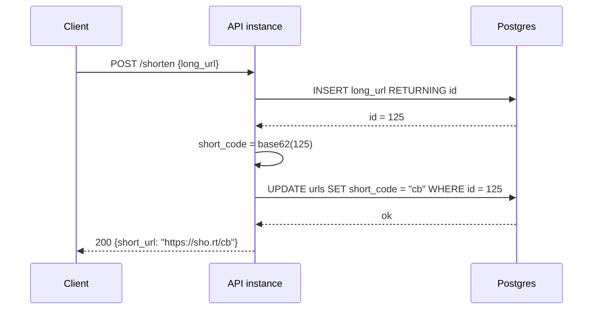
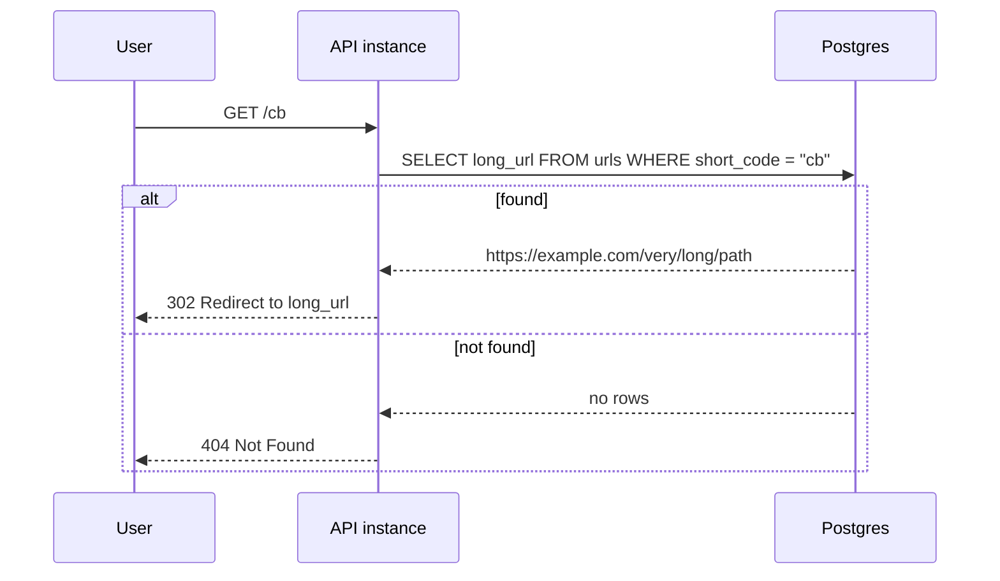

# URL Shortener: простейшая архитектура

Связанный кейс: [[002-url-shortener]]

## Что сейчас разбираем

Начинаем не с финальной system design архитектуры, а с минимального рабочего варианта:

- один или несколько `API instance`;
- один нешардированный `Postgres`;
- без отдельного `ID Generator`;
- без `Redis`;
- без `CDN`;
- без шардинга;
- без аналитики кликов.

Цель такого разбора — сначала понять, какую задачу решает самая простая архитектура, а потом отдельно увидеть, почему ее начинает не хватать.

## Зачем вообще сокращать URL

Возьмем реалистичный сценарий: интернет-магазин отправляет клиенту SMS, что заказ готов к выдаче.

Без shortener сообщение может выглядеть так:

```text
Ваш заказ готов. Детали: https://shop.example.com/orders/923847293847?token=eyJhbGciOiJIUzI1NiIsInR5cCI6IkpXVCJ9&utm_source=sms&utm_campaign=pickup_ready
```

Проблемы:

- SMS имеет ограничение по длине, длинная ссылка может разбить одно сообщение на несколько SMS и увеличить стоимость рассылки.
- Пользователь видит длинную техническую ссылку с параметрами и токеном, поэтому меньше ей доверяет.
- В некоторых каналах длинная ссылка может некрасиво переноситься, обрезаться или ломаться.
- Бизнесу нужно понимать, сколько людей перешли именно из этой SMS-кампании.

С shortener сообщение становится короче:

```text
Ваш заказ готов. Детали: https://sho.rt/a8K2pQ
```

А в БД shortener хранится соответствие:

```text
a8K2pQ -> https://shop.example.com/orders/923847293847?token=...&utm_source=sms&utm_campaign=pickup_ready
```

Когда пользователь открывает `https://sho.rt/a8K2pQ`, сервис находит длинный URL и возвращает redirect.

То есть задача shortener не только в том, чтобы сделать ссылку красивее. Он помогает:

- уместить ссылку в SMS, push, QR-код или печатный материал;
- скрыть длинный технический URL с параметрами;
- измерять переходы по конкретной кампании;
- иметь стабильную короткую ссылку, даже если реальный длинный URL потом изменится.

## Простейшая модель данных

```sql
CREATE TABLE urls (
    id BIGSERIAL PRIMARY KEY,
    short_code TEXT UNIQUE NOT NULL,
    long_url TEXT NOT NULL,
    created_at TIMESTAMPTZ NOT NULL DEFAULT now()
);
```

В этом варианте `id` генерирует сам Postgres через `BIGSERIAL`.

`short_code` можно получить из `id`:

```text
id = 125
base62(125) = "cb"
short_url = "https://sho.rt/cb"
```

То есть отдельный генератор ID не нужен: Postgres сам выдает следующий числовой ID, а приложение только превращает его в короткий код.

## Write flow: создание короткой ссылки



Можно сделать и в один SQL-запрос, если base62-кодирование вынести в БД или заранее генерировать код в приложении. Но для первого понимания полезнее видеть два шага:

1. БД выдала уникальный `id`.
2. API превратил `id` в короткий `short_code`.

## Read flow: переход по короткой ссылке



## Почему эта архитектура вообще нормальная

Для небольшого сервиса это рабочее решение.

Например:

- внутренний корпоративный shortener;
- short links внутри админки;
- сервис для небольшой команды;
- pet project;
- MVP, где важнее быстро проверить продукт.

В такой ситуации один Postgres может спокойно держать и запись новых URL, и чтение коротких ссылок. `BIGSERIAL` дает уникальность, `UNIQUE` на `short_code` защищает от дублей, а индекс по `short_code` позволяет быстро находить оригинальный URL.

## Где здесь границы

Пока все держится на одном Postgres:

- все записи идут через один database primary;
- все редиректы читают из той же БД;
- `short_code` получается последовательным и угадываемым;
- при большом read traffic БД становится горячей точкой;
- при большом write traffic счетчик и индекс в одной БД становятся общей точкой координации;
- если БД недоступна, сервис почти полностью недоступен.

Это еще не значит, что архитектура плохая. Это значит, что следующие паттерны появляются не "потому что так принято", а когда конкретная нагрузка или требование ломает эту простую схему.

## Что будем добавлять дальше

Дальше можно разбирать по одному усложнению:

| Проблема простой схемы | Что обычно добавляют |
|---|---|
| Много redirect-запросов бьют в Postgres | `Redis` cache / cache-aside |
| Один Postgres не вмещает все данные | шардинг storage |
| Последовательные `short_code` легко перебирать | random code + retry |
| Нужны короткие sortable ID без центральной БД | Snowflake / range-based ID |
| Горячие ссылки создают всплески чтения | CDN / edge cache |
| Нужна статистика кликов | async event pipeline |
