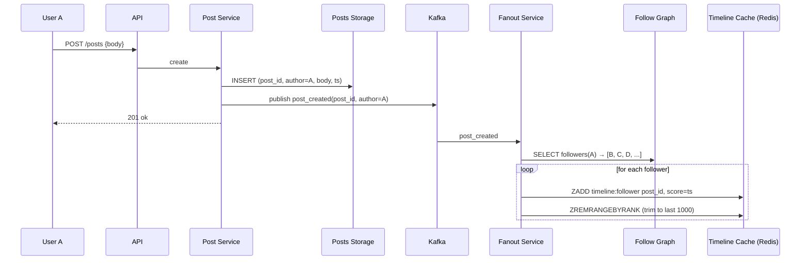
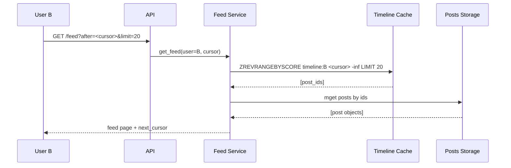
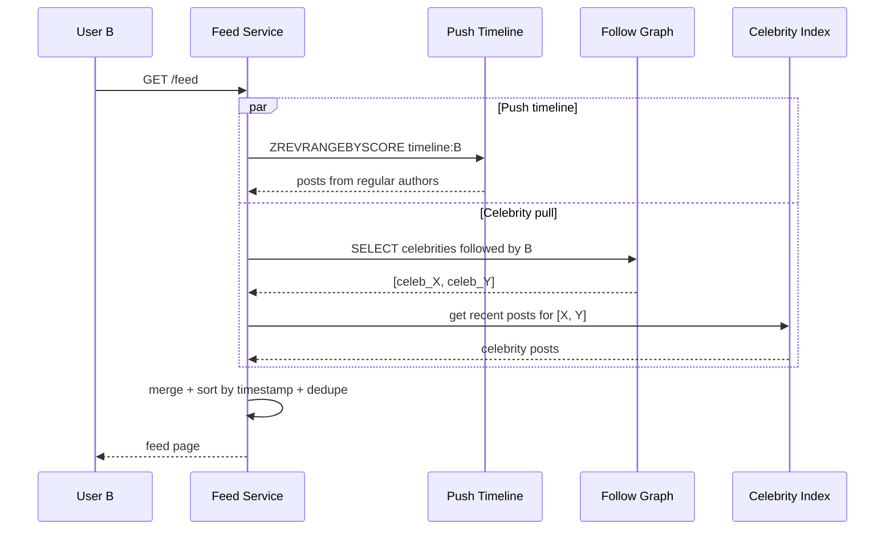

# News Feed (Twitter / Instagram-like)

## Source

- Классическая задача System Design interview.
- Референсы:
  - Alex Xu — "System Design Interview Vol. 1", Chapter 11.
  - Raffi Krikorian (ex-Twitter) — "Timelines at Scale" (InfoQ presentation).
  - Twitter Engineering — [The Infrastructure Behind Twitter](https://blog.twitter.com/engineering/).
  - Instagram — [Building a Better News Feed](https://about.instagram.com/blog/).

## Problem

Спроектировать сервис, формирующий **персональную ленту** (feed) из постов людей, на которых подписан пользователь.

API:
```
POST /posts                  { body, media_url? }
GET  /feed?after=<cursor>&limit=20
GET  /users/:id/posts
POST /follow                 { target_user_id }
```

Лента — список постов от **followed users**, упорядоченный (chronological или ranked) с pagination.

Вне scope (для простоты): ranking ML-моделей, ads, media processing (CDN), trending topics.

## Requirements

### Functional
- Создать пост.
- Подписаться / отписаться от пользователя.
- Получить свою ленту (последние N постов от followed).
- Pagination ленты.
- Real-time появление новых постов (опц.) — через push.

### Non-functional

| Метрика                  | Значение                                |
|--------------------------|------------------------------------------|
| DAU                      | 300M (Twitter), 1B+ (Instagram)         |
| Posts/day                | ~500M (Twitter) — ~6000 posts/sec       |
| Feed reads/day           | 30B — ~350k reads/sec average           |
| Read/Write ratio         | **~100:1**                              |
| Feed P99 latency         | **< 200 ms**                            |
| Follows median           | 200, max — celebrity 100M+              |
| Followers median         | 200, max — Cristiano Ronaldo ~600M     |
| Storage per post         | ~1 KB (текст + meta + ссылка на media)  |
| Availability             | 99.99%                                   |

Архитектурные приоритеты:
- **Read-heavy** → акцент на materialized timelines + кэш.
- **Celebrity problem** → нужен hybrid push/pull.
- **Pagination** — стабильная при insertions (новые посты не сдвигают страницы).

---

## Solution A: Pure Fanout-on-Write (Push)

### Идея

При публикации поста — сразу копируем его в **timeline cache** каждого follower'а. Read ленты — простое чтение готового списка. Это fanout-on-write модель из [[fanout-strategies]].

### Компоненты

- **Post Service** — приём постов, persist в БД.
- **Fanout Service** — async worker, читает событие `post_created`, добавляет post_id в timeline каждого follower'а.
- **Timeline Cache** (Redis Sorted Set per user) — `ZADD timeline:user_X score=timestamp post_id`.
- **Post Storage** (Cassandra / sharded SQL) — single source of truth для постов.
- **Follow Graph** — graph DB (Neo4j) или sharded SQL (`(follower_id, followed_id)`).
- **Kafka** — события постов.

### Поток write (новый пост)



### Поток read (feed)



### Используемые паттерны

- [[fanout-strategies]] — fanout-on-write.
- [[materialized-view]] — timeline — это per-user materialized view.
- [[pagination]] — cursor-based по `(timestamp, post_id)`.
- [[caching-strategies]] — Redis Sorted Set как timeline cache.
- [[consistent-hashing]] — sharding Cassandra и Redis по user_id.

### Плюсы

- **Read дёшев** — один Redis `ZREVRANGEBYSCORE` + batch-get постов.
- **Простая модель** — feed = timeline cache.
- **Estimated реал-тайм** — пост попадает в follower's ленту за секунды.
- **Stable pagination** через cursor.

### Минусы

- **Celebrity write storm.** Cristiano Ronaldo (~600M followers) пишет пост → 600M вставок в Redis. Невыполнимо в realtime.
- **Storage explode.** Пост от popular author хранится в N timeline copies (можно митигировать через `post_id` вместо полного post — мы уже так делаем).
- **Inactive followers waste.** Пользователь не заходил год → его timeline всё равно обновляется.
- **Cold start.** Новый user без timeline → сначала fanback-fill.
- **Reordering** при удалении / редактировании поста — нужны explicit events.

---

## Solution B: Hybrid Push/Pull (Twitter approach)

### Идея

Разделить authors на **celebrity** (>N followers, например 10k+) и **regular**:

- **Regular authors** → fanout-on-write (push) в timelines followers (как Solution A).
- **Celebrity authors** → **не fanout**; пост хранится один раз. При чтении ленты — pull-merge с постами celebrity-following.

Дополнительно: push **только активным** followers (логинились за N дней). Inactive — lazy compute при возврате.

### Компоненты

Те же, что в A, плюс:
- **User Classification** — кто celebrity (по `follower_count > threshold`).
- **Celebrity Post Index** — отдельная структура `user_X → recent_posts_list`, оптимизированная под pull.
- **Merge logic в Feed Service** — собирает push timeline + pulled celebrity posts.

### Поток write

```mermaid
sequenceDiagram
    participant U as Author A
    participant Post as Post Service
    participant Class as Classifier
    participant Kafka
    participant Fan as Fanout Service

    U->>Post: create post
    Post->>Class: is A celebrity?
    alt regular author
        Post->>Kafka: post_created
        Kafka->>Fan: fanout to active followers
    else celebrity (>10k followers)
        Post->>Kafka: post_created_celebrity
        Note over Fan: skip fanout; only store
    end
```

### Поток read (feed)



### Используемые паттерны

- [[fanout-strategies]] — hybrid push/pull (см. там подробнее).
- [[materialized-view]] — push-timeline + celebrity-recent-posts (две view'хи).
- [[pagination]] — cursor over merged timeline.
- [[caching-strategies]] — обе view'хи в Redis.

### Плюсы

- **Решает celebrity problem** — нет 600M вставок.
- **Reduce write amplification** — fanout только активным non-celebrity-following.
- **Storage эффективнее** — celebrity posts хранятся один раз.

### Минусы

- **Read сложнее** — merge двух источников + sort + dedupe.
- **Pagination сложнее.** Cursor должен координировать обе модели.
- **Ordering issues** на границах — push-сообщения и pull-celebrity-posts могут «прыгать» при смене страницы.
- **Сложнее реализовать** — больше движущихся частей.
- **Threshold celebrity** — субъективен, требует тюнинга.

---

## Trade-offs

| Критерий                      | A: Pure Push (fanout-on-write) | B: Hybrid Push/Pull              |
|-------------------------------|--------------------------------|----------------------------------|
| Write cost (regular post)     | O(N followers)                | O(N active followers)            |
| Write cost (celebrity post)   | **O(N) — катастрофа**          | O(1)                             |
| Read cost                     | O(1) — read cache              | O(1) push + O(celebrity follows) |
| Storage                       | post_id × N copies             | mixed; selective                 |
| Implementation                | проще                          | сложнее                          |
| Celebrity problem             | блокер                         | **решён**                        |
| Realtime feel                 | отлично                        | отлично                          |
| Inactive user efficiency      | плохо                          | **хорошо**                       |
| Pagination stability          | хорошо                         | сложнее, но работает             |

**Когда A:** маленький social network, мало celebrities, ограниченный scale.
**Когда B:** Twitter/Instagram scale — N followers распределены по power law с длинным хвостом.

**Production:** Twitter и Instagram используют variants B. Pure A — для прототипов или specialized communities.

---

## Дополнительные соображения

### Ranking (вне scope, упомянуть)

Современные ленты — **не chronological**, а ML-ranked. Архитектурное влияние:
- После сборки candidate posts → ranking service.
- Ranking service дёргает feature store + ML model.
- Feed возвращается уже отранжированный.
- Pagination сложнее: ranking может ставить новые items посередине → нужен **session-stable** ranking (заморозить ranking на сессию).

### Timeline cache size

- 1000 последних постов на пользователя достаточно для большинства scroll'еров.
- Тримминг через `ZREMRANGEBYRANK` после ZADD.
- Для inactive users — TTL на timeline cache (если пользователь вернётся — rebuild от Cassandra).

### Read-your-writes

Пользователь создал пост → хочет увидеть его в своей ленте сразу. Решения:
- Inject own latest на стороне Feed Service при сборке.
- Synchronous projection в свой собственный timeline.

### Hot post

Пост, который получает 1M комментариев/лайков → партиция в Cassandra перегружена.
- Sub-partitioning постов по `(post_id, day_bucket)`.
- Aggregates (likes count) — отдельный counter сервис, async update.

### Edits / deletions

Пост отредактирован / удалён → нужно обновить во всех timelines где он есть.
- Через события: `post_updated`, `post_deleted`.
- Timeline хранит post_id, не полный post → при чтении lookup даёт актуальную версию.
- Удаление: фильтровать tombstones при read.

### Media

Image / video — отдельный pipeline: upload → encode → CDN.
- Post body содержит ссылку на CDN.
- CDN — out of scope здесь.

### Pagination details

Cursor = `base64({last_timestamp, last_post_id, direction})`. Подписан HMAC.

При hybrid модели cursor содержит **обе** позиции (push timeline + celebrity index).

```
{
  "push_after": "<post_id_in_push_timeline>",
  "celeb_after": {
    "celeb_X": "<post_id>",
    "celeb_Y": "<post_id>"
  },
  "merge_threshold": "<timestamp>"
}
```

См. [[pagination]] о cursor format.

---

## Key Takeaways

1. **News Feed = materialized view над social graph.** Не «JOIN на каждый read», а pre-computed timeline. См. [[materialized-view]].

2. **Fanout-on-Write — основа для большинства lent.** При regular users работает отлично. См. [[fanout-strategies]].

3. **Celebrity problem требует hybrid push/pull.** Threshold (10k followers) делит authors на два класса. Без этого — Twitter уровень в принципе невозможен.

4. **Cursor-based pagination обязательна.** Offset разрушается при insertion. Cursor стабилен и быстр. См. [[pagination]].

5. **Active vs inactive users.** Push только активным — кардинально снижает write amplification.

6. **Timeline cache → Redis Sorted Set** — стандартный выбор. Поддерживает range queries, ordering, trimming.

7. **Ranking меняет архитектуру.** Chronological feed → ML ranked feed = добавление ranking service, session-stable pagination.

8. **Read-your-writes требует hack.** Inject собственных постов на стороне Feed Service, иначе пользователь не увидит свой пост.

## Open Questions

- **Ranking архитектура** — feature store, batch vs online inference, A/B testing platforms.
- **Ads injection** — отдельный pipeline, slot-based, auction.
- **Trending topics** — streaming aggregation поверх постов.
- **Multi-region** — replicated timelines vs regional sharding.
- **Stories / ephemeral content** — TTL-based, разный access pattern.
- **Real-time updates** — push новых постов через [[long-lived-connections]] vs polling.
- **Anti-abuse** — spam detection, ban propagation в timeline cache.

## References

- Alex Xu — "System Design Interview Vol. 1", Chapter 11: Design a news feed.
- Raffi Krikorian — [Timelines at Scale](https://www.infoq.com/presentations/Twitter-Timeline-Scalability/) (Twitter, 2013).
- Instagram — [Building a Better News Feed](https://about.instagram.com/blog/announcements/changes-to-improve-your-instagram-feed).
- Facebook — [News Feed Ranking](https://about.facebook.com/news/2021/01/how-news-feed-ranking-works/).
- Связанные паттерны: [[fanout-strategies]], [[materialized-view]], [[pagination]], [[caching-strategies]], [[consistent-hashing]].
