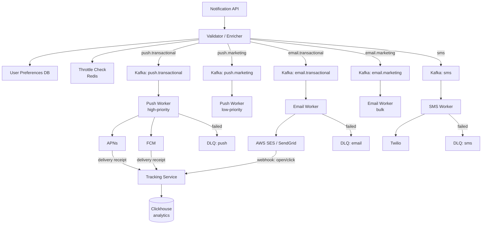
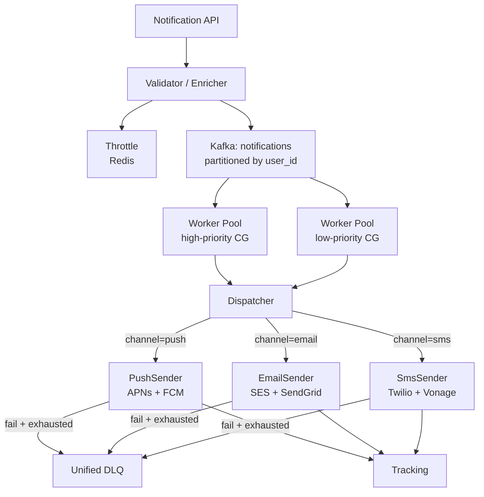

# 007 — Notification Service

## Source

Alex Xu, *System Design Interview Vol. 1*, Chapter 10. Аналоги: системы уведомлений Facebook, Airbnb, Duolingo.

---

## Problem

Нужна платформа, которая доставляет уведомления пользователям через несколько каналов: push (iOS/Android), email, SMS. Уведомления бывают транзакционные (сброс пароля, подтверждение оплаты) и маркетинговые (акции, еженедельный дайджест). Объём — сотни миллионов уведомлений в сутки.

---

## Requirements

### Functional

- Отправка push (APNs/FCM), email, SMS через внешних провайдеров.
- Поддержка типов: transactional (high priority) и marketing (low priority).
- Scheduling: delayed / recurring отправка.
- User preferences: подписка/отписка по типу и каналу.
- Open / click tracking для email и push.
- Channel fallback: если push failed → email.

### Non-Functional

- Transactional уведомления: p99 latency < 5 s от trigger до доставки.
- Marketing кампании: доставка в течение 30 минут для 10M пользователей.
- At-least-once доставка + idempotency (без дублей у пользователя).
- Deliverability: email SPF/DKIM/DMARC, IP warm-up.
- Throttling: не более N уведомлений на пользователя в час.

### Scale (back-of-envelope)

| Метрика | Значение |
|---|---|
| DAU | 100M |
| Push/сутки | 150M |
| Email/сутки | 50M |
| SMS/сутки | 5M |
| Peak RPS (trigger) | ~5 000 |
| Email через SES | ~600 emails/s при 50M/сутки |

---

## Solution A — Channel-Specific Pipeline via Kafka Topics

### Идея

Каждый канал имеет собственный Kafka topic. Сервисы-отправители (Push Worker, Email Worker, SMS Worker) изолированы друг от друга — независимо масштабируются и деплоятся. Приоритизация через отдельные топики (`push.transactional` vs `push.marketing`).

### Architecture



### Flow (transactional push)

```
sequenceDiagram
    participant S as Source Service
    participant API as Notification API
    participant K as Kafka push.transactional
    participant W as Push Worker
    participant APNs

    S->>API: POST /notify {user_id, type, payload}
    API->>API: validate + enrich (device tokens, preferences)
    API->>API: throttle check (Redis INCR + TTL)
    API->>K: produce message {idempotency_key, tokens[], payload}
    K-->>W: consume
    W->>APNs: send push
    APNs-->>W: 200 OK / error
    alt error
        W->>W: retry with exponential backoff (3x)
        W->>DLQ: move if exhausted
    end
    W->>TrackingDB: log delivery status
```

### Priority Lanes

```
Kafka topic                 Consumer Group          Max lag SLA
──────────────────────────────────────────────────────────────
push.transactional          push-workers-high       < 1 000 msgs
push.marketing              push-workers-low        < 500 000 msgs
email.transactional         email-workers-high      < 5 000 msgs
email.marketing             email-workers-bulk      < 2 000 000 msgs
```

Transactional workers имеют выше `num.partitions` и больший pod count.

### Pros

- Полная изоляция каналов: Email Worker не деградирует от SMS-шторма.
- Простой consumer — один топик = одна ответственность.
- Независимый scaling per-channel, per-priority.
- Kafka retention позволяет replay без отдельной DLQ-инфраструктуры.

### Cons

- Много топиков (2 приоритета × 3 канала = 6+) — operational overhead.
- Дублирование логики ретрая в каждом Worker.
- Сложнее поменять маршрутизацию (добавить новый канал = новый топик + новый Worker).

---

## Solution B — Unified Worker Pool + Strategy Pattern

### Идея

Один тип воркера читает из единого топика `notifications`. Маршрутизацию и логику отправки инкапсулирует **Strategy** (ChannelSender interface): PushSender, EmailSender, SmsSender. Приоритизация — через поле `priority` в сообщении + weighted consumer groups.

### Architecture



### Channel Fallback

```
Attempt push delivery
    │
    ▼
APNs / FCM error? (token invalid / unregistered)
    │
    ▼
Check: user has email?
    │ yes
    ▼
Enqueue email notification (same idempotency_key suffix + ".fallback")
    │
    ▼
Log: fallback triggered → analytics
```

Fallback регистрируется в Tracking Service, чтобы не дублировать если исходный push всё же дошёл (delivery receipt пришёл позже).

### Scheduling

```
Scheduler DB (Postgres)
  ┌───────────────────────────────────┐
  │ id, user_id, channel, payload     │
  │ scheduled_at, status, attempts    │
  │ idempotency_key                   │
  └───────────────────────────────────┘
         ↑ poll every second (cron job / Quartz)
         │ SELECT WHERE scheduled_at <= NOW() AND status = 'pending'
         ↓
    Notification API → Kafka
```

Для высокой точности (<1 s jitter) используется горизонтально масштабируемый scheduler с row-level locking (`SELECT ... FOR UPDATE SKIP LOCKED`).

### Pros

- Один тип воркера — меньше кода, единая retry-логика.
- Легко добавить канал: новый ChannelSender без нового топика.
- Централизованный DLQ — один дашборд.

### Cons

- Один топик = shared fate: медленный SMS-провайдер повышает lag для push.
- Weighted consumer groups сложнее настраивать и мониторить.
- Dispatcher — единая точка маршрутизации, сложнее тестировать.

---

## Deep Dives

### Idempotency

Каждый запрос к Notification API несёт `idempotency_key` (UUID от caller). Перед отправкой воркер проверяет Redis:

```
SET idempotency:{key}:{channel} 1 NX EX 86400
→ OK    → proceed
→ nil   → already sent, skip
```

TTL = 24 часа покрывает window ретраев. Ключ содержит channel чтобы fallback не блокировался.

### Per-user Throttling

```
Redis INCR notif:{user_id}:{channel}:{hour_bucket}
EXPIRE notif:{user_id}:{channel}:{hour_bucket} 3600
```

Лимиты: transactional — без ограничений; marketing — 5/час push, 2/час email.
Сервисы-источники передают `type`, Throttle middleware применяет политику.

### Retry + DLQ

[[retry-with-backoff]] — Full Jitter, `base=500ms`, `cap=30s`, `maxAttempts=5`.
После 5 попыток — в [[dead-letter-queue]].

DLQ сообщение содержит `failure_reason`, `attempt_count`, `original_topic`, `correlation_id`.
Alert: `dlq_depth > 0` → PagerDuty.

### Deliverability (Email)

- **SPF** — список IP, которым разрешено отправлять от домена.
- **DKIM** — подпись заголовков письма приватным ключом; получатель проверяет по DNS.
- **DMARC** — политика (`p=quarantine/reject`) при провале SPF/DKIM.
- **IP warm-up** — новый sending IP начинает с 100 писем/день, удваивает еженедельно. Провайдеры (SES, SendGrid) имеют dedicated IP pools.
- **Bounce/Complaint handling** — SES Bounce webhook → помечаем email как invalid в User Preferences, прекращаем отправку.

### Open / Click Tracking

Email: `` + redirect wrapper для ссылок.

Push: APNs / FCM delivery receipt → Tracking Service.

События пишутся в Clickhouse (column-store, дешёвый аналитический запрос):
```sql
SELECT notification_id, event_type, COUNT(*)
FROM notification_events
WHERE created_at >= today() - 7
GROUP BY 1, 2
```

---

## Trade-offs

| Критерий | Solution A (Channel Topics) | Solution B (Unified Pool) |
|---|---|---|
| Изоляция каналов | Полная | Частичная (weighted CG) |
| Добавить канал | Новый topic + Worker | Новый ChannelSender |
| Operational complexity | Много топиков | Один топик |
| Priority isolation | Явные топики | Weighted consumers |
| Retry централизация | Дублируется | Единая логика |
| **Рекомендация** | Когда каналы растут независимо | Когда каналов мало и команда небольшая |

---

## Key Takeaways

1. **Priority lanes критичны**: transactional должен доходить до пользователя даже во время маркетинговой кампании на 10M — изолируй их физически (топики) или логически (weighted consumers).
2. **Idempotency key на каждом уровне**: API → брокер → провайдер. APNs/FCM принимают `apns-collapse-id` / `collapse_key` для дедупликации на своей стороне.
3. **DLQ — не мусор**: 0 сообщений в DLQ — норма, любое попадание требует расследования.
4. **Email deliverability — отдельная дисциплина**: SPF + DKIM + DMARC + IP warm-up — это не «потом настроим», это prerequisite для попадания в inbox.
5. **Channel fallback повышает reach**, но усложняет дедупликацию: нужен общий idempotency scope.

---

## Open Questions

- Нужен ли In-App Notification channel (WebSocket / SSE)? Добавляется как ещё один ChannelSender без изменения топологии.
- Как обрабатывать timezone-aware scheduling для маркетинга («отправь в 10:00 по timezone пользователя»)? Scheduler должен хранить `user_tz` и конвертировать в UTC при enqueue.
- Как ротировать DKIM ключи без downtime? DNS TTL + двойная публикация: старый ключ `dkim._domainkey`, новый `dkim2._domainkey`, переключение через неделю после прогрева.

---

## References

- Alex Xu, *System Design Interview Vol. 1*, Chapter 10
- Apple Push Notification service (APNs) documentation
- Firebase Cloud Messaging (FCM) documentation
- AWS SES — Sending Email documentation
- [Airbnb — Scaling Notification Infrastructure](https://medium.com/airbnb-engineering/scaling-airbnbs-notification-platform-to-100m-notifications-per-day-a02ff1a65b59)
- [[retry-with-backoff]]
- [[dead-letter-queue]]
- [[idempotency-key]]
- [[rate-limiting-algorithms]]
