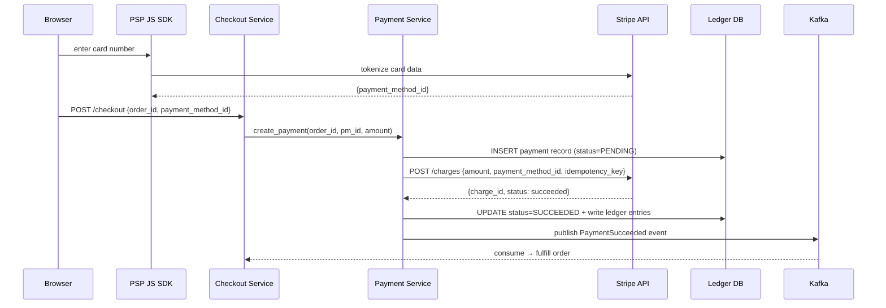
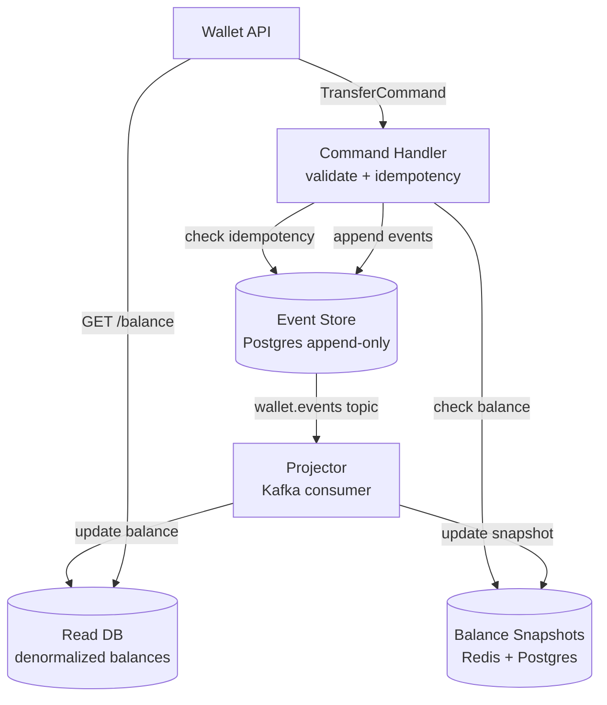

# 012 — Payment System

## Source

Alex Xu, *System Design Interview Vol. 2*, Chapter 11. Аналоги: Stripe, PayPal, Airbnb Payments, Uber Pay.

---

## Problem

Спроектировать платёжную систему для e-commerce платформы (Amazon-like или marketplace). Покупатель оплачивает картой, деньги поступают продавцу за вычетом комиссии. Система должна гарантировать: деньги не потеряются, не задвоятся, reconciliation с банком/PSP всегда сходится.

---

## Requirements

### Functional

- Pay-in: принять оплату картой / цифровым кошельком.
- Pay-out: перевести деньги продавцу (на банковский счёт).
- Ledger: хранить историю всех движений денег.
- Reconciliation: ежедневная сверка с PSP (Stripe / Adyen).
- Возврат (refund): полный или частичный.
- Chargeback handling: обработка оспоренных транзакций.

### Non-Functional

- **Exactly-once** семантика: за один заказ — ровно один списаний. Никаких дублей.
- **Consistency > Availability** (CAP): лучше отказать, чем создать двойную транзакцию.
- **Durability**: транзакция записана → не теряется при любом сбое.
- **Audit trail**: каждое движение денег хранится вечно.
- **PCI DSS**: номера карт не хранятся в нашей системе.

### Scale (back-of-envelope)

| Метрика | Значение |
|---|---|
| Транзакций/день | 1M |
| Avg TPS | ~12 |
| Peak TPS (Black Friday) | ~500 |
| Avg транзакция | $50 |
| Дневной оборот | $50M |
| Reconciliation строк/день | 1M |

*Платёжные системы — не high-throughput задача. Correctness важнее throughput.*

---

## Solution A — PSP-Integrated Checkout (Pay-in Flow)

### Идея

Карточные данные никогда не касаются наших серверов (PCI DSS). Клиент вводит карту в **PSP hosted fields** (Stripe Elements / Adyen Drop-In) — JavaScript на странице отправляет данные прямо в PSP, возвращает токен. Наш сервер работает только с токеном → создаёт charge через PSP API → записывает результат в ledger.

### Architecture



### Payment Service: State Machine

```
PENDING
  │
  ├─ PSP success → SUCCEEDED
  │                    │
  │                    ├─ refund requested → REFUND_PENDING → REFUNDED
  │                    └─ chargeback → DISPUTED → CHARGEBACK_LOST / WON
  │
  ├─ PSP decline → FAILED
  │
  └─ timeout / no response → PENDING (retry with same idempotency_key)
                              │
                              └─ max retries → FAILED
```

### Idempotency Key к PSP

```
Проблема: мы отправили charge в Stripe, сеть упала, ответ не получили.
Retry без защиты → второй charge (double charge пользователя).

Решение: Stripe Idempotency-Key header.
    key = SHA256(order_id + user_id + amount + currency)
    POST /v1/charges
    Idempotency-Key: {key}

Stripe: если ключ уже видели → возвращает исходный ответ, не создаёт новый charge.
Гарантия: даже при 100 ретраях — ровно 1 charge.

Хранить ключ в payments таблице:
    ALTER TABLE payments ADD COLUMN psp_idempotency_key TEXT UNIQUE;
```

### Ledger Entries для Pay-in

```sql
-- Успешная оплата $100: buyer платит, $97 → seller escrow, $3 → platform fee

BEGIN;
INSERT INTO ledger_entries (transaction_id, account_id, amount, direction, description) VALUES
    ('txn_pay_001', 'user_12345_wallet',    10000, 'debit',  'order #789 payment'),
    ('txn_pay_001', 'platform_psp_account', 10000, 'credit', 'order #789 payment'),  -- деньги пришли от PSP
    
    ('txn_split_001', 'platform_psp_account', 9700, 'debit',  'seller split order #789'),
    ('txn_split_001', 'seller_67890_escrow',  9700, 'credit', 'seller split order #789'),
    
    ('txn_split_001', 'platform_psp_account',  300, 'debit',  'platform fee order #789'),
    ('txn_split_001', 'platform_revenue',       300, 'credit', 'platform fee order #789');
COMMIT;

-- Invariant check: SUM(all amounts WHERE direction='debit')
--               = SUM(all amounts WHERE direction='credit')
```

### Pay-out Flow (Seller Withdrawal)

```
Продавец запрашивает вывод $97 на банковский счёт:

1. Payment Service проверяет баланс escrow счёта продавца
2. Создаёт payout запись (status=PENDING)
3. [Outbox] записывает payout_initiated событие в outbox таблицу — одной транзакцией с ledger entry
4. Outbox Publisher → PSP API: create transfer to seller bank account
5. PSP webhook → Payment Service: transfer.paid
6. Ledger: debit seller_escrow, credit seller_bank (external marker)
7. Payout status → COMPLETED

Критично: шаг 3 использует [[outbox]] — если сервис упадёт после ledger write,
но до PSP call — Publisher поднимет задачу из outbox и завершит.
```

---

## Solution B — Internal Wallet System (Event Sourced)

### Идея

Для marketplace или super-app с внутренними переводами (Airbnb Credit, Uber Cash) — собственная wallet система. Нет PSP для каждого внутреннего перевода. Ledger = event log. Текущий баланс — snapshot + incremental replay.

### Architecture



### Command → Events

```
TransferCommand {
    idempotency_key: "usr_A_to_B_order_456"
    from_account: "wallet_A"
    to_account:   "wallet_B"
    amount:       5000   # $50.00 in cents
    currency:     "USD"
    reason:       "order_payment"
}

Validation:
  1. Idempotency check: SELECT 1 FROM events WHERE idempotency_key = ?
     → если есть → вернуть cached result (no-op)
  2. Balance check: snapshot.balance >= amount
     → если нет → InsufficientFundsError (4xx, не ретраить)

Events produced (atomic):
  FundsDebited  {account: "wallet_A", amount: 5000, txn_id: "txn_xyz"}
  Fundscredited {account: "wallet_B", amount: 5000, txn_id: "txn_xyz"}
```

### Exactly-Once в Event Store

```sql
-- Одна транзакция: проверка + запись
BEGIN;
  -- Проверяем idempotency (UNIQUE constraint)
  INSERT INTO events (idempotency_key, type, payload, created_at)
  VALUES ('usr_A_to_B_order_456', 'FundsDebited', '{"account":"wallet_A","amount":5000}', NOW());
  -- Если duplicate key → ROLLBACK → вернуть existing result

  INSERT INTO events (idempotency_key, type, payload, created_at)
  VALUES ('usr_A_to_B_order_456_credit', 'FundsCredited', '{"account":"wallet_B","amount":5000}', NOW());
COMMIT;
-- Без этой транзакции — debit без credit при падении между ними
```

### Saga: Distributed Payment (cross-service)

```
Покупка включает несколько сервисов:
  1. Reserve inventory (Inventory Service)
  2. Charge payment (Payment Service)
  3. Fulfill order (Order Service)

Saga (choreography через события):
  OrderCreated →
    InventoryService: reserve → InventoryReserved →
      PaymentService: charge → PaymentCharged →
        OrderService: fulfill → OrderFulfilled

Rollback (compensation):
  PaymentFailed →
    InventoryService: release → InventoryReleased →
      OrderService: cancel → OrderCancelled

[[saga]] + [[outbox]] на каждом шаге = at-least-once delivery + idempotent consumers
```

---

## Deep Dives

### Reconciliation Pipeline

```
Ежедневно в 02:00 UTC:

Step 1: Download PSP report
    Stripe: GET /v1/balance/history?created[gte]=yesterday_start
    → CSV: {charge_id, amount, status, created_at, fee}

Step 2: Load internal records
    SELECT psp_charge_id, amount, status, created_at
    FROM payments
    WHERE created_at BETWEEN yesterday_start AND yesterday_end

Step 3: Three-way match
    for each stripe_row:
        internal = internal_map.get(stripe_row.charge_id)
        if not internal:
            alert("MISSING in internal: " + stripe_row.charge_id)
        elif internal.amount != stripe_row.amount:
            alert("AMOUNT MISMATCH: " + charge_id)
        elif internal.status != stripe_row.status:
            alert("STATUS MISMATCH: " + charge_id)

    for each internal_row:
        if internal_row.psp_charge_id not in stripe_map:
            alert("GHOST ENTRY: " + internal_row.id)

Step 4: Write reconciliation_report
    {date, total_matched, missing_count, mismatch_count}
    → если mismatch_count > 0 → PagerDuty

Step 5: Auto-fix missing entries
    Для MISSING: re-fetch from PSP API → write correcting ledger entry
    Для GHOST: mark for manual review (никогда не удалять ledger entries)
```

### Refund Flow

```
Пользователь запрашивает возврат за order #789:

1. Payment Service: создать Refund запись (status=PENDING)
2. PSP: POST /v1/refunds {charge_id, amount, reason}
   idempotency_key = SHA256("refund_" + order_id + "_" + refund_id)
3. PSP: обрабатывает ~5-10 рабочих дней (visa/mastercard)
4. Webhook: refund.created / refund.failed
5. Ledger reverse entries:
   credit  user_wallet (возврат средств)
   debit   platform_psp_account

Partial refund: amount < original → только часть.
Заблокировать повторный полный refund: CHECK в Payment Service.
```

### Chargeback Handling

```
Пользователь оспорил транзакцию в банке (dispute):

1. PSP webhook: charge.dispute.created
2. Payment Service: статус → DISPUTED
3. Evidence collection (72 часа у нас):
   - Order confirmation
   - Delivery proof
   - Customer communication logs
4. Submit evidence через PSP API
5. PSP webhook: charge.dispute.closed (won / lost)
6. If LOST:
   Ledger: debit seller_escrow (убрать деньги у продавца)
           credit platform_chargeback_reserve (фонд покрытия)
   Notify seller
7. Если seller fraud pattern → ограничить аккаунт
```

### PCI DSS Compliance

```
Что НЕ хранить в нашей системе:
  - Полный номер карты (PAN) — никогда
  - CVV / CVC — никогда, даже временно
  - PIN

Что хранить можно:
  - Last 4 digits (для display)
  - Card brand (Visa, Mastercard)
  - Expiry month/year
  - PSP token (payment_method_id) — не раскрывает PAN

Архитектурное решение:
  Stripe Elements / Adyen Web Components:
    JavaScript в iframe от PSP → данные карты НЕ попадают в наш DOM
    PSP tokenizes → наш код получает только token
    Наши серверы никогда не видят PAN
    → PCI DSS scope значительно сужается (SAQ A vs QSA audit)
```

### Payment Retry Logic

```
PSP вернул временную ошибку (rate limit, timeout):
    [[retry-with-backoff]]: base=1s, cap=30s, maxAttempts=3
    Используем тот же psp_idempotency_key → PSP deduplicate

PSP вернул permanent error (card declined, insufficient funds):
    НЕ ретраить → вернуть 4xx клиенту с reason

Network timeout (нет ответа от PSP):
    Неизвестно, прошёл ли charge.
    Стратегия: retry с тем же idempotency_key → PSP вернёт
    существующий результат или создаст новый (но не дублирует).

После max retries: payment → FAILED
    → поместить в [[dead-letter-queue]] для ручного расследования
    → уведомить пользователя
```

### Async Payment Methods (bank transfer, SEPA)

```
Для bank transfers (SEPA, ACH):
  - Инициация: создать transfer запись, status=INITIATED
  - PSP обрабатывает 1–3 рабочих дня
  - Webhook: payment.completed / payment.failed
  - Нельзя блокировать пользователя на 3 дня

Решение: optimistic capture
  1. Зарезервировать товар (inventory hold)
  2. Выполнить заказ условно (status=awaiting_payment)
  3. При подтверждении PSP → финализировать
  4. При отказе → отменить заказ + освободить резерв
```

---

## Trade-offs

| Критерий | Solution A (PSP Checkout) | Solution B (Internal Wallet) |
|---|---|---|
| PCI DSS scope | Минимальный (SAQ A) | Больше (если хранить токены) |
| Интеграционная сложность | Средняя (PSP API) | Высокая (event sourcing) |
| Latency | ~300–500 ms (PSP roundtrip) | < 50 ms (internal) |
| Для внешних платежей | Идеально | Нужна PSP интеграция всё равно |
| Для внутренних переводов | Overhead (через PSP) | Идеально |
| Reconciliation | С PSP обязательна | Только с internal ledger |
| **Рекомендация** | E-commerce, marketplace | Финансовая платформа, super-app |

---

## Key Takeaways

1. **Idempotency key — на каждом уровне**: API (наш) + PSP (Stripe header). Без этого retry = double charge.
2. **Ledger append-only**: ошибка компенсируется reverse entry, не UPDATE. Это не техническое ограничение — это требование аудита.
3. **Отделяй pay-in от pay-out**: pay-in (от покупателя) быстрый и синхронный; pay-out (к продавцу) — асинхронный через Outbox, batch.
4. **PSP не хранит карту — мы тоже**: hosted fields / iframe = PSP scope. Это фундамент PCI DSS compliance, а не опция.
5. **Reconciliation — не опция, а обязательный процесс**: любое расхождение обнаруживается максимум через сутки; мисматч > 0 = инцидент.

---

## Open Questions

- **Multi-currency**: Exchange rate при конвертации → записывать явно в ledger (какой курс, какой источник). Курс фиксируется в момент транзакции.
- **Fraud detection**: real-time scoring (ML модель на сигналах: velocity, geo, device) перед зарядом карты. Отдельный сервис, async обратная связь через событие.
- **Tax / VAT**: некоторые транзакции требуют split на сумму + налог → отдельный tax_account в ledger.
- **Regulatory reporting**: FINCEN, AML/KYC — у каждой юрисдикции свои требования к хранению и отчётности.

---

## References

- Alex Xu, *System Design Interview Vol. 2*, Chapter 11
- [Stripe Engineering — Designing robust and predictable APIs with idempotency](https://stripe.com/blog/idempotency)
- [Airbnb Engineering — Avoiding Double Payments](https://medium.com/airbnb-engineering/avoiding-double-payments-in-a-distributed-payments-system-9e1d4cc86fd1)
- Martin Kleppmann — *Designing Data-Intensive Applications*, Chapters 7, 12
- PCI DSS v4.0
- [[double-entry-ledger]]
- [[idempotency-key]]
- [[outbox]]
- [[saga]]
- [[retry-with-backoff]]
