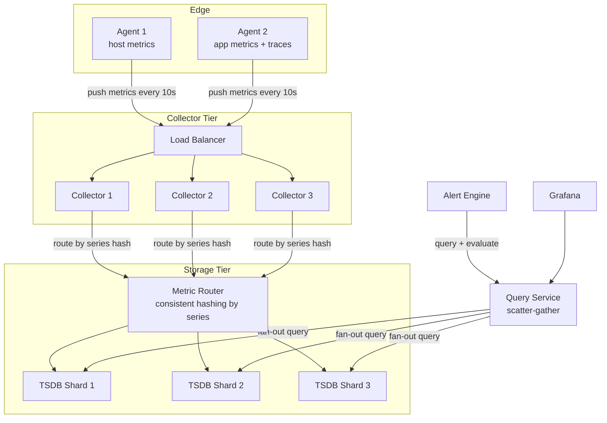

# 014 — Metrics Monitoring & Alerting

## Source

Alex Xu, *System Design Interview Vol. 2*, Chapter 5. Аналоги: Prometheus + Grafana + Alertmanager, Datadog, New Relic, Cloudwatch.

---

## Problem

Спроектировать систему мониторинга метрик для инфраструктуры масштаба крупного облачного провайдера: 1000+ серверов, 100 метрик на каждом, scrape каждые 15 секунд. Система должна хранить данные, поддерживать запросы (dashboard, алерты), уведомлять on-call при нарушении пороговых значений.

---

## Requirements

### Functional

- Сбор метрик (CPU, memory, disk, network, custom app metrics).
- Хранение с настраиваемым retention.
- Query API (PromQL / MetricsQL / аналог).
- Визуализация (Grafana-like dashboards).
- Алерты: threshold + rate + absence. Уведомления → PagerDuty, Slack, email.
- Downsampling: raw → 5m → 1h → 1d агрегаты.

### Non-Functional

- Write throughput: 1M samples/s.
- Query latency: p99 < 1s для диапазонов до 24ч.
- Availability: 99.9% (мониторинг должен работать даже при деградации monitored систем).
- Retention: raw 2 недели, downsampled 2 года.
- **Не теряем алерты**: alerting path отдельный от query path.

### Scale (back-of-envelope)

| Метрика | Значение |
|---|---|
| Серверов | 1 000 |
| Метрик на сервер | 100 |
| Уникальных time series | 100 000 |
| Scrape interval | 15 с |
| Samples/s | 100 000 / 15 ≈ **6 700** |
| Bytes/s (raw) | 6 700 × 16 B ≈ 107 KB/s |
| Bytes/s (Gorilla, ~2B) | 6 700 × 2 B ≈ 13 KB/s |
| Storage raw (2 недели) | 13 KB/s × 86400 × 14 ≈ **16 GB** |

*Небольшой масштаб. Для Datadog-масштаба (100K серверов): 100× → 1.6 TB raw.*

---

## Solution A — Pull-Based: Prometheus + Thanos

### Идея

Prometheus **скрейпит** (pull) метрики с targets каждые 15 секунд. Каждый сервис экспонирует `/metrics` endpoint (Prometheus exposition format). Prometheus хранит данные локально в TSDB. Для long-term и HA — **Thanos** добавляет слой над Prometheus: sidecar + object store (S3).

### Architecture

```mermaid
flowchart TD
    subgraph Targets
        App1[App Server\n/metrics]
        App2[DB Server\n/metrics]
        App3[K8s Node\n/metrics]
    end

    subgraph Prometheus Tier
        SD[Service Discovery\nConsul / K8s API / file_sd]
        P1[Prometheus 1\n+Thanos Sidecar]
        P2[Prometheus 2\n+Thanos Sidecar\n(duplicate)]
    end

    subgraph Thanos Tier
        TQ[Thanos Query\nfederation + dedup]
        TSG[Thanos Store\nGateway]
        TC[Thanos Compactor\n+Downsampler]
    end

    S3[(S3 / GCS\nlong-term storage)]
    AM[Alertmanager\nHA pair]
    Grafana[Grafana]
    PD[PagerDuty / Slack]

    SD -->|scrape targets list| P1 & P2
    P1 -->|pull /metrics every 15s| App1 & App2 & App3
    P2 -->|pull /metrics every 15s| App1 & App2 & App3
    P1 -->|upload 2h blocks| S3
    P2 -->|upload 2h blocks| S3
    TC -->|compact + downsample| S3
    TQ -->|query recent| P1 & P2
    TQ -->|query historical| TSG
    TSG -->|read blocks| S3
    Grafana -->|PromQL| TQ
    P1 -->|fire alerts| AM
    P2 -->|fire alerts| AM
    AM -->|deduplicate + route| PD
```

### Pull Model: как работает скрейп

```
Prometheus target config:
  scrape_configs:
    - job_name: "api-servers"
      scrape_interval: 15s
      static_configs:
        - targets: ["api-1:8080", "api-2:8080"]

На каждом api сервере:
  GET http://api-1:8080/metrics →

  # TYPE http_requests_total counter
  http_requests_total{method="GET",status="200"} 42315
  http_requests_total{method="POST",status="500"} 12

  # TYPE process_cpu_seconds_total counter
  process_cpu_seconds_total 1234.56

  # TYPE go_goroutines gauge
  go_goroutines 42

Prometheus парсит → writes to HEAD block
```

### Service Discovery

```
Static: не масштабируется → только для маленьких инфраструктур
Kubernetes: Prometheus читает K8s API → все Pods/Services/Nodes автоматически
Consul: targets регистрируются при старте, Prometheus читает Consul catalog
EC2: AWS API → список инстансов с тегами
File SD: JSON/YAML файл с targets, hot-reload без restart
```

### Thanos: HA + Long-Term

```
Проблема Prometheus:
  1. Single node → нет HA
  2. Local disk → retention ограничен диском
  3. Нет federation для query across multiple Prometheus

Thanos решает:
  Sidecar: рядом с каждым Prometheus
    → копирует 2h блоки в S3 после flush
    → отвечает на query от Thanos Query (recent data)

  Thanos Query:
    → запрашивает все Sidecars (параллельно)
    → запрашивает Store Gateway (historical)
    → дедуплицирует: P1 и P2 скрейпят те же targets
      → при query видим дубли → dedup по external_labels

  Thanos Compactor:
    → мёрджит мелкие блоки в S3 (2h → 1d → 2w)
    → downsampling: raw → 5m → 1h агрегаты
    → удаляет expired blocks (retention)

  Store Gateway:
    → читает blocks из S3 при историческом query
    → кэширует index в памяти, data на диске
```

### Recording Rules (Pre-aggregation)

```yaml
# prometheus.yml — recording rules
groups:
  - name: api_aggregates
    interval: 1m
    rules:
      # Pre-compute rate of requests per service (expensive at query time)
      - record: job:http_requests:rate5m
        expr: sum(rate(http_requests_total[5m])) by (service)

      # Error rate
      - record: job:http_errors:rate5m
        expr: sum(rate(http_requests_total{status=~"5.."}[5m])) by (service)
```

Recording rules записывают агрегированные series в отдельный топик → дашборды строятся по ним (дешевле), не по raw metrics.

### Alerting Rules + Alertmanager

```yaml
# Alert rules
groups:
  - name: api_alerts
    rules:
      - alert: HighErrorRate
        expr: job:http_errors:rate5m / job:http_requests:rate5m > 0.05
        for: 2m        # должно быть true 2 мин подряд (избегаем flapping)
        labels:
          severity: critical
        annotations:
          summary: "High error rate {{ $value | humanizePercentage }}"

      - alert: ServiceDown
        expr: absent(up{job="api-servers"} == 1)
        for: 1m
        labels:
          severity: page

# Alertmanager: routing
route:
  receiver: 'pagerduty-critical'
  routes:
    - match:
        severity: critical
      receiver: 'pagerduty-critical'
    - match:
        severity: warning
      receiver: 'slack-warnings'

inhibit_rules:
  - source_match:
      severity: 'critical'
    target_match:
      severity: 'warning'
    equal: ['service']    # если critical, не шлём warning для того же сервиса
```

### HA для Alertmanager

```
Две копии Alertmanager формируют кластер (gossip protocol, mesh):
  - Обе получают одинаковые alerts от P1 и P2
  - Gossip синхронизирует silences и notification state
  - Deduplication: alert уже отправлен → не отправлять второй раз
  - При падении одной → вторая продолжает без перерыва
```

### Pros

- Open-source, battle-tested, огромная экосистема exporters.
- Pull модель: Prometheus знает статус target (up/down), нет потерянных агентов.
- PromQL — мощный query язык для ad-hoc анализа.
- Thanos обеспечивает unlimited retention через object store.

### Cons

- Pull требует сетевой доступ к target: не работает за firewall / NAT без pushgateway.
- Один Prometheus держит ~1M active series (RAM: ~1 MB per 1K series × 1K = ~1 GB).
- Pull + federation complexity при мультиrегиональных deployments.

---

## Solution B — Push-Based: Distributed Collector Fleet (Datadog-like)

### Идея

На каждом сервере — **Agent** (Datadog Agent / Telegraf / OpenTelemetry Collector), который собирает метрики локально и **push**-ает их в централизованный **Collector tier**. Нет scrape endpoints. Подходит для environments с ограниченной сетевой доступностью и для IoT/edge.

### Architecture



### Agent Push Protocol

```
Agent on each server:
  Collect every 10s:
    - system: cpu.usage, mem.used, disk.io, net.bytes
    - process: per-process metrics
    - custom: StatsD UDP port (app metrics)

  Batch (last 10s) → HTTP POST /v1/metrics:
  {
    "series": [
      {
        "metric": "cpu.usage",
        "tags": ["host:server-1", "region:us-east"],
        "points": [[1716000010, 42.3], [1716000020, 44.1]],
        "type": "gauge"
      }
    ]
  }

  Retry on failure: [[retry-with-backoff]], local buffer (disk) for network outages
  Buffer size: 10 minutes of data → ~600 KB per host
```

### Consistent Hashing для Sharding

```
Metric Router: получает поток metrics от Collectors
    → для каждой series вычислить shard:
    shard = consistent_hash(series_key) % num_shards
    series_key = "cpu.usage{host=server-1,region=us-east}"

Consistent hashing: добавление/удаление шарда перекладывает ~1/N series
  → нет mass re-routing при scaling event

Query: scatter-gather по всем шардам
  Q: avg(cpu.usage) by region
  → fan-out to all DB shards → each returns partial result
  → merge + aggregate in Query Service
```

### Pros

- Работает за NAT / firewall.
- Агент буферизирует локально → нет потерь при кратковременной недоступности коллектора.
- Горизонтальное масштабирование Collector tier независимо.
- Поддержка heterogeneous environments (IoT, Windows, контейнеры).

### Cons

- Prometheus не видит "мёртвые" агенты: нет up/down метрики по умолчанию (нужен heartbeat metric).
- Сложнее управлять агентами на тысячах хостов (конфиг drift, версии).
- Push storms: все агенты перезапустились одновременно → spike нагрузки на коллекторы.

---

## Deep Dives

### Pull vs Push: ключевые отличия

```
Pull (Prometheus):
  + Prometheus контролирует tempo (backpressure естественен)
  + up/down метрика бесплатно (failed scrape = target down)
  + Конфиг и discovery в одном месте
  - Нужен network access к target
  - Не для short-lived jobs (< scrape interval): используй Pushgateway

Push (Datadog):
  + Работает везде (NAT, firewall, IoT)
  + Agent буферизирует при сетевых проблемах
  - Нет бесплатного "target down" (нужен heartbeat + absence alert)
  - Сложнее контролировать cardinality (agent может слать что угодно)
  - Push storms при массовом restart
```

### Cardinality Management

```
Проблема: разработчик добавил метку user_id в http_requests_total
  → 10M пользователей × 1000 endpoints = 10B time series
  → Prometheus OOM за минуты

Превентивные меры:
  1. Limits в Prometheus:
     global:
       enforce_sample_limit: 10000  # reject scrape если > 10K series
  
  2. Recording rules вместо high-cardinality labels:
     Плохо: http_latency{user_id="123", endpoint="/api/v1/search"}
     Хорошо: http_latency{endpoint="/api/v1/search"}  (агрегат по всем users)
  
  3. Cardinality monitoring:
     Метрика prometheus_tsdb_head_series > alert threshold
     Отдельный dashboard: топ-N series по кардинальности

  4. Drop rule в Prometheus:
     metric_relabel_configs:
       - source_labels: [user_id]
         action: labeldrop  # удалить метку до записи
```

### Alerting: избегать flapping

```
Flapping = алерт срабатывает и гасится попеременно (ложные тревоги)

Решения:
  1. for: duration — alert должен быть true N минут подряд:
     expr: error_rate > 0.05
     for: 2m  ← не сработает на кратковременный spike

  2. Smoothing: rate() вместо instant value:
     Плохо:  http_errors_total > 100  ← одиночный burst
     Хорошо: rate(http_errors_total[5m]) > 2  ← устойчивый rate

  3. Dead man's switch:
     Алерт, который должен ПОСТОЯННО гореть:
     - alert: WatchdogAlwaysFiring  
       expr: vector(1)
     Alertmanager шлёт keepalive в PagerDuty.
     Если keepalive пропал → PagerDuty сам поднимает инцидент
     (даже если Alertmanager лежит)

  4. Inhibition rules: не шли warning если уже есть critical
```

### Metrics Taxonomy (четыре golden signals)

```
Google SRE — Four Golden Signals:
  1. Latency    — время ответа (p50, p95, p99)
  2. Traffic    — RPS, requests/s
  3. Errors     — error rate (5xx / total)
  4. Saturation — CPU%, memory%, queue depth

Prometheus metric types:
  Counter: только растёт (requests_total) → используй rate() для RPS
  Gauge:   текущее значение (memory_bytes, queue_depth)
  Histogram: bucket distribution (request_duration_seconds_bucket)
             → используй histogram_quantile(0.99, ...)
  Summary: pre-computed quantiles (дешевле для клиента, хуже для агрегации)

Правило: НИКОГДА не вычислять percentile из Counter.
  Правильно: Histogram → histogram_quantile(0.99)
```

### Long-Term Storage: Thanos vs VictoriaMetrics

```
Thanos (CNCF):
  Архитектура: Prometheus + sidecar → S3 blocks
  Плюсы: нативная совместимость с Prometheus, battle-tested
  Минусы: много компонентов (sidecar, query, store, compactor, ruler)

VictoriaMetrics:
  Единый binary (single-node) или кластер
  Лучше сжатие (~7× vs ~4× Prometheus)
  Высокая ingestion performance
  Prometheus-compatible API
  Минусы: меньше экосистема, меньше battle-tested на гиперскейле

Cortex / Thanos + Grafana Mimir:
  Multi-tenant, horizontally scalable Prometheus
  Microservices (ingester, distributor, querier, compactor)
  Полная горизонтальная масштабируемость
```

---

## Trade-offs

| Критерий | Solution A (Pull / Prometheus+Thanos) | Solution B (Push / Collector Fleet) |
|---|---|---|
| Network requirements | Target должен быть доступен | Агент инициирует соединение |
| Target health | Бесплатно (up metric) | Нужен heartbeat + absence alert |
| Конфигурация | Централизованная | Распределённая (агент на каждом хосте) |
| Backpressure | Естественный (pull rate) | Нужно явно (buffer + rate limit) |
| Short-lived jobs | Плохо (Pushgateway workaround) | Хорошо |
| Operational complexity | Средняя | Высокая (fleet management) |
| **Рекомендация** | Cloud-native (K8s), open-source stack | Edge, firewall env, enterprise |

---

## Key Takeaways

1. **TSDB ≠ RDBMS**: не хранить метрики в Postgres/MySQL строками — Gorilla compression даёт 10–20× экономию, range queries на 100M+ строк убивают обычные БД.
2. **Cardinality = главный враг TSDB**: один высокоуникальный label (`user_id`, `request_id`) = OOM. Кардинальность нужно мониторить саму по себе.
3. **Pull знает о target down, push — нет**: при pull-based monitoring `up == 0` = цель недоступна. При push — нужен heartbeat metric + `absent()` alert.
4. **Alerting path отдельно от query path**: Alertmanager в HA паре работает даже если Grafana/Thanos недоступны. Dead man's switch = защита от "monitoring is down".
5. **Recording rules снижают query latency**: pre-computed aggregates на 1-мин интервалах вместо raw scan при каждом dashboard refresh.

---

## Open Questions

- **Logs + Traces + Metrics**: OpenTelemetry объединяет сбор всех трёх сигналов через единый OTLP протокол. Корреляция: trace_id в метриках позволяет перейти от метрики → трейсу.
- **Anomaly detection**: threshold alerts плохо работают для бизнес-метрик с сезонностью (трафик в воскресенье < трафика в понедельник). Нужен baseline + relative change (Datadog ML anomaly detection).
- **Multi-cluster federation**: несколько кластеров в разных регионах → Thanos Query объединяет.
- **Cost optimization**: raw метрики дорого хранить 2 года. Aggressive downsampling (1h resolution после 30 дней) сокращает storage в 240× при потере точности.

---

## References

- Alex Xu, *System Design Interview Vol. 2*, Chapter 5
- [Facebook — Gorilla: A Fast, Scalable, In-Memory Time Series Database](https://vldb.org/pvldb/vol8/p1816-teller.pdf)
- Prometheus documentation — Storage, Configuration, Alerting
- [Thanos architecture](https://thanos.io/tip/thanos/architecture.md)
- Google SRE Book — Chapter 6: Monitoring Distributed Systems
- [[time-series-storage]]
