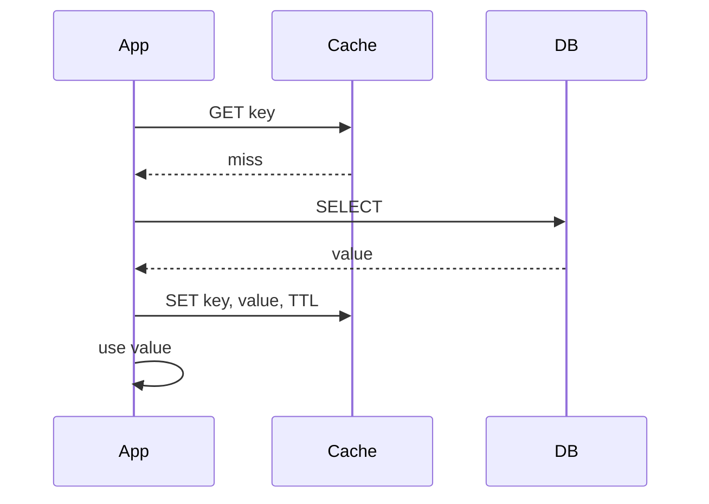

# Caching Strategies

## What

Набор паттернов взаимодействия приложения с кэшем (Redis, Memcached, in-memory): кто обновляет кэш, кто читает из БД, как обрабатываются промахи, как инвалидируются записи.

## Why / Problem it solves

БД дороже и медленнее кэша. Кэш ускоряет чтения, снижает нагрузку на БД. Но появляются проблемы:
- **Stale data** — кэш отстаёт от БД.
- **Cache stampede** — на промахе тысячи запросов одновременно идут в БД.
- **Cache penetration** — запросы к несуществующим ключам обходят кэш.
- **Cache inconsistency** — два источника правды расходятся.

Стратегия определяет, как с этим бороться.

## Strategies

### 1. Cache-Aside (Lazy Loading)

Приложение **само** управляет кэшем. Самая распространённая стратегия.

```
Read:
  1. App → cache.get(key)
  2. miss → app → DB.get(key)
  3. App → cache.set(key, value, TTL)
  4. Return value

Write:
  1. App → DB.update(key, value)
  2. App → cache.invalidate(key)   // или cache.set
```

- **+** Простая, кэш не критичен (можно пережить падение).
- **+** Кэшируются только реально запрашиваемые ключи.
- **−** При промахе — три RTT (cache miss, DB read, cache set).
- **−** Race condition: thread A пишет в DB, thread B читает старое из cache.

### 2. Read-Through

Кэш сам подтягивает данные из БД при промахе. Приложение работает только с кэшем.

```
Read:
  1. App → cache.get(key)
  2. miss → cache внутри → DB.get(key) → cache.set
  3. Return value
```

- **+** Приложение упрощено.
- **+** Стандартная логика инкапсулирована в кэше.
- **−** Требует, чтобы кэш умел в БД (Redis с loader, AWS DAX, ElastiCache loader).
- **−** Cold cache → DB штормит.

### 3. Write-Through

Запись идёт **синхронно** в кэш и БД (или сначала в кэш, потом сразу в БД).

```
Write:
  1. App → cache.set(key, value)
  2. cache → DB.update(key, value)
  3. Return
```

- **+** Cache всегда консистентен с DB.
- **+** Read-after-write hit гарантирован.
- **−** Write latency = max(cache, DB).
- **−** Кэшируется всё, что пишется (даже редко читаемое — пустая нагрузка).

### 4. Write-Behind (Write-Back)

Запись в кэш, **асинхронно** реплицируется в БД (батчинг).

```
Write:
  1. App → cache.set(key, value)
  2. Return
  3. (background) cache → DB.batch_update(...)
```

- **+** Очень низкий write latency.
- **+** Батчинг → меньше нагрузка на БД.
- **−** Риск **потери данных** при падении кэша до flush'а.
- **−** Сложность реализации (durability в кэше).
- **−** Применяется редко, в основном для метрик / счётчиков.

### 5. Refresh-Ahead

Кэш проактивно обновляет горячие ключи до истечения TTL.

```
1. Каждый hit фиксирует last_access.
2. Перед expiration: если ключ "горячий" → background refresh из БД.
3. Клиент всегда читает свежее.
```

- **+** Нет latency spike на expiration.
- **+** Меньше нагрузка на DB во время stampede.
- **−** Сложно правильно определить «горячий» порог.
- **−** Лишние reads, если ключ перестал быть горячим.

## Invalidation strategies

Инвалидация — самая сложная часть. «There are only two hard things in Computer Science: cache invalidation and naming things» (Phil Karlton).

### TTL (time-based)
Кэш сам выкидывает запись через N секунд. Просто, eventually consistent.

### Explicit invalidation
Приложение вызывает `cache.delete(key)` при изменении. Работает только если **все** writers идут через приложение.

### Event-based
БД публикует CDC / события в [[event-driven-architecture]] (Debezium / Kafka), invalidator подписывается → удаляет ключи.

### Versioned keys
Ключ содержит версию: `user:42:v3`. На update — bump версии, старые ключи протухают по TTL.

## Cache Stampede / Thundering Herd

**Проблема:** популярный ключ истёк → 10000 параллельных запросов идут в БД → DB falls over.

**Митигация:**
- **Singleflight / request coalescing.** Только один поток идёт в БД, остальные ждут результата.
- **Probabilistic early expiration.** Ноды решают вероятностно «обновить пораньше» до фактического expire.
- **Jitter в TTL.** Не `TTL=300`, а `TTL=300 + random(0..30)` → не истекает разом.
- **Bg refresh** (см. Refresh-Ahead).

## Cache Penetration

**Проблема:** запросы к несуществующим ключам (атака или баги) идут в БД минуя кэш.

**Митигация:**
- Кэшировать **отрицательные** ответы (`null` с коротким TTL).
- [[Bloom Filter]] перед кэшем для отсева заведомо отсутствующих ключей.

## Eviction Policies

Когда кэш заполнен, нужно что-то вытеснять:

- **LRU** (Least Recently Used) — стандарт.
- **LFU** (Least Frequently Used) — лучше для устойчиво-горячих ключей.
- **TTL-only** — выкидывает только истёкшие.
- **Random** — Redis допускает.
- **allkeys-lru / volatile-lru** — Redis-specific.

## Диаграмма (Cache-Aside)



## Common pitfalls

- **Кэш без TTL.** Stale data навсегда.
- **Инвалидация только из одного writer'а.** Если есть второй путь записи в БД (миграция, sql-консоль) — кэш разъезжается.
- **Один общий cache для всего.** На промах одна нагрузка из БД глобальная — нужна изоляция по неймспейсам/инстансам.
- **Game of throughput.** Кэшировать всё подряд → wasted memory + плохой hit rate.
- **Hot key.** Один ключ создаёт 90% нагрузки → даже кэш становится bottleneck. Решение: replicate hot key на N узлах, либо рандомизация суффиксом.
- **Cache как source of truth (Write-Behind).** Если durability в кэше слабая — теряем данные.

## Variations

- **Two-tier cache:** L1 (in-process) + L2 (Redis). L1 убирает сетевые RTT для самых горячих.
- **Edge cache (CDN).** Тот же cache-aside / read-through, но географически распределённый.
- **Materialized views.** Pre-computed agregates в БД — не кэш, но та же идея trade durability ↔ freshness.

## Used in case studies

- [[002-url-shortener]] — Cache-Aside для resolve hot URLs (Redis перед Postgres), TTL + jitter, opportunity для Refresh-Ahead на топ-1% URL.

## References

- AWS — [Caching Patterns](https://aws.amazon.com/caching/best-practices/).
- Facebook Engineering — [Scaling Memcache at Facebook](https://research.facebook.com/publications/scaling-memcache-at-facebook/).
- Martin Kleppmann, "Designing Data-Intensive Applications" — главы про кэширование.
