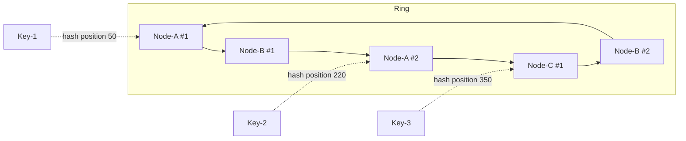

# Consistent Hashing

## What

Техника распределения данных (или запросов) между N узлами так, чтобы при добавлении/удалении узла мигрировала **только малая часть ключей** (≈ 1/N), а не все. Ключи и узлы мапятся в одно числовое пространство (кольцо), ключ принадлежит первой ноде по часовой стрелке от своей позиции.

## Why / Problem it solves

**Наивный шардинг** через модуль: `shard = hash(key) % N`.

Если `N` меняется (добавили или убрали ноду) → **все** ключи получают новые шарды → массовая миграция, инвалидация кэша, простой.

Consistent hashing решает: при `N → N+1` мигрирует только ~1/N ключей (те, что попадают на новую ноду).

## When to apply

**Применять:**
- Распределённые кэши (Memcached, Redis Cluster).
- NoSQL базы с шардингом (Cassandra, DynamoDB, Riak).
- L7 load balancers со sticky routing.
- Любые системы, где **частое добавление/удаление узлов** ожидаемо.

**Не применять:**
- Фиксированное количество шардов, никогда не меняется → modulo достаточно.
- Reshard через явный mapping table (range-based sharding, как в Bigtable) — другой подход.

## How

### Hash Ring

1. Возьми пространство: `0 .. 2^32 - 1` (4 млрд точек).
2. Каждую **ноду** хэшируй → положи на кольцо: `hash(node_id) → position`.
3. Каждый **ключ** хэшируй → положи на кольцо: `hash(key) → position`.
4. Ключ принадлежит **первой ноде по часовой стрелке** от своей позиции.

```
                       0
                       │
              ┌────────┼────────┐
              │        │        │
            Node-A   Key-1    Node-B
                       │
                     Key-2
                       │
                       ▼  → принадлежит Node-B (первая по часовой)

Key-2 hashes to position 100, Node-B is at 110 → Key-2 lives on Node-B.
```

### Добавление ноды

Появилась `Node-C` на позиции 105. Только ключи в диапазоне `(99, 105]` (раньше принадлежавшие Node-B) переходят на Node-C. Остальные ключи **не двигаются**.

Если N нод равномерно распределены → переезжает примерно `1/N` ключей.

### Удаление ноды

Ключи удалённой ноды наследует следующая по часовой. Остальные ключи не двигаются.

### Virtual Nodes (vnodes)

**Проблема:** при малом N распределение по кольцу неравномерное → одни ноды получают сильно больше данных (skew).

**Решение:** каждая физическая нода представлена **K точками** на кольце (часто K=100..200), каждая с разным хэшем (`hash(node_id + ":" + i)`).

Эффект:
- Равномерное покрытие кольца даже при малом числе нод.
- При добавлении ноды её K точек «вырезают» небольшие диапазоны у разных существующих нод → нагрузка миграции **распределена**.
- Балансировка хорошая даже для скошенных распределений ключей.

## Диаграмма



ASCII-вариант кольца с vnodes:

```
                      0/2^32
                        │
                        N1
                  N3  ┌─┼─┐  N2
                ┌─────│ │ │─────┐
                │ N2  │ │ │  N1 │
                │     │ │ │     │
                │ N1  │ │ │  N3 │
                └─────│ │ │─────┘
                  N2  └─┼─┘  N3
                        │
                        N1
```

Каждая физическая нода (N1/N2/N3) — 3 точки на кольце.

## Replication (RF > 1)

Для high availability ключ часто хранится на нескольких нодах. На кольце — на **первых R нодах по часовой стрелке** от позиции ключа.

```
RF=3, ключ → позиция 100:
   replicas = [Node-A (pos 110), Node-D (pos 150), Node-B (pos 200)]
```

Это базис для Cassandra/DynamoDB.

## Common pitfalls

- **Без vnodes.** При 3-5 нодах распределение крайне неравномерное.
- **Hot key.** Один очень популярный ключ всё равно на одной ноде → не решается hashing'ом. Нужна репликация горячего ключа на несколько нод.
- **Skewed key distribution.** Если ключи сами по себе не uniform (большинство `user:42`-подобных), даже идеальное кольцо распределяет неравномерно.
- **Hash function.** Использовать **uniform** хэш (MurmurHash, xxHash), не cryptographic SHA (медленнее).
- **Ребалансировка под нагрузкой.** Переезд данных при изменении N — отдельный challenge (стриминг, дельта-копия).
- **Confused with sharding by range.** Range-based sharding (Bigtable, HBase) — другой подход; consistent hashing — для hash-based.

## Variations

- **Rendezvous Hashing (HRW).** Для каждого ключа выбирается узел с максимальным `hash(node, key)`. Не требует кольца, но сложнее визуализировать. Используется некоторыми CDN.
- **Jump Consistent Hash** (Google). Алгоритм без памяти, эффективен для шардинга по фиксированному N с возможностью изменения.
- **Maglev Hashing** (Google L4 LB). Lookup table вместо кольца, фиксированный размер.
- **Bounded-load consistent hashing.** Расширение, где ни одна нода не получает больше чем `(1+ε)/N` нагрузки.

## Used in case studies

- [[002-url-shortener]] — шардинг Redis-кэша по `short_id` через consistent hashing; шардинг Postgres по тому же ключу.

## References

- David Karger et al. — [Consistent Hashing and Random Trees](https://www.akamai.com/site/en/documents/research-paper/consistent-hashing-and-random-trees-distributed-caching-protocols-for-relieving-hot-spots-on-the-world-wide-web-technical-publication.pdf) (1997).
- Amazon — [Dynamo: Amazon's Highly Available Key-value Store](https://www.allthingsdistributed.com/files/amazon-dynamo-sosp2007.pdf) (2007).
- Google — [Maglev Network Load Balancer](https://research.google/pubs/maglev-a-fast-and-reliable-software-network-load-balancer/) (2016).
- Damian Gryski — [Consistent Hashing: Algorithmic Tradeoffs](https://dgryski.medium.com/consistent-hashing-algorithmic-tradeoffs-ef6b8e2fcae8).
