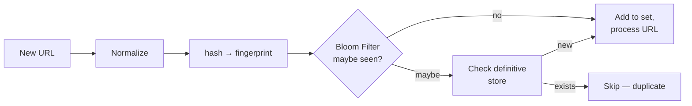
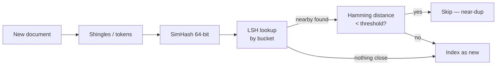

# Content Deduplication

## What

Техники обнаружения **идентичных** и **похожих** ресурсов (URLs, документов, изображений) для исключения повторной обработки. Идентичные определяются через cryptographic hash (SHA-256, MD5), похожие — через fingerprinting (SimHash, MinHash, ssdeep) и LSH.

## Why / Problem it solves

В системах, обрабатывающих контент в масштабе (crawlers, search indexes, image deduplication, log ingestion), большая часть данных дублируется:
- Web crawler: один URL встречается в тысячах ссылок → не выкачивать снова.
- News aggregator: одна статья перепечатана на сотнях сайтов → одна копия в индексе.
- Image storage: одна фотография загружена 1000 раз → одна копия на диске.

Naive comparison "всё со всем" — O(N²), невозможно. Нужны hash-based и approximate-comparison техники.

## Levels of dedup

### 1. Exact URL dedup

Сравнение строк URL. Тривиально, но требует нормализации:

```
http://Example.com/path?b=2&a=1
http://example.com/path?a=1&b=2
http://example.com/path?a=1&b=2&utm_source=email
```

Все три — один ресурс. Нормализация:
- Lowercase host.
- Sort query parameters.
- Remove tracking parameters (`utm_*`, `fbclid`, ...).
- Strip default ports (`:80`, `:443`).
- Strip fragments (`#anchor`).
- Resolve relative paths (`/foo/../bar` → `/bar`).

После нормализации — exact match по hash.

### 2. Exact content dedup

`SHA-256(content)` → если совпадает с уже виденным → дубль.

Применение: object storage (S3 Intelligent Tiering, IPFS), git blobs.

### 3. Near-duplicate dedup (fuzzy)

Документы **похожие**, но не идентичные (один и тот же текст с разными датами / навигацией / реклaмой).

#### SimHash (Google)

Документ → fingerprint (64 бита). Близкие документы → близкие fingerprint'ы по **Hamming distance**.

```
SimHash(doc):
  v = [0]*64
  for word in doc:
      h = hash(word)        # 64-bit
      for i in 0..63:
          v[i] += weight(word) if bit_i(h) == 1 else -weight(word)
  result = bits where v[i] > 0
  return result

dedup: hamming_distance(simhash_a, simhash_b) < threshold (e.g., 3)
```

Используется Google для near-duplicate detection в web crawling.

#### MinHash (set similarity)

Документ → set of shingles (n-grams). MinHash оценивает **Jaccard similarity** между set'ами.

```
Jaccard(A, B) = |A ∩ B| / |A ∪ B|
```

Для каждого set'а вычисляется K min-hash значений (K независимых hash функций); вероятность совпадения min-hash = Jaccard similarity.

Применение: текстовая дедупликация, plagiarism detection.

#### LSH (Locality Sensitive Hashing)

Indexing-стратегия для быстрого поиска близких. Bucketing: похожие fingerprint'ы попадают в один bucket. Lookup за O(1) на средний случай vs O(N) brute force.

### 4. Image / Binary near-dup

- **pHash / dHash** (perceptual hash) — для картинок.
- **ssdeep** (CTPH) — для бинарных файлов / malware.

## Bloom Filter для URL dedup

Web crawler видит ~10B URL, hash-set в памяти не помещается. **Bloom Filter**:

- Probabilistic set: «возможно есть» / «точно нет».
- 8 GB Bloom filter с 1% false positive rate вмещает ~10B URLs.
- False positive → пропустить URL (acceptable trade-off в crawler'е).
- **False negative невозможен** → не будет дубликата.

```
on new URL:
    if bloom.maybe_contains(url):
        check_db_for_certainty()
    else:
        bloom.add(url)
        process(url)
```

См. [[id-generation]] для деталей про Bloom Filter (упомянут там как side-tool).

## Architecture



Для near-duplicate (документы):



## Sharded dedup at scale

Single Bloom Filter / hashset в памяти не масштабируется на петабайтные corpora. Шардируется через [[consistent-hashing]]:

- `shard = hash(url) % N`.
- Bloom Filter per shard.
- Lookup → route to shard.

## Common pitfalls

- **Не нормализовали URL.** `http://Example.COM/A?b=2&a=1` и `http://example.com/A?a=1&b=2` — пропустили дубль.
- **Игнорирование tracking params.** UTM-метки — пропустили дубль.
- **Bloom Filter без resize strategy.** Filter заполняется → false positive rate растёт неконтролируемо. Pre-size правильно или используй **scalable Bloom Filter**.
- **SimHash без нормализации текста.** HTML tags / stopwords шумят. Очистка + stemming обязательны.
- **Threshold Hamming distance подобран наугад.** Слишком жёсткий — пропустим dup. Слишком мягкий — false positive. Калибровка на размеченных данных.
- **MinHash с малым K.** K=16 даёт большую variance. K=128-200 для надёжной оценки.
- **Считаем dedup в один поток.** При 10B URL не уложишься — distributed по shard.

## Used in case studies

- [[006-web-crawler]] — Bloom Filter для exact URL dedup; SimHash для near-duplicate content detection.

## References

- Manku, Jain, Sarma — [Detecting Near-Duplicates for Web Crawling](http://www.wwwconference.org/www2007/papers/paper215.pdf) (Google, 2007) — оригинальная SimHash статья.
- Broder — [On the resemblance and containment of documents](https://www.cs.princeton.edu/courses/archive/spring13/cos598C/broder97resemblance.pdf) (1997) — MinHash.
- Andrei Broder — Bloom Filter scalable variants.
- Bloom — [Space/Time Trade-offs in Hash Coding](https://dl.acm.org/doi/10.1145/362686.362692) (1970) — оригинальная статья.
