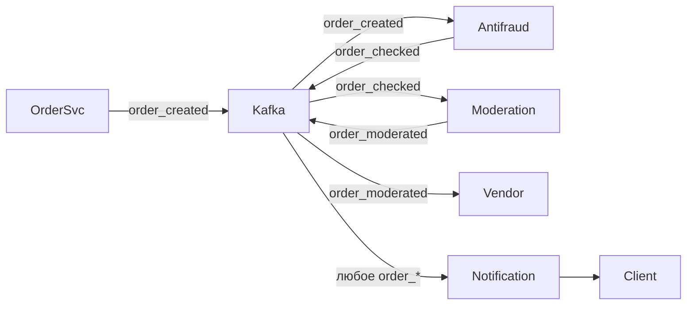

# Event-Driven Architecture

## What

Архитектурный стиль, в котором компоненты не вызывают друг друга напрямую (RPC), а **публикуют события** в общую шину. Заинтересованные сервисы **подписываются** на нужные события и реагируют независимо. Producer не знает о consumer'ах и наоборот.

## Why / Problem it solves

Прямые синхронные вызовы (RPC) создают:
- **Сильную связанность.** Order Service вынужден знать про Payment, Inventory, Notification, Antifraud, Analytics.
- **Каскадные сбои.** Падение одного downstream-сервиса блокирует upstream.
- **Высокий latency.** Клиент ждёт, пока вся цепочка отработает синхронно.
- **Сложность расширения.** Добавить новый шаг (например, модерация) — менять Order Service.

Event-Driven меняет модель:
- Producer публикует факт («заказ создан») в топик.
- Consumer подписывается и обрабатывает по своей логике.
- Добавить новый consumer — не трогая producer.

## When to apply

**Применять:**
- Бизнес-логика естественно описывается через события («что произошло»).
- Нужна **расширяемость** — новые подсистемы добавляются часто.
- Допустима **асинхронность** для клиента.
- Подсистемы должны **скейлиться независимо**.

**Не применять:**
- Простые CRUD-сервисы с малым количеством взаимодействий.
- Требуется строгая read-after-write для клиента (event-driven → eventual consistency).
- Команда не готова к операционной сложности брокера.

## How

### Ключевые компоненты

- **Event bus / broker** — Kafka, NATS JetStream, RabbitMQ, AWS SNS+SQS, GCP Pub/Sub. Хранит и доставляет события.
- **Producers** — публикуют события. Гарантируют доставку (часто через [[outbox]]).
- **Consumers** — подписаны на топики, обрабатывают события идемпотентно (см. [[idempotency-key]]).
- **Topics / streams** — каналы для определённого типа событий (`order_created`, `payment_succeeded`).

### Что такое «событие»

Факт о произошедшем изменении, в прошедшем времени:
- `OrderCreated`, `PaymentSucceeded`, `OrderShipped`.
- Не «команда» (`CreateOrder`) — команда подразумевает адресата, событие — нет.

Структура: `event_id`, `event_type`, `aggregate_id`, `timestamp`, `payload`, `schema_version`.

### Цепочки событий

Бизнес-процесс собирается из цепочки: каждый consumer обрабатывает входное событие и публикует новое.

```
order_created  →  antifraud  →  order_checked
                                       │
order_checked  →  moderation →  order_moderated
                                       │
order_moderated →  vendor    →  order_fulfilled
                                       │
order_fulfilled →  notification → (WebSocket к клиенту)
```

### Диаграмма



### Инварианты

- Producer'ы не знают consumers и наоборот — связь только через тип события.
- **At-least-once** delivery → consumers идемпотентны.
- Схема событий **версионируется** (Avro / Protobuf + Schema Registry).
- События **immutable** — если что-то изменилось, публикуется новое событие.

## Common pitfalls

- **Использовать события как RPC.** Если producer публикует и **ждёт** ответа на специальное "reply"-событие — это синхронный паттерн в плохой обёртке. Лучше gRPC.
- **Слишком мелкие события.** Producer публикует `field_X_changed` на каждое поле → шум, сложно собрать бизнес-картину.
- **Слишком крупные события.** `OrderEvent` с типом внутри → плохая фильтрация, consumers тащат всё.
- **Event-carried state vs notification.** Решить: payload содержит **состояние** (consumers не дёргают БД) или **уведомление** (consumers идут читать актуальное). Смешивать опасно.
- **Нет schema management.** Сломанная обратная совместимость → консьюмеры падают.
- **Eventual consistency не объяснили продукту.** Клиент видит «заказ создан», но через секунду — «отклонён антифродом». UX это должен учитывать.
- **Choreography без явной модели.** Сложно понять, кто на что реагирует → debug-кошмар. Документировать event-storming-картой.

## Variations

- **Event Notification** — событие = «что-то произошло, иди читай детали». Малый payload, consumers дёргают producer для деталей.
- **Event-Carried State Transfer** — событие содержит полный state. Consumers самодостаточны, но события толстые.
- **Event Sourcing** — события **есть** источник правды; текущее состояние = свёртка событий. Отдельная сложность.
- **CQRS + Event-Driven** — часто идут вместе: команды → события → проекции для чтения.

## Used in case studies

- [[001-order-backend-marketplace]] — Solution B построено на EDA: Kafka в центре, цепочка топиков `order_created → order_checked → order_moderated → order_fulfilled`, Notification Service подписан на топики и шлёт WebSocket клиенту.

## References

- Martin Fowler — [What do you mean by "Event-Driven"?](https://martinfowler.com/articles/201701-event-driven.html).
- Gregor Hohpe, Bobby Woolf, "Enterprise Integration Patterns".
- Confluent — Kafka documentation, Schema Registry.
