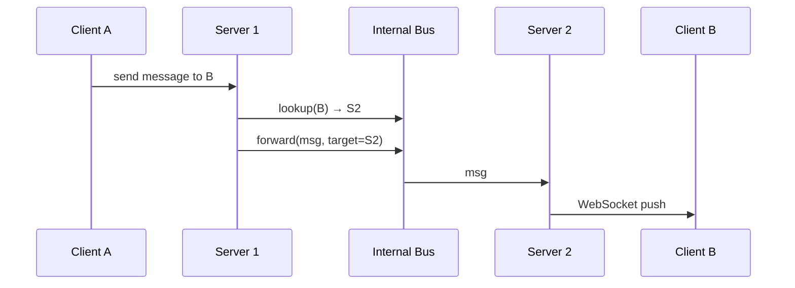

# Long-Lived Connections

## What

Persistent двунаправленный канал между клиентом и сервером, удерживающийся минутами/часами. Сервер может пушить данные клиенту без запроса (WebSocket, SSE, gRPC streaming, MQTT). Альтернатива классическому request/response.

## Why / Problem it solves

Классический HTTP polling:
- Высокая latency (polling interval).
- Множество пустых запросов (отдельный handshake каждый раз).
- TLS handshake + connection setup ~100ms+.

Long-polling улучшает latency, но всё равно тратит ресурсы на reconnect.

Persistent connection даёт:
- **Real-time push** от сервера к клиенту без polling.
- Низкая latency после установки (~ ms).
- Минимум overhead на сообщение.

Применяется в: чатах, нотификациях, live-данных (биржа, спорт, метрики), играх, collaborative editing.

## Protocols

### WebSocket (RFC 6455)
- Поверх HTTP с `Upgrade: websocket`.
- Двунаправленный binary/text framing.
- Через прокси/LB обычно идёт нормально (HTTP-compatible handshake).
- **Default** для interactive web/mobile.

### Server-Sent Events (SSE)
- HTTP-stream от сервера, **одностороний** (server → client).
- Текстовый, простой формат `data: ...\n\n`.
- Автореконнект встроен.
- **Когда:** нужен только push (notifications, live feed), без client → server в том же канале.

### Long-Polling
- Клиент шлёт HTTP GET, сервер «висит» до появления данных или таймаута.
- При получении ответа — клиент сразу шлёт новый запрос.
- Fallback для окружений без WebSocket.

### gRPC Streaming
- Server streaming / client streaming / bidi streaming поверх HTTP/2.
- Server-to-server, mobile (Protobuf-эффективно).

### MQTT / AMQP
- Binary pub/sub протоколы. MQTT — IoT-стандарт, низкоресурсный.

### Сравнение

| Протокол       | Bidirectional | Overhead | Через прокси    | Use case                    |
|----------------|---------------|----------|-----------------|------------------------------|
| WebSocket      | да            | low      | OK (Upgrade)    | Web/mobile real-time         |
| SSE            | нет (S→C)     | low      | **очень OK**    | Notifications, feed          |
| Long-polling   | нет           | high     | OK              | Fallback                     |
| gRPC streaming | да            | very low | HTTP/2 требует  | Service-to-service           |
| MQTT           | да (pub/sub)  | very low | специальный LB  | IoT                          |

## How

### Connection registry

Сервер должен знать **кто куда подключён**: на каком инстансе живёт WebSocket пользователя `user_42`.

```
connection_registry: user_id → (server_id, connection_id, last_seen)
```

Реализации:
- **Centralized Redis** — каждый сервер регистрирует подключения, обновляет heartbeat. Все могут найти любого. Simple, но Redis = SPOF.
- **Distributed hashtable / Consul / etcd** — то же, но более HA.
- **Gossip** — серверы периодически рассылают изменения друг другу. Eventually consistent.
- **Sharded by user_id** через [[consistent-hashing]] — L7 LB маршрутизирует `user_42` всегда на тот же server (sticky). Server знает только своих clients.

### Routing message to recipient

Чтобы доставить сообщение от `user_A` к `user_B`:

1. Найти, где подключён `user_B` (через registry).
2. Если на том же сервере — отдать напрямую.
3. Если на другом сервере — **forward** через внутренний bus (Kafka / Redis Pub/Sub / direct gRPC).
4. Если оффлайн — store-and-forward, push notification.



### Connection lifecycle

```
1. Client → Server: HTTP GET /ws + Upgrade: websocket
2. Server: 101 Switching Protocols
3. Connection registered in registry (server_id, user_id)
4. Periodic ping/pong (heartbeat) — обычно каждые 30 sec
5. On disconnect (clean / timeout / network):
   - Unregister from registry
   - Update presence
   - Drain queued messages
```

### Scaling

**Сколько соединений на инстанс?** Зависит от:
- Memory per connection (~4-32 KB для WebSocket с буферами).
- OS limits (`ulimit -n`, `net.core.somaxconn`, ephemeral ports).
- Тип нагрузки (idle vs busy).

Practical numbers (правильно тюненный Linux + Go/Erlang/Node):
- **100k–1M connections** на инстанс — реально.
- WhatsApp известны 2M+ на сервер (Erlang).

Bottleneck обычно — CPU на handling frames, не количество соединений.

## Common pitfalls

- **Sticky session strategy не масштабируется при rolling deploy.** Когда инстанс рестартует, все его клиенты делают reconnect — thundering herd. Решение: graceful drain, балансер с health-check, exponential backoff на клиенте.
- **Нет heartbeat.** Сервер думает, что клиент жив, но TCP-сессия мёртва (half-open connection). Heartbeat обязателен.
- **Нет idle timeout.** Заброшенные соединения накапливаются → memory leak. Закрывать неактивные.
- **Backpressure не реализован.** Медленный клиент → буферы растут → OOM. Drop сообщений или disconnect при превышении буфера.
- **Hot key — slow consumer.** Один клиент медленнее, тормозит весь shard. Изолировать в отдельный goroutine/actor.
- **Message ordering.** Если клиент reconnect между сообщениями, порядок может сломаться. Возвращать sequence number, дедуплицировать на клиенте.
- **Proxies/LB режут idle.** Многие LB рвут соединения через 60 sec idle. Heartbeat должен быть чаще.
- **Auth на upgrade.** Cookie/JWT валидируется на handshake; после нельзя «обновить» auth без reconnect.

## Presence

Тесно связан с connection state. Простейшая реализация:

```
on_connect:    redis.set(presence:user_42, server_id, EX=60)
on_heartbeat:  redis.expire(presence:user_42, 60)
on_disconnect: redis.del(presence:user_42)

query:         redis.get(presence:user_42) → online / offline
```

Для миллионов подписчиков на presence нужны оптимизации:
- **Push при изменениях** через [[event-driven-architecture]] (pub-sub presence-events).
- **Batch poll** для contact lists.
- **Privacy filtering** (показывать online только для friends).

## Used in case studies

- [[004-chat]] — основа real-time message delivery; обе solutions используют WebSocket с разными connection-registry стратегиями.

## References

- WhatsApp Engineering — [The WhatsApp Architecture Facebook Bought For $19 Billion](https://www.developer.com/web-services/the-whatsapp-architecture-facebook-bought-for-19-billion/).
- Slack Engineering — [How Slack Built Shared Channels](https://slack.engineering/how-slack-built-shared-channels/).
- Discord Engineering — [How Discord Stores Billions of Messages](https://discord.com/blog/how-discord-stores-billions-of-messages).
- RFC 6455 — The WebSocket Protocol.
