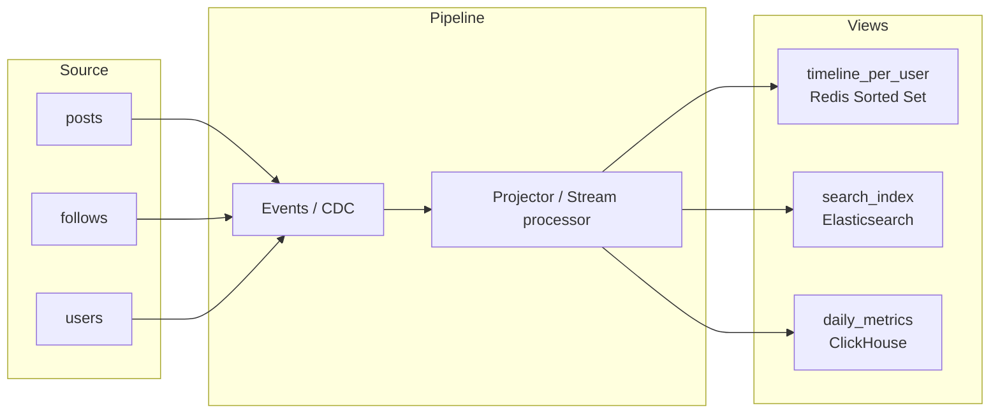

# Materialized View

## What

Pre-computed read-оптимизированное представление данных, обновляемое из source-of-truth. В отличие от обычного view (SQL view = stored query), **материализованный** view физически хранит результат и обновляется отдельно. Применяется когда вычисление вьюхи на каждый read слишком дорого.

Не следует путать с кэшем: cache хранит копию запроса; materialized view — отдельная **denormalized структура**, оптимизированная под чтение.

## Why / Problem it solves

Нормализованная схема хороша для write/consistency, но плоха для сложных read:
- JOIN 5 таблиц на каждый запрос — дорого.
- Aggregation (counts, sums) пересчитывать каждый раз — bottleneck.
- Сложный ranking / filtering на лету — high latency.

Materialized view решает: посчитать **один раз** при изменении источника, читать готовое много раз.

## When to apply

**Применять:**
- **Read-heavy** workload (100:1+).
- Дорогие вычисления, агрегаты, JOIN'ы.
- Данные «логически выводимые» из других (timeline = posts от follows; leaderboard = score-sorted users).
- Возможна eventual consistency (read может слегка отставать).
- Известны заранее ключевые «views» (timeline, dashboard, search index).

**Не применять:**
- Equal read/write ratio.
- Нужна strict consistency между источником и view.
- Слишком много вариаций view (бесконечные user-specific фильтры).
- Сам read дешёвый (простой index lookup).

## Examples

| Source                          | Materialized View                       |
|----------------------------------|------------------------------------------|
| posts + follows (graph)         | per-user timeline                        |
| user_actions log                | aggregated daily metrics dashboard       |
| products + scores               | top-N leaderboard                        |
| documents                       | search index (Elasticsearch)             |
| transactions                    | account balance (running sum)            |
| events (event sourcing)         | current state projections                |

## How

### Storage

Materialized view хранится отдельно от источника:
- **Та же БД, отдельная таблица** — Postgres `MATERIALIZED VIEW` или просто denormalized table.
- **Отдельный store** оптимизированный под чтение: Redis sorted set (для leaderboard / timeline), Elasticsearch (для search), ClickHouse (для analytics).
- **In-memory** application cache (если умещается).

### Refresh strategies

Когда обновлять view?

#### 1. On-Write (push)

Каждое изменение источника тут же триггерит обновление view.


Часто через [[event-driven-architecture]]: writer публикует событие, проектор обновляет view.

**+** View почти realtime (lag < 100 ms).
**+** Read-time всегда быстрый.

**−** Дорого на write (fanout, см. [[fanout-strategies]]).
**−** Возможно временное несоответствие (write succeeded, view lagging).

#### 2. On-Read (pull / lazy)

View пустой до первого read; при miss — построить и закэшировать.

**+** Зря не строим views для inactive entities.
**+** Простота.

**−** Первый read медленный.
**−** Cache stampede при популярных entities.

#### 3. Scheduled refresh

Периодический cron / scheduler полностью пересоздаёт view (раз в N минут / часов / дней).

```sql
REFRESH MATERIALIZED VIEW posts_top_daily;
```

**+** Простая, предсказуемая нагрузка.
**+** Можно перестраивать с нуля → нет drift.

**−** Stale данные между refresh.
**−** Большие views — долгий refresh.

**Когда:** dashboards, daily metrics, OLAP.

#### 4. Incremental refresh

View хранит state; источник публикует **дельты**; view применяет дельты.

Часто реализуется через streaming (Kafka → Flink → ClickHouse).

**+** Realtime + scale.
**+** Не пересоздаём целиком.

**−** Сложность (state management, exactly-once, replay).

**Когда:** stream processing pipelines.

#### 5. Hybrid

Cron pulls baseline + on-write applies дельты. Eventually correct.

### Diagram



## Consistency considerations

- **Eventual consistency** — view всегда чуть отстаёт от источника.
- **Read-your-writes** проблема: пользователь запостил → не видит своего поста в ленте сразу. Mitigation:
  - Optimistic update на клиенте.
  - Specifically inject «own latest» в view при чтении.
  - Synchronous projection для own data.
- **Idempotent projections** — обработка дублирующих событий не должна ломать view. Через [[idempotency-key]] / dedup.
- **Replay** — для восстановления view нужно уметь переиграть события / пересчитать из источника.

## Schema considerations

- View **денормализована** — то, что в источнике в 5 таблицах, во view может быть одной плоской структурой.
- Storage cost > source (одна сущность дублирована в N views).
- Schema migrations сложнее — нужно пересчитывать view при изменении.

## Common pitfalls

- **Подмена кэша materialized view.** Cache ≠ view. Cache держит копию query result; view — отдельная denormalized структура. Не путать responsibilities.
- **Synchronous projection в hot path.** Запись в view блокирует write. Async через events.
- **Нет fallback к источнику.** View отстал / упал → читать из source-of-truth как fallback (медленнее, но работает).
- **Replay невозможен.** Project только из live стрима, без возможности перестроить → данные навсегда теряются при сбое.
- **Storage explode.** Naively duplicate всё во views → 10x storage. Селективно проектировать.
- **N views на одно изменение.** Каждое write триггерит обновление N views → write amplification. Батчинг через Kafka.

## Variations

- **CQRS** — паттерн, в котором write-model и read-model **разделены**. Write-model нормализован, read-models — materialized views.
- **Event Sourcing** — события источник истины, views = проекции событий.
- **Streaming materialized views** (Materialize, RisingWave) — БД, специализированные на incremental refresh.
- **Search index** — Elasticsearch / OpenSearch как специализированный view над БД.

## Used in case studies

- [[005-news-feed]] — timeline per-user — классический materialized view, обновляемый on-write (fanout) или гибридно.

## References

- Martin Kleppmann, "Designing Data-Intensive Applications" — главы про derived data и materialized views.
- Postgres docs — [MATERIALIZED VIEW](https://www.postgresql.org/docs/current/sql-creatematerializedview.html).
- Materialize blog — [What is a Streaming Database](https://materialize.com/blog/).
