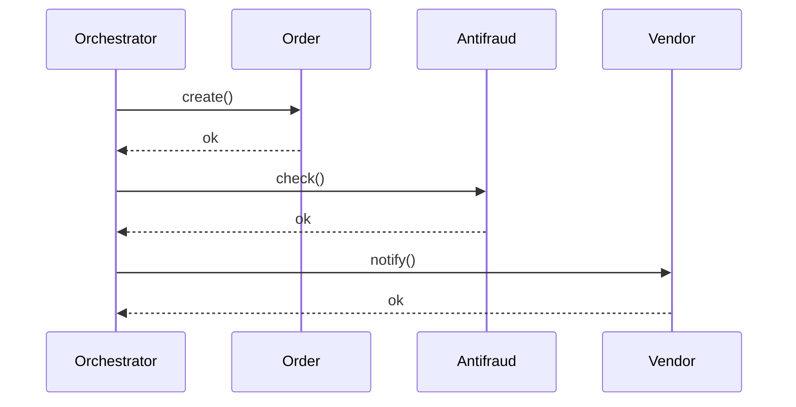
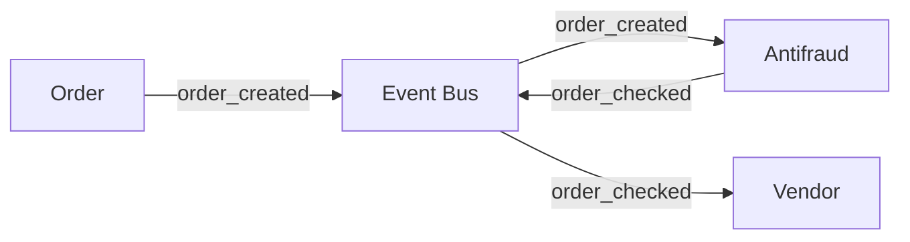

# Orchestration vs Choreography

## What

Два стиля координации сервисов в распределённой системе:

- **Orchestration** — есть центральный **координатор**, который последовательно вызывает сервисы и знает весь бизнес-процесс.
- **Choreography** — координатора нет; сервисы реагируют на события друг друга, бизнес-процесс «собирается» из их реакций.

## Why / Problem it solves

Когда бизнес-операция охватывает 3+ сервиса, надо решить: **кто знает порядок шагов?**

- Orchestration: знание централизовано в координаторе. Проще понять и менять процесс, но координатор — точка связанности.
- Choreography: знание распределено, каждый сервис знает только свою реакцию. Меньше связанности, но сложнее увидеть процесс целиком.

## When to apply

### Orchestration уместен когда:

- Процесс **линейный** с понятным порядком шагов.
- Нужны явные **компенсации** при сбое (см. [[saga]]).
- Логика процесса часто меняется — лучше менять в одном месте.
- Важна **наблюдаемость**: где сейчас находится конкретный заказ.
- Команда новая в EDA — orchestration проще освоить.

### Choreography уместен когда:

- Много независимых реакций на одно событие (notification, analytics, antifraud — каждому нужен `order_created`).
- Подсистемы должны **скейлиться и развиваться независимо**.
- Часто добавляются новые consumers, без изменения существующих.
- Допустима eventual consistency.

## How

### Тот же бизнес-процесс в двух стилях

**Orchestration:**

**Choreography:**

### Признаки чистого orchestration

- Один сервис явно вызывает другие (HTTP/gRPC).
- Состояние процесса хранится у координатора.
- Сервисы — «инструменты», не знают про процесс.

### Признаки чистой choreography

- Сервисы общаются только через события.
- Никто не знает «весь процесс».
- Каждый сервис знает только: «на какие события подписан, какие публикую».

## Common pitfalls

### Orchestration

- **Координатор-Бог.** Логика всех процессов в одном сервисе → he becomes the bottleneck and risk.
- **Синхронные блокирующие вызовы.** Координатор последовательно ждёт каждый сервис → высокий latency.
- **Hidden coupling.** Сервисы формально независимы, но координатор знает их API → меняя один, надо обновлять координатор.

### Choreography

- **Implicit process.** Никто не описал процесс целиком → "where does order go after antifraud?" — никто не знает без чтения кода всех consumers.
- **Циклические зависимости.** Сервис A пишет событие, на которое реагирует B, который пишет событие, на которое реагирует A. Сложно отлаживать.
- **Невозможно ответить «где сейчас заказ».** Без orchestration-уровня + correlation_id + observability.

## Variations / Гибрид

На практике часто **гибрид**:

- **Choreography для глобального flow** (заказ движется через события: `created → checked → moderated → fulfilled`).
- **Orchestration внутри сложного шага** (Antifraud Service внутри себя — оркестратор: дёргает rules engine, ML-модель, history-сервис, потом публикует одно событие).

Также есть отдельный класс — **workflow engines** (Temporal, Cadence, Camunda): orchestration с persistent state, ретраями, версиями.

## Used in case studies

- [[001-order-backend-marketplace]] — Solution A построено на orchestration (Order Orchestrator + saga), Solution B на choreography (цепочка топиков в Kafka). Кейс прямо иллюстрирует разницу.

## References

- Sam Newman, "Building Microservices" — глава Orchestration vs Choreography.
- Bernd Rücker, "Practical Process Automation" — про orchestration через workflow engines.
