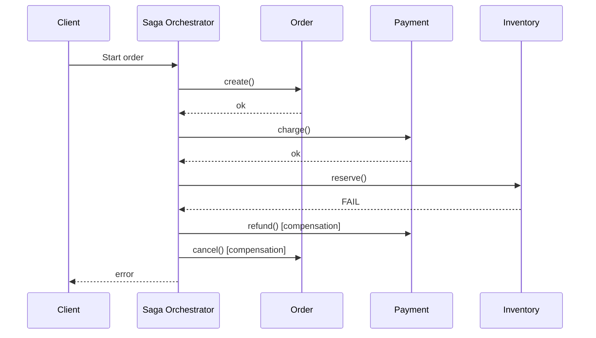

# Saga

## What

Распределённая транзакция, представленная как последовательность **локальных** транзакций в разных сервисах. Если какой-то шаг падает, выполняются **компенсирующие действия** для уже завершённых шагов — система откатывается к консистентному состоянию без глобальной блокировки.

## Why / Problem it solves

Бизнес-операция затрагивает несколько сервисов с собственными БД (заказ → списать средства → зарезервировать товар → уведомить вендера). Хочется атомарности: либо всё, либо ничего.

Классические распределённые транзакции (2PC, XA):
- Требуют координатора и блокировок ресурсов.
- Плохо масштабируются.
- Несовместимы с многими современными хранилищами (NoSQL, message queues).

Saga отказывается от ACID-атомарности в пользу **eventual consistency** + явных компенсаций. Каждый шаг коммитится сразу; при ошибке — последовательно откатываем уже сделанное через компенсирующие операции.

## When to apply

**Применять:**
- Бизнес-процесс охватывает несколько сервисов / БД.
- Допустима временная неконсистентность.
- Можно сформулировать компенсирующую операцию для каждого шага.

**Не применять:**
- Все операции в одной БД — обычной транзакции достаточно.
- Нельзя написать компенсацию (например, отправка SMS — отозвать нельзя; нужно проектировать иначе).
- Требуется строгая read-after-write консистентность для внешнего клиента.

## How

### Два стиля

**Orchestration:** центральный координатор (Saga Orchestrator) последовательно дёргает сервисы, знает порядок и компенсации.

**Choreography:** каждый сервис подписывается на события и реагирует на них; нет центрального координатора, цепочка строится из событий.

Детальное сравнение: [[orchestration-vs-choreography]].

### Пример (orchestration)

Заказ в маркетплейсе:

```
1. Order Service        → создать заказ          (компенсация: отменить)
2. Payment Service      → списать средства       (компенсация: вернуть)
3. Inventory Service    → зарезервировать товар  (компенсация: освободить)
4. Notification Service → уведомить вендера      (компенсации обычно нет)

При сбое на шаге 3:
   - выполнить compensation(2): вернуть средства
   - выполнить compensation(1): отменить заказ
   - сообщить клиенту об ошибке
```

### Диаграмма (orchestration)



### Инварианты

- Каждый шаг — локальная транзакция, коммитится сразу.
- Для каждого шага определена **компенсация** (semantic rollback, не physical undo).
- Компенсации должны быть **идемпотентны** (могут выполниться повторно при ретраях). См. [[idempotency-key]].
- Состояние саги персистентно (БД саги, event sourcing) — переживает рестарт оркестратора.

## Common pitfalls

- **Компенсация невозможна по природе.** Отправка email, физическая доставка. Решение — отложенный commit на шаге, который нельзя откатить (do it last).
- **Гонка с компенсацией.** Сага запустила compensation, но "успешный" шаг ещё в полёте → состояние неконсистентно. Решение — версионирование, состояние саги.
- **Компенсация не идемпотентна.** При ретрае refund() — двойной возврат денег.
- **Сложность тестирования.** Покрыть все пути отказа N сервисов → 2^N сценариев. Нужны контрактные тесты + chaos.
- **Choreography → "паутина" событий.** Без явной модели сложно понять, что куда идёт.

## Variations

- **Orchestrated Saga** — центральный координатор. Проще отлаживать, явная модель.
- **Choreographed Saga** — события через шину. Слабее связь, но сложнее отслеживать.
- **Routing Slip** — каждый шаг знает следующий, инструкция передаётся вместе с сообщением. Гибрид.
- **Process Manager / BPMN engine** — formal workflow engine (Temporal, Camunda) — orchestration на стероидах.

## Used in case studies

- [[001-order-backend-marketplace]] — в Solution A (orchestration) Order Orchestrator реализует сагу для координации Order Service, Payment, Vendor notification.

## References

- Hector Garcia-Molina, Kenneth Salem, "Sagas" (1987) — оригинальная статья.
- Chris Richardson, "Microservices Patterns" — главы про Saga.
- microservices.io — [Pattern: Saga](https://microservices.io/patterns/data/saga.html).
