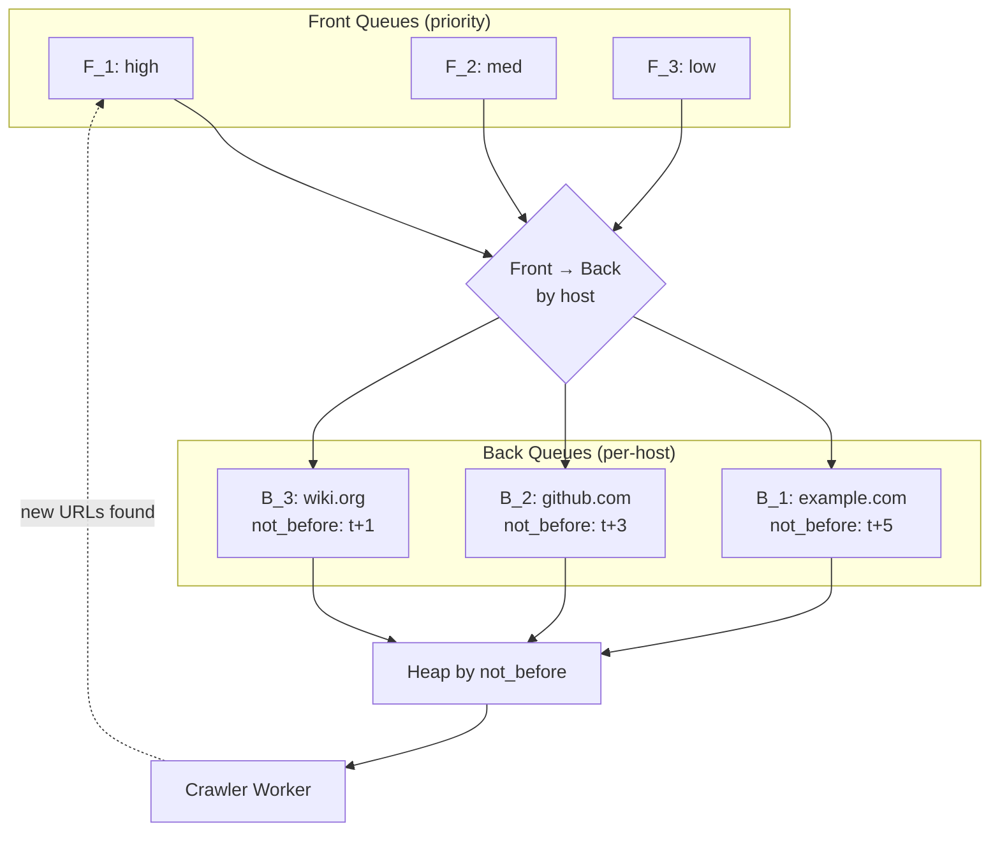

# URL Frontier

## What

Структура, управляющая порядком обхода URL в web crawler'е: какой URL посетить **следующим**, не перегружая ни один сайт. Сочетает **приоритет** (важные URL раньше) и **politeness** (limit per-host).

Шире — это инстанс паттерна «distributed priority queue с per-key rate limiting», применимого в любых системах распределённого scheduling'а с ограничениями по target (crawlers, scrapers, batch APIs, outbound webhook workers).

## Why / Problem it solves

Наивная очередь URL не работает:
- Без приоритета → краулим тривиальные URL миллион раз, важные не успеваем.
- Без politeness → DDoS-им один и тот же сайт (тысячи параллельных запросов в `example.com`).
- Без шардинга → один worker = bottleneck. С N workers — race за один host = снова DDoS.
- Без persistence → сбой = потеряли frontier.

URL Frontier решает все четыре проблемы.

## Structure

Frontier = двухуровневая очередь:

### Front Queues (prioritization)

K очередей по приоритету: `F_1 ... F_K` (1 — highest). Selector выбирает следующий URL из них с **prioritized probabilistic** sampling (например, 50% из F_1, 25% из F_2, ...).

```
F_1 (high priority): [url, url, url]    ← important pages, news, popular sites
F_2 (medium):        [url, url]
F_3 (low):           [url]
```

### Back Queues (politeness)

B очередей, каждая закреплена за **одним host'ом** в данный момент. Один host = одна back queue. Каждая back queue имеет «not-before» timestamp (когда можно сделать следующий request).

```
B_1 (host: example.com,  not_before: t=12:00:05): [url_1, url_2]
B_2 (host: github.com,   not_before: t=12:00:03): [url_a, url_b]
B_3 (host: wikipedia.org,not_before: t=12:00:01): [url_x]
```

### Heap по `not_before`

Selector worker'а: вынимает из heap'а back queue с минимальным `not_before` <= now, делает request, обновляет `not_before = now + delay_for_this_host`.

### Routing front → back

URL вытаскивается из front queue → определяется host → попадает в back queue этого host'а. Если такой back queue ещё нет — назначается свободная.

### Диаграмма



## Politeness rules

- **Default delay** между запросами к одному host'у — 1-5 секунд.
- **Crawl-delay** из `robots.txt` приоритетен.
- **Adaptive delay** — если сайт отвечает 429/503, увеличить delay.
- **Per-IP, not just per-host** — несколько доменов могут резолвиться в один IP (shared hosting). Использовать DNS resolution с кэшированием.

## Persistence

Frontier должен **переживать рестарт**:
- Front + back queues на disk (RocksDB, LMDB).
- Heap of back queues в памяти, переcтраивается на старте.
- Checkpoints периодически.

## Distributed deployment

При N crawler инстансах:

### Partition by host

Маршрутизация по `hash(host)` через [[consistent-hashing]]: каждый host «принадлежит» одному инстансу.

**+** Каждый инстанс держит свои back queues локально — нет contention.
**+** Politeness invariant сохраняется автоматически.

**−** Hot host (huge site) перегружает один инстанс.
**−** Rebalancing при add/remove instance.

### Centralized frontier с distributed workers

Один shared frontier (Redis / DB), workers вытаскивают URL.

**+** Простая балансировка.

**−** Frontier = bottleneck.
**−** Politeness требует distributed locking или claim-with-lease.

В практике **partition by host** выигрывает для больших crawler'ов.

## Common pitfalls

- **Politeness без robots.txt.** Игнорирование `Crawl-delay` → ban.
- **Один host = один back queue, но один TLD.** `*.tumblr.com` — миллионы хостов, но один origin IP. Per-IP politeness важен.
- **Front queue без bounds.** Накопили миллиард URL — out of memory. Bound + persist на disk.
- **Не учли DNS overhead.** Resolve каждый раз → DNS-сервер становится bottleneck. Кэшировать DNS.
- **Без adaptive throttling.** 429 от сайта → не замедляем → ban.
- **Депрессия приоритета.** Если F_1 заполняется быстрее, чем опустошается → low priority никогда не обходим. Selector должен гарантировать минимальный share для каждой priority.
- **Дедупликация URL не там.** Если дедуп после frontier — миллионы дубликатов в очереди. Дедуп до frontier через [[content-deduplication]] (Bloom Filter).

## Used in case studies

- [[006-web-crawler]] — основной механизм управления обходом.

## References

- "Mercator: A Scalable, Extensible Web Crawler" (Heydon & Najork, 1999) — оригинальное описание two-level frontier.
- "Web Crawling" by Olston & Najork (Foundations and Trends in Information Retrieval, 2010).
- Apache Nutch documentation.
- Common Crawl architecture posts.
